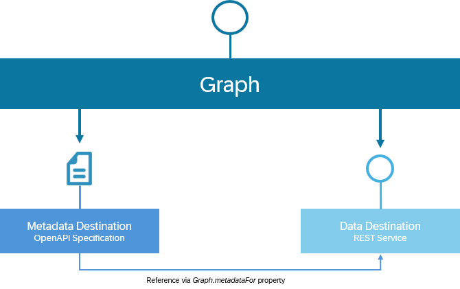

<!-- loio3fa3dc3c40e5459ea1bc4b8da9aa86ab -->

# REST Services

Connecting REST services as data sources to Graph requires, unlike OData services, creating two destinations: a data destination and a metadata destination.

When integrating REST services into a business data graph, the resources of that REST service are transformed into unbound actions and functions to maintain OData compatibility. Read more about how resources from REST services are exposed in the [Graph - Configuration](https://api.sap.com/api/Graph_ConfigurationAPI/overview) OData API.

<a name="loio3fa3dc3c40e5459ea1bc4b8da9aa86ab__section_hlb_zw5_l2c"/>

## Setup Connectivity

Before establishing a connection, ensure that your REST API service is publicly accessible and consider implementing secure communication protocols.

<a name="loio3fa3dc3c40e5459ea1bc4b8da9aa86ab__section_qb3_bx5_l2c"/>

## Create Destinations

To integrate your REST services into Graph, you'll need to create two destinations: 

-   Data Destination

    This destination points to the actual REST service and is annotated with `Graph.destinationType = REST`.

-   Metadata Destination

    This destination points to a metadata document for your REST service, expressed in OpenAPI format, and is annotated with `Graph.metadataFor: <name of the referenced data destination>` and `Graph.destinationType: OpenAPI`.

### Data Destination

As an SAP BTP administrator, create a destination with the following specifications:

-   URL: The endpoint of your REST service \(this should point to the service-root where all described resources are available\).

-   Authentication: Choose the appropriate authentication method based on your REST service configuration. BasicAuthentication can be used for services requiring basic HTTP authentication. NoAuthentication, can be used for public services \(not recommended for production due to security concerns\).

-   Annotations: Add the property `Graph.REST.data: true` to specify that this destination is used for data access.

Additionally, if your REST service requires special HTTP headers, define them using additional `URL.headers` properties in the destination configuration.

### Metadata Destination

Create a destination for the OpenAPI metadata with the following specifications:

-   URL: The endpoint where the OpenAPI metadata document of your REST service can be accessed.

-   Annotations: Include the property `Graph.metadataFor: <name of the referenced data destination>` to link this metadata destination to the corresponding data destination established earlier.

Ensure that the OpenAPI specification outlines the available resources of your REST service.

