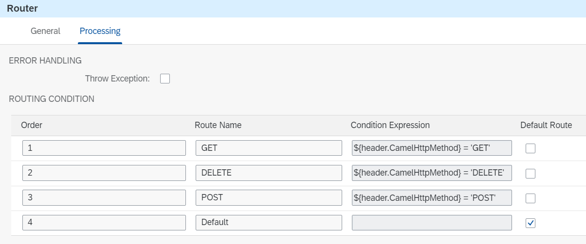

<!-- loiof3486cb540514fc885f186673f155797 -->

# Restrict an API to HTTP Methods

Let's assume your integration flow exposes an http-based endpoint. However, not all potentially supported http methods on SAP Cloud Integration should be implemented. This guideline describes how the exposed API can be restricted to particular http methods only.

<a name="loiof3486cb540514fc885f186673f155797__section_f2f_4wq_lsb"/>

## Implementation

To illustrate this rule, see the *Modeling Basics - Restrict Http Method* integration flow.

The example scenario works as follows. The integration flow receives a request through an HTTP adapter. Based on the http method, the following activities are carried out:

-   For a POST request, product data is stored in a data store with name ModelingBasics-RestrictHttpMethod.

-   For a GET request, product details are read from the data store ModelingBasics-RestrictHttpMethod. If the product doesn't exist, an http error code 404 is returned with the information that the product could not be found.

-   For a DELETE request, the specified product data is deleted from the data store ModelingBasics-RestrictHttpMethod.

-   For any other method, an http error code 405 is returned with the information that the method isn’t allowed.

For the incoming message, the *HTTP Sender Adapter* writes the http method into the header `CamelHttpMethod` which we can use in the following router conditions to pass the message to the corresponding route:

-   For the POST route: `${header.CamelHttpMethod} = 'POST'`.

-   For the GET route: `${header.CamelHttpMethod} = 'GET'`.

-   For the DELETE route: `${header.CamelHttpMethod} = 'DELETE'.`

-   For any other http method, the default route is carried out.

In each route, the corresponding local integration process is called. In the following, we focus on the Default route only which calls the *Handle any other HTTP method local* integration process.

As you can see, we’ve defined a *content modifier* step only.

In the content modifier step, we create a new header in the Message Header tab as follows:

<table>
<tr>
<td valign="top">

*Name*

</td>
<td valign="top">

CamelHttpResponseCode

</td>
</tr>
<tr>
<td valign="top">

*Source Type*

</td>
<td valign="top">

Constant

</td>
</tr>
<tr>
<td valign="top">

*Source Value*

</td>
<td valign="top">

405

</td>
</tr>
</table>

This configuration sets the http error code of the response to 405 Method Not Allowed.

The response is defined as follows \(see Message Body tab\): HTTP method `${header.CamelHttpMethod}` not implemented.

To test the integration scenario, perform the following steps:

1.  Deploy the integration flow *Modeling Basics - Restrict Http Method*.

2.  In the Postman client, open the RestrictHttpMethod folder in the ModelingBasics collection, and run the following requests:

    ****

    <table>
    <tr>
    <th valign="top">

    Request
    
    </th>
    <th valign="top">

    Description
    
    </th>
    </tr>
    <tr>
    <td valign="top">
    
    RestrictHttpMethod - POST
    
    </td>
    <td valign="top">
    
    The POST request contains an XML body with product details. By default, the product id is defined as HT-1000. You may change the id before sending or re-sending the request.

    If you send the request, a new entry is added to the data store ModelingBasics-RestrictHttpMethod with entry id equals specified product id in the message body.

    You should see the following response text depending on the specified product id:

    Product <your product id\> written to the database.
    
    </td>
    </tr>
    <tr>
    <td valign="top">
    
    RestrictHttpMethod - GET
    
    </td>
    <td valign="top">
    
    The GET request contains the product id in the URL path. By default, the id HT-1000 is defined. You may change the URL path depending on the specified id in the POST request before.

    If you send the request, the product details are read from the data store ModelingBasics-RestrictHttpMethod.

    You should see the product details in the response. Otherwise, if you have chosen an id in your GET request which doesn't correspond to an entry in the data store, you should receive the response code 404 and the message content:

    Product with ID <your product id\> not found.
    
    </td>
    </tr>
    <tr>
    <td valign="top">
    
    RestrictHttpMethod - PUT
    
    </td>
    <td valign="top">
    
    The PUT request contains an XML body with product details.

    Regardless of the message body, you always get a response code 405 and the following message content returned:

    HTTP method PUT not implemented.
    
    </td>
    </tr>
    <tr>
    <td valign="top">
    
    RestrictHttpMethod - PATCH
    
    </td>
    <td valign="top">
    
    The PATCH request contains an XML body with product details.

    Regardless of the message body, you always get a response code 405 and the following message content returned:

    HTTP method PATCH not implemented.
    
    </td>
    </tr>
    <tr>
    <td valign="top">
    
    RestrictHttpMethod - DELETE
    
    </td>
    <td valign="top">
    
    The DELETE request contains the product id in the URL path. By default, the id HT-1000 is defined. You may change the URL path depending on the specified id in the POST request before.

    If you send the request, the product details are deleted from the data store ModelingBasics-RestrictHttpMethod.

    You should receive the following message content:

    Product <your product id\> deleted from the database.
    
    </td>
    </tr>
    </table>
    

**Related Information**  

[Define Router](define-router-d7fddbd.md "")

[HTTPS Sender Adapter](https-sender-adapter-0ae4a78.md "")

