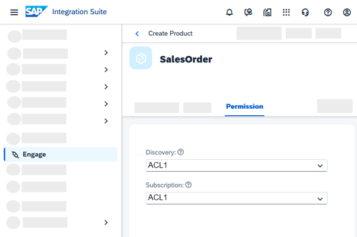

<!-- loio09fb892458c54952a1c9abcef141ef97 -->

# Restricting Access to API Products Using Custom Role Attribute

You can control access to an API product using a custom role collection. During product creation, you can assign a custom role attribute to the product to restrict its access. By assigning permissions to products through custom role attribute, you control which users can discover and subscribe to specific API products.

<a name="loio09fb892458c54952a1c9abcef141ef97__prereq_y5k_q5x_ddb"/>

## Prerequisites

-   The `APIPortal.Administrator` role collection is assigned to you.
-   Create a custom role collection in the SAP BTP Cockpit, then create a custom role and add it to the custom role collection you just created. For the step-by-step instructions, see [Creating and Assigning a Custom Role Collection](creating-and-assigning-a-custom-role-collection-9d827cd.md).

## Context

Whenever you create a product or edit a draft product, permissions can be added to product. You can grant permission to users for discovering and subscribing to the product in Developer Hub. Only users who are assigned the required role collection can discover and subscribe to the product.

> ### Note:  
> Currently, we do not support assigning of permissions to the products defined in the remote API portals that are connected to a centralised Developer Hub.
> 
> \*Remote API portals are those that are not in the same subaccount as the centralised Developer Hub and are configured via the manage connections. For more information, [Centralized Developer Hub](../centralized-developer-hub-38422de.md).

## Procedure

1.  Log on to SAP Integration Suite .

2.  Choose the navigation icon on the left and choose *Engage*.

3.  Go to the *Products* tab and choose *Permission*.

    Here, whenever a product is created or a draft product is edited, permissions can be added to product.

    The dropdown for *Discovery* and *Subscription* displays the custom attribute value assigned to your custom role.

4.  Select the custom attribute from both the *Discovery* and *Subscription* dropdown lists; only users assigned the selected role can discover or subscribe to this product in Developer Hub.

    

    You can change or remove the roles selected for *Discovery* and *Subscription* by choosing *Edit* or *Remove Role*.

**Related Information**  

[Create a Product](create-a-product-d769622.md "Explains how to create products to publish a bundle of API proxies together.")

