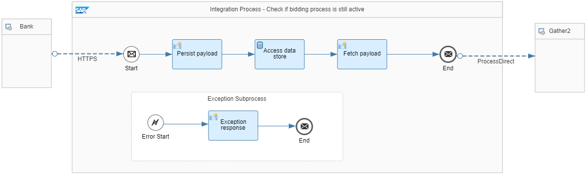

<!-- loio987eef23b2544f79b500b4e6e3bb4616 -->

# Scatter-Gather

You want to send a message to multiple recipients and each of them sends a reply that needs to be collected. With the Scatter-Gather pattern, you can broadcast a message to multiple recipients and reaggregate the responses back into a single message.


<a name="loio987eef23b2544f79b500b4e6e3bb4616__section_yvl_mm2_5jb"/>

## Use Case

This pattern is typically used for bidding processes. In our example, an agency requests a bank loan. In a first step, a solvency check is carried out at a General Credit Protection Agency. Then the request, enriched by the score from the solvency check, is forwarded to multiple banks, asking for their quotes. Each bank sends back their quotes within a specific timeframe. When the time has passed, the bidding is closed. Any bid received after this time is ignored. Based on all responses, the best quote is calculated and returned to the original requester.


<a name="loio987eef23b2544f79b500b4e6e3bb4616__section_m3y_qm2_5jb"/>

## Implementation

The *Pattern Scatter-Gather* reference integration flow consists of 2 integration processes, one for the scatter part and one for the Gather part. Another integration process has been added in between the scatter and the Gather parts o reject any quote that arrives after the bidding has closed.

**Scatter Integration Process**

The Scatter integration process receives the request and broadcasts it to all banks.


This integration process calls the solvency check subprocess, then triggers the timer of the bidding process, followed by a parallel multicast to broadcast the request to multiple banks. The rest of the steps are required to handle inactive biddings.

The first step in the model is a Local Process call. Here, the subprocess that handles the solvency check is called. For demo purposes, a constant value is mapped to the score.

Next, a Content Modifier stores the original payload. Otherwise, it is overwritten when triggering the timer of the collection in the other part. For that purpose, a new *payload* property with the value *$\{in.body\}* is defined.

The *Map to trigger timer format* Content Modifier defines the message body as follows:

> ### Sample Code:  
> ```
> <sg:BankLoanBid xmlns:sg="http://demo.sap.com/eip/scatter-gather" >
> 
> <RequestID>${property.requestID}</RequestID>
> 
> </sg:BankLoanBid>
> ```

This expression contains a bid that contains the request ID only but no actual bid.

A Request Reply step calls the Gather integration process. This step triggers the timer for the aggregation step within the Gather part. Connection between the scatter and the Gather part is done via a ProcessDirect adapter.

Next, the payload is overwritten again with the original message. Therefore, in a Content Modifier the message body is defined by the expression *$\{property.payload\}*.

Finally, a parallel multicast is added, as well as a receiver for each bank.

**Gather Integration Process**

The Gather integration process receives the quotes from the banks, aggregates them, calculates the best quote, and finally returns the best quote to the requester.


The first step is an Aggregator step with the *Correlation Expression* specified as *//RequestID*.

This setting ensures that all quotes for a particular request are collected in a single instance.

The following Aggregation strategy has been defined for the Aggregator step:


<table>
<tr>
<th valign="top">

Attribute

</th>
<th valign="top">

Value

</th>
</tr>
<tr>
<td valign="top">

Incoming Format

</td>
<td valign="top">

XML \(Same Format\)

</td>
</tr>
<tr>
<td valign="top">

Aggregation Algorithm

</td>
<td valign="top">

Combine

</td>
</tr>
<tr>
<td valign="top">

Last Message Condition \(XPath\)

</td>
<td valign="top">

false

</td>
</tr>
<tr>
<td valign="top">

Completion Timeout

</td>
<td valign="top">

2 minutes

\(for demo purposes, any time value can be specified\)

</td>
</tr>
</table>

Once the aggregation has completed, the best quote is calculated in a message mapping. Here, the one with the lowest interest rate is taken for sakes of simplicity.

Next, a Filter is added which removes the multi-mapping nodes that were added by the Aggregator. The Filter is defined as follows:


<table>
<tr>
<th valign="top">

Attribute

</th>
<th valign="top">

Value

</th>
</tr>
<tr>
<td valign="top">

XPath Expression

</td>
<td valign="top">

//sg:BankLoanResponse

</td>
</tr>
<tr>
<td valign="top">

Value

</td>
<td valign="top">

Nodelist

</td>
</tr>
</table>

The remaining steps are related to the inactive bidding handling.

**Handling Inactive Biddings**

In order to reject quotes that have arrived after the bidding has closed, another Integration Process has been added before calling the Gather integration process. As a result, all bids from the banks are sent to this integration flow.



First, a Content Modifier stores the original payload. Otherwise, it is overwritten in the subsequent step. For that purpose, a new *payload* property with the value *$\{in.body\}* is defined. Furthermore, a *requestID* property with type *XPath* and value *sg:BankLoanBid/RequestID* is defined.

A subsequent Data Store Get step is modeled with the following attributes:


<table>
<tr>
<th valign="top">

Attribute

</th>
<th valign="top">

Value

</th>
</tr>
<tr>
<td valign="top">

Data Store Name

</td>
<td valign="top">

ScatterGather-ActiveBids

</td>
</tr>
<tr>
<td valign="top">

Entry ID

</td>
<td valign="top">

$\{property.requestID\}

</td>
</tr>
</table>

The *Throw Exception on Missing Entry* option is selected.

The *ScatterGather-ActiveBids* data store contains all bids that are still open. The key of the entry is the request ID. If the bid has been closed already, the Data Store Get operation raises an exception. Therefore, an Exception Subprocess has been added which ends processing and returns a message that the bidding period has closed.

If the bidding is still active, processing continues and in a Content Modifier the original payload is fetched again \(specified by the expression *$\{property.payload\}* in the *Message Body* tab\).

Finally, the Gather integration process is called via the ProcessDirect adapter.

To ensure that the *ScatterGather-ActiveBids* data store contains the entries of all active bids, the Scatter integration flow is enhanced by adding a Data Store Write step called *ScatterGather-ActiveBids* the *$\{property.requestID\}* entry ID, after having received the original request.

Furthermore, it has to be ensured that once the bidding has been closed, the corresponding entry is deleted from the data store. For that purpose, in the Gather integration flow, a Data Store Delete step called *ScatterGather-ActiveBids* and the *$\{property.requestID\}* entry ID is executed after having calculated the best quote.

