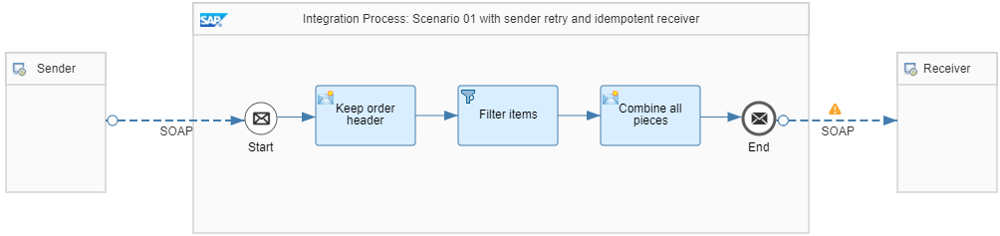

<!-- loio9f3e2b65afab4f7da9aeb69be404b1f2 -->

# Sender and Receiver with SAP RM Protocol

The following assumptions apply for the design of this scenario:

-   It implements the communication between exactly 1 sender and 1 receiver.

-   The message protocol contains a unique ID such as a message ID.

-   The sender supports message retry. It's assumed that the message ID remains the same for all retries.

-   The receiver is **idempotent**. This means that the receiver is able to detect and ignore duplicate messages.

    Therefore, the integration flow doesn’t require any additional implementation steps to support EO.

-   The integration flow design bears no risk of any side effects that can result in nondeterministic behavior. For example: During message processing, Cloud Integration writes variables and doesn't roll back the write action on failure.

You can anticipate the following situations:

-   The call fails at first place, and therefore the sender retries until the message is successfully delivered.

-   The system has delivered the message successfully, however, the positive acknowledgment from the receiver got lost in between. As a result, the sender assumes that the call failed and therefore resends the message. This behavior results in duplicate messages arriving at the receiver side. Since the receiver is idempotent, the system discards the duplicate message.

This scenario doesn’t require any additional implementation steps within the integration flow to support EO. Therefore, the integration flow model was kept simple. However, there's the following drawback: If there's a redelivery from the sender side, the system reprocesses the complete integration flow steps. This behavior causes a performance impact on the Cloud Integration runtime as well as writing of an additional message processing log \(MPL\) entry.

<a name="loio9f3e2b65afab4f7da9aeb69be404b1f2__section_d1v_k4c_nrb"/>

## Involved Integration Flows

To simulate the communication of sender and receiver systems through Cloud Integration for the different scenarios, the integration package comes with multiple integration flows. To learn more about how these integration flows interact with each other during the processing of a scenario, see [Interaction of the Involved Integration Flows](interaction-of-the-involved-integration-flows-44be68d.md).

<a name="loio9f3e2b65afab4f7da9aeb69be404b1f2__section_fyx_34v_mrb"/>

## Example Scenario

The *Pattern Quality Of Service - Scenario 01* integration flow implements a content filter pattern \(for more information on this pattern, see also [Content Filter](content-filter-6fd4a86.md)\):

The scenario contains a SOAP \(SAP RM\) sender adapter with SAP Reliable Messaging message protocol. Using this option, the sender can pass on a protocol-specific message ID to the integration flow. The adapter supports different options:

-   Using an SAP proprietary SOAP header with element name `messageId` in the query part of the URL.

-   Using an SAP proprietary SOAP header as a field with name `MessageId` in the query part of the URL.

Cloud Integration saves the message ID in the header `SapMessageIdEx`.

See [Configure the SOAP \(SAP RM\) Sender Adapter](configure-the-soap-sap-rm-sender-adapter-6962234.md).

On the receiver side, the scenario uses a SOAP \(SAP RM\) receiver adapter. On the *Processing* tab of the SOAP receiver adapter, the *SAP RM Message ID Determination* parameter is set to *Reuse*. This setting ensures that the receiver uses the value of header `SapMessageIdEx` as SAP RM Message ID. See [Configure the SOAP \(SAP RM\) Receiver Adapter](configure-the-soap-sap-rm-receiver-adapter-8366495.md).

> ### Note:  
> Beside SOAP \(SAP RM\), the following protocols support the exchange of a unique message ID as well:
> 
> -   XI protocol
> 
>     For this protocol, the message ID is part of the SOAP header. The same rule as for SAP RM applies: The sender stores the message ID in the header `SapMessageIdEx`; the receiver uses the header `SapMessageIdEx` to define the message ID of the outbound XI message.
> 
> -   IDoc adapter
> 
>     The IDoc adapter uses the header `SapMessageId` within the integration flow processing. If header `SapMessageId` isn't defined, the IDoc receiver adapter automatically generates a unique ID. Otherwise, it reuses the value of header `SapMessageId`. If for outgoing messages you choose the IDoc content type `application/x-sap.idoc`, the SAP backend ensures EO handling.
> 
> -   AS2 adapter
> 
>     The AS2 adapter uses the header `AS2MessageID`. At AS2 receiver side, the left and right part of the ID can be flexibly defined using any header or property.

With the described settings, you can ensure that the integration flow passes on the ID sent by the sender to the receiver system. If the sender retries the message delivery, the same ID is passed on to the receiver. As the receiver is idempotent, the duplicate message is discarded.

To make it easy for you to set up and run the scenario, the integration package contains the predefined integration flow *Pattern Quality Of Service – Mocked Sender*. This integration flow simulates different sender system situations. In the present case, the sender system is able to resend messages keeping the same message ID.

Furthermore, the *Generic Receiver* integration flow has been extended to mock different kind of receiver systems. In general, the *Generic Receiver* integration flow creates a data store entry for each receiver call. To support the present scenario, the *Integration Process: Idempotent receiver using SAP RM* integration process with SAP RM sender adapter has been added. The *Entry ID* of the *Data Store Write* step is defined by the value of the header `SapMessageIdEx`. To verify this setting, check out the *Set context and id* content modifier of this integration process. As a result, each duplicate message overwrites the existing entry with the same payload instead of adding additional data store entries. Therefore, overall, the scenario is idempotent.

To test the scenario, perform the following steps:

1.  Set up inbound *Basic* authentication for integration flow endpoints.

    See:

    [Basic Authentication with clientId and clientsecret for Integration Flow Processing](../40-RemoteSystems/basic-authentication-with-clientid-and-clientsecret-for-integration-flow-processing-647eeb3.md)

    [Setting Up Inbound HTTP Connections (with Basic Authentication), Neo Environment](https://help.sap.com/viewer/368c481cd6954bdfa5d0435479fd4eaf/Cloud/en-US/391c45cfcd0f4435952ab085283b7f7d.html "") :arrow_upper_right:

2.  Deploy a *User Credentials* artifact with the following parameters using the *Monitor* application \(*Security Material* tile under *Manage Security*\).

    <table>
    <tr>
    <th valign="top">

    Parameter
    
    </th>
    <th valign="top">

    Setting
    
    </th>
    </tr>
    <tr>
    <td valign="top">
    
    *Name*
    
    </td>
    <td valign="top">
    
    `OWN`
    
    </td>
    </tr>
    <tr>
    <td valign="top">
    
    *User*
    
    </td>
    <td valign="top">
    
    Enter the user as specified when setting up inbound basic authentication.
    
    </td>
    </tr>
    <tr>
    <td valign="top">
    
    *Password*
    
    </td>
    <td valign="top">
    
    Enter the password as specified when setting up inbound basic authentication.
    
    </td>
    </tr>
    </table>
    
    > ### Note:  
    > When you check out the integration flows *Pattern Quality Of Service – Mocked Sender* and *Pattern Quality Of Service - Scenario 01*, you notice that the receiver adapters refer to a *User Credentials* artifact with the name *OWN*.
    > 
    > Both integration flows operate on the same tenant and use the same user credentials for inbound requests.

3.  Deploy all 3 integration flows *Generic Receiver*, *Pattern Quality Of Service – Mocked Sender*, and *Pattern Quality Of Service - Scenario 01*.

4.  In the Postman client, open the *QualityOfService* folder in the *Enterprise Integration Patterns* collection, and run the *QualityOfService – Scenario 01* request.

    If you set the request parameter `sendDuplicates` to `true` \(in the *Params* tab of Postman\), the *Pattern Quality Of Service – Mocked Sender* integration flow sends a second message to the *Pattern Quality Of Service - Scenario 01* integration flow with a delay of 5 seconds.

5.  Once the system has processed the second message successfully, check the data store *Pattern-QualityOfService* \(open the *Monitor* application and select the *Data Stores* tile under *Manage Stores*\).

    > ### Tip:  
    > You see only 1 entry with an entry *ID* that is identical to the message id of the *Pattern Quality Of Service – Mocked Sender* integration flow processing.

6.  Before rerunning the test, clean up the data store.

7.  Optionally, you can switch on the trace to be able to verify the overall behavior.

<a name="loio9f3e2b65afab4f7da9aeb69be404b1f2__section_mcy_bsv_mrb"/>

## Further Examples with Similar EO Settings

If your integration flow contains a *Multicast* pattern with a *Join/Gather* step, you end up with one inbound message and one outbound message. Therefore, the scenario shows the quality of service like the integration flow with exactly 1 sender and 1 receiver described in this section.

The same applies to a *Splitter with Gather* combination.

