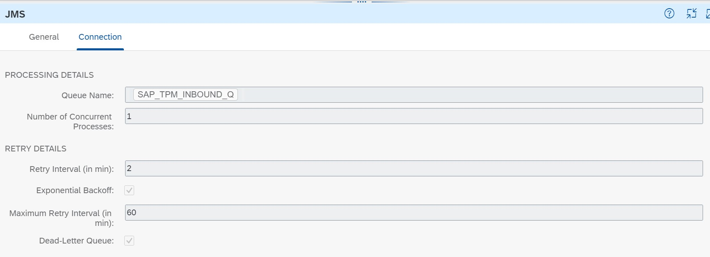

<!-- loio5b946c5acdd5455fab15d3bc90a35ccc -->

<link rel="stylesheet" type="text/css" href="../css/sap-icons.css"/>

# Sender Communication Flow V2

Configure the sender side integration flow.

The integration flows receive and extract messages sent using the AS2, AS2 MDN, IDoc, SOAP and ProcessDirect adapter. In 2.1.0 version, the error messages are persisted in the JMS Queue and also during retry, the error messages will be persisted again in the queue. You need to monitor the JMS queue in order to resolve the issues.

The image below shows the default configuration of the JMS *Connection* tab in 2.0.

Follow the procedure below to configure these integration flows.

> ### Note:  
> If you have a custom integration flow calling the sender side integration flow, it has to hand over the type system in header, and avoid using the header name reserved by the application\(TPM\).
> 
> Few pointers to note while using the AS2/AS2 MDN communication flow:
> 
> -   All AS2 Requests will be decrypted based on the mime header instead of the Communication settings \(AS2 Sender\).
> 
>     -   If the Decryption is disabled but an encrypted message is received, the integration flow will throw an error: *Private key not found*.
> 
>     -   If Decryption is enabled but a plain-text message is received, the integration flow will process it with no error.
> 
> -   If your agreements contain any transaction scenarios with AS2 adapter, it is recommended to reactivate the agreements before delpoying the integration flows to avoid any errors. This is also to ensure that the value of *SAP\_AS2\_Pid\_Resolution\_Mode* and *SAP\_AS2\_MDN\_Inbound\_Pid\_Resolution\_Mode* is pushed into the Partner Directory before deploying the integration flows.
> 
>     The activation will create two new PD entries for the values above and these entries are specific to an user account. So, if there are multiple agreements that use the AS2 Sender Communication of the same user account with no changes made to the *Security* or *Processing*, then you need to activate only one agreement so that the entries are created for this user account.
> 
> -   If you have configured AS2 Partner ID based security configurations in the *Security* tab of the partner profile, then on activation of agreements using these configurations can potentially overwrite similar AS2 Partner ID based configurations done outside of Trading Partner Management solution. To know more about the IDs that could be potentially impacted, see [Creating a Trading Partner Profile](creating-a-trading-partner-profile-542fb11.md).
> -   If you have an active agreement that consists of the AS2 adapter but is not compatible with 2.0 version of the integration flow, you need to deactivate the agreement and follow few more steps to make it work with this version. To know more, see [Migration Steps for 2.0 Compatibility](migration-steps-for-2-0-compatibility-8631960.md)

<a name="loio5b946c5acdd5455fab15d3bc90a35ccc__section_u3w_vld_mrb"/>

## Sender AS2 Communication Flow V2

1.  In the *Artifacts* tab, choose the *Action*  button of the integration flow *Step 1 - Sender AS2 Communication Flow V2* and select *Configure*.

2.  Under the *Sender* tab, maintain the following parameters.

    **Parameters for Configuration**

    <table>
    <tr>
    <th valign="top">

    Parameter
    
    </th>
    <th valign="top">

    Default Value
    
    </th>
    <th valign="top">

    Description
    
    </th>
    </tr>
    <tr>
    <td valign="top">
    
    Sender
    
    </td>
    <td valign="top">
    
     
    
    </td>
    <td valign="top">
    
    The sender adapter name.
    
    </td>
    </tr>
    <tr>
    <td valign="top">
    
    Adapter Type
    
    </td>
    <td valign="top">
    
    AS2
    
    </td>
    <td valign="top">
    
    The adapter type which is set to *AS2* by default.
    
    </td>
    </tr>
    <tr>
    <td valign="top">
    
    Address
    
    </td>
    <td valign="top">
    
    /tpm/b2b/as2
    
    </td>
    <td valign="top">
    
    Address of the endpoint to start the integration flow.
    
    </td>
    </tr>
    <tr>
    <td valign="top">
    
    User Role
    
    </td>
    <td valign="top">
    
    ESBMessaging.send
    
    </td>
    <td valign="top">
    
    Role authorisation needed to trigger the integration flow. *ESBMessaging.send* is selected by default.

    Choose *Select* if you want to change the user role.
    
    </td>
    </tr>
    <tr>
    <td valign="top">
    
    Own AS2 ID
    
    </td>
    <td valign="top">
    
     
    
    </td>
    <td valign="top">
    
    Own company ID \(receiver\) from the incoming message expected in the sender AS2 channel.
    
    </td>
    </tr>
    </table>
    
3.  Select the *Receiver* tab and maintain the following parameter

    **Receiver Parameter**

    <table>
    <tr>
    <th valign="top">

    Parameter
    
    </th>
    <th valign="top">

    Default Value
    
    </th>
    <th valign="top">

    Description
    
    </th>
    </tr>
    <tr>
    <td valign="top">
    
    Receiver
    
    </td>
    <td valign="top">
    
     
    
    </td>
    <td valign="top">
    
    The name of the receiver
    
    </td>
    </tr>
    <tr>
    <td valign="top">
    
    Adapter Type
    
    </td>
    <td valign="top">
    
    JMS
    
    </td>
    <td valign="top">
    
    The type of the receiver adapter which is set to *JMS* by default.
    
    </td>
    </tr>
    <tr>
    <td valign="top">
    
    Queue Name
    
    </td>
    <td valign="top">
    
    SAP\_TPM\_INBOUND\_Q
    
    </td>
    <td valign="top">
    
    JMS queue where the incoming message is persisted.

    > ### Note:  
    > This queue will also persist the error messages.

    
    </td>
    </tr>
    </table>
    
4.  Choose *Save*.
5.  Choose *Deploy*.

<a name="loio5b946c5acdd5455fab15d3bc90a35ccc__section_svz_mw3_2vb"/>

## Sender AS2 MDN Flow V2

This integration flow is used to capture the Technical Acknowledgement through the AS2 adapter. You can also view the Technical Acknowledgement in the *B2B Monitoring* tab.

1.  In the *Artifacts* tab, choose the *Action*  button of the integration flow *Step 1 - Sender AS2 MDN Flow V2* and select *Deploy*.

<a name="loio5b946c5acdd5455fab15d3bc90a35ccc__section_kwk_cmd_mrb"/>

## Sender IDOC Communication Flow V2

1.  In the *Artifacts* tab, choose the *Action*  button of the integration flow *Step 1 - Sender IDOC Communication Flow V2* and select *Configure*

2.  Under the *Sender* tab, maintain the following parameters

    **Parameters for Configuration**

    <table>
    <tr>
    <th valign="top">

    Parameter
    
    </th>
    <th valign="top">

    Default Value
    
    </th>
    <th valign="top">

    Description
    
    </th>
    </tr>
    <tr>
    <td valign="top">
    
    Sender
    
    </td>
    <td valign="top">
    
     
    
    </td>
    <td valign="top">
    
    The name of the sender.
    
    </td>
    </tr>
    <tr>
    <td valign="top">
    
    Adapter Type
    
    </td>
    <td valign="top">
    
    IDOC
    
    </td>
    <td valign="top">
    
    The type of the sender adapter which is set to *IDOC* by default.
    
    </td>
    </tr>
    <tr>
    <td valign="top">
    
    Address
    
    </td>
    <td valign="top">
    
    /tpm/b2b/idoc/
    
    </td>
    <td valign="top">
    
    Address of the endpoint to start the integration flow
    
    </td>
    </tr>
    <tr>
    <td valign="top">
    
    User Role
    
    </td>
    <td valign="top">
    
    ESBMessaging.send
    
    </td>
    <td valign="top">
    
    Role authorisation needed to trigger the integration flow.

    Choose *Select* to change the user role.
    
    </td>
    </tr>
    </table>
    
3.  Choose the *Receiver* tab and maintain the following parameter

    **Receiver Parameter**

    <table>
    <tr>
    <th valign="top">

    Parameter
    
    </th>
    <th valign="top">

    Default Value
    
    </th>
    <th valign="top">

    Description
    
    </th>
    </tr>
    <tr>
    <td valign="top">
    
    Receiver
    
    </td>
    <td valign="top">
    
     
    
    </td>
    <td valign="top">
    
    The name of the receiver
    
    </td>
    </tr>
    <tr>
    <td valign="top">
    
    Adapter Type
    
    </td>
    <td valign="top">
    
    JMS
    
    </td>
    <td valign="top">
    
    The type of the receiver adapter which is set to *JMS* by default.
    
    </td>
    </tr>
    <tr>
    <td valign="top">
    
    Queue Name
    
    </td>
    <td valign="top">
    
    SAP\_TPM\_INBOUND\_Q
    
    </td>
    <td valign="top">
    
    JMS queue where the incoming message is persisted.
    
    </td>
    </tr>
    </table>
    
4.  Choose *Save*.
5.  Choose *Deploy*.

<a name="loio5b946c5acdd5455fab15d3bc90a35ccc__section_dlc_qmd_mrb"/>

## Sender SOAP Communication Flow V2

1.  In the *Artifacts* tab, choose the *Action*  button of the integration flow *Step 1 - Sender IDOC Communication Flow V2* and select *Configure*

2.  Under the *Sender* tab, maintain the following parameters

    **Parameters for Configuration**

    <table>
    <tr>
    <th valign="top">

    Parameter
    
    </th>
    <th valign="top">

    Default Value
    
    </th>
    <th valign="top">

    Description
    
    </th>
    </tr>
    <tr>
    <td valign="top">
    
    Sender
    
    </td>
    <td valign="top">
    
     
    
    </td>
    <td valign="top">
    
    The name of the sender
    
    </td>
    </tr>
    <tr>
    <td valign="top">
    
    Adapter Type
    
    </td>
    <td valign="top">
    
    SOAP
    
    </td>
    <td valign="top">
    
    The type of the sender adapter which is set to *SOAP* by default.
    
    </td>
    </tr>
    <tr>
    <td valign="top">
    
    Address
    
    </td>
    <td valign="top">
    
    /tpm/b2b/soap/
    
    </td>
    <td valign="top">
    
    Address of the endpoint to start the integration flow
    
    </td>
    </tr>
    <tr>
    <td valign="top">
    
    User Role
    
    </td>
    <td valign="top">
    
    ESBMessaging.send
    
    </td>
    <td valign="top">
    
    Role authorisation needed to trigger the integration flow.

    Choose *Select* if you want to change the user role.
    
    </td>
    </tr>
    </table>
    
3.  Choose the *Receiver* tab and maintain the following parameter.

    **Receiver Parameter**

    <table>
    <tr>
    <th valign="top">

    Parameter
    
    </th>
    <th valign="top">

    Default Value
    
    </th>
    <th valign="top">

    Description
    
    </th>
    </tr>
    <tr>
    <td valign="top">
    
    Receiver
    
    </td>
    <td valign="top">
    
     
    
    </td>
    <td valign="top">
    
    The name of the receiver
    
    </td>
    </tr>
    <tr>
    <td valign="top">
    
    Adapter Type
    
    </td>
    <td valign="top">
    
    JMS
    
    </td>
    <td valign="top">
    
    The type of the receiver adapter which is set to *JMS* by default.
    
    </td>
    </tr>
    <tr>
    <td valign="top">
    
    Queue Name
    
    </td>
    <td valign="top">
    
    SAP\_TPM\_INBOUND\_Q
    
    </td>
    <td valign="top">
    
    JMS queue where the incoming message is persisted.
    
    </td>
    </tr>
    </table>
    
4.  Choose *Save*.
5.  Choose *Deploy*.

<a name="loio5b946c5acdd5455fab15d3bc90a35ccc__section_phb_xhq_bzb"/>

## Sender Process Direct Communication Flow V2

1.  In the *Artifacts* tab, choose the *Action*  button of the integration flow *Step 1 - Sender Process Direct Communication Flow V2* and select *Deploy*.

<a name="loio5b946c5acdd5455fab15d3bc90a35ccc__section_jmd_h3q_bzb"/>

## Write Message to Message Queue

This integration flow writes the incoming message into the message queue.

1.  In the *Artifacts* tab, choose the *Action*  button of the integration flow *Step 1b - Write Message to Message queue* and select *Configure*.

2.  Select the *Receiver* tab and maintain the following parameter

    **Receiver Parameter**

    <table>
    <tr>
    <th valign="top">

    Parameter
    
    </th>
    <th valign="top">

    Default Value
    
    </th>
    <th valign="top">

    Description
    
    </th>
    </tr>
    <tr>
    <td valign="top">
    
    Receiver
    
    </td>
    <td valign="top">
    
     
    
    </td>
    <td valign="top">
    
    The name of the receiver
    
    </td>
    </tr>
    <tr>
    <td valign="top">
    
    Adapter Type
    
    </td>
    <td valign="top">
    
    JMS
    
    </td>
    <td valign="top">
    
    The type of the receiver adapter which is set to *JMS* by default.
    
    </td>
    </tr>
    <tr>
    <td valign="top">
    
    Queue Name
    
    </td>
    <td valign="top">
    
    SAP\_TPM\_INBOUND\_Q
    
    </td>
    <td valign="top">
    
    JMS queue where the incoming message is persisted.

    > ### Note:  
    > This queue will also persist the error messages.

    
    </td>
    </tr>
    </table>
    
3.  Choose *Save*.
4.  Choose *Deploy*.

