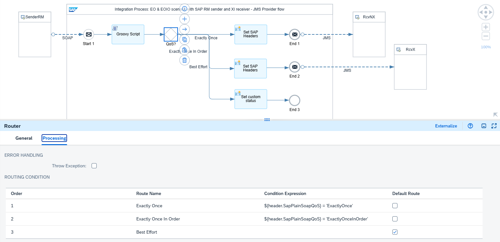
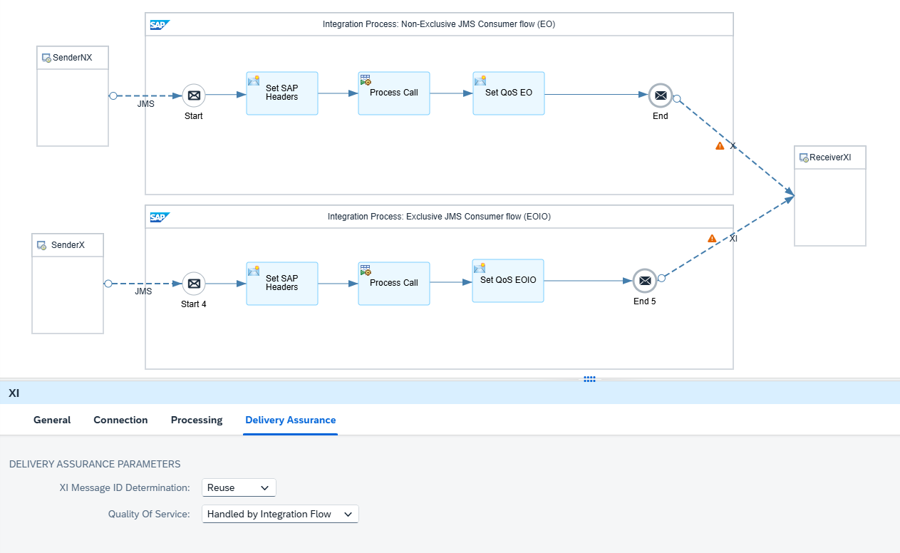

<!-- loio5f35b5c9e8e34a3ea8fd90df19ade49c -->

# Sender with SAP RM Protocol and Receiver with XI Protocol

The following assumptions apply for the design of this scenario:

-   The SAP RM sender adapter is used to reliably exchange messages with the sender using the SAP RM protocol.
-   The XI receiver adapter is used to reliably exchange messages with the receiver using the XI 3.0 protocol.
-   The sender ensures that a message is only sent when the predecessor message was acknowledged by a technical success response.
-   The sender performs a retry if an error occurs when delivering the message to Cloud Integration.

The SAP RM protocol extends the plain SOAP protocol to support Exactly Once and Exactly Once In Order delivery by providing SAP proprietary SOAP headers or query parameters.

-   To support Exactly Once delivery, a message ID that is used to detect duplicate messages must be transferred to Cloud Integration. The message ID can be either defined as SOAP header with element name `messageId` or as a parameter of the query part of the URL with name `MessageId`. If a message ID is present, the quality of service is implicitly determined as Exactly Once.
-   To support Exactly Once In Order delivery, a queue ID must be transferred to Cloud Integration as a parameter of the query part of the URL with name `QueueId`. If a queue ID is present, the quality of service is implicitly determined as Exactly Once In Order.
-   You can explicitly define the quality of service by transferring the query parameter with name `QualityOfService`. However, if you set the QualityOfService parameter value to `ExactlyOnceInOrder` without specifying a parameter for the queue ID, the call fails.
-   Based on the settings in the SOAP header or the query, the SAP RM adapter sets the headers `SapPlainSoapQoS` and `SapPlainSoapQueueId`, which can be used within the integration flow to model the message orchestration.
-   Furthermore, the SAP RM sender adapter saves the protocol-specific message ID in the header `SapMessageIdEx`, which can then be passed to the XI receiver adapter for defining a unique ID for duplicate handling.

See [Plain SOAP](https://help.sap.com/docs/SUPPORT_CONTENT/abapconn/3354079746.html).

The XI adapter in Cloud Integration doesn’t natively support Exactly Once In Order delivery. However, you can select the *Handled by Integration Flow* delivery assurance to implement guaranteed delivery within the integration flow:

-   If you use the *Handled by Integration Flow* delivery assurance setting, the XI receiver adapter doesn’t persist the outgoing message.
-   The XI receiver adapter expects the headers `SapQualityOfService` and eventually `SapQueueId` to be set within the integration flow.

A JMS queue is used where the messages are directly stored once they reach the middleware, Cloud Integration.

-   By persisting the messages in a JMS queue, Cloud Integration can carry out the retry of the message delivery if an error occurs.
-   For Exactly Once delivery, the message is stored in a non-exclusive queue, whereas for Exactly Once In Order delivery an exclusive JMS queue is used. For the latter, the message sequence can be preserved.

<a name="loio5f35b5c9e8e34a3ea8fd90df19ade49c__section_wts_z3b_1fc"/>

## Integration Flows Involved

To simulate the communication of sender and receiver systems through Cloud Integration for the different scenarios, the integration package comes with multiple integration flows. To learn more about how these integration flows interact during the processing of a scenario, see [Interaction of the Involved Integration Flows](interaction-of-the-involved-integration-flows-44be68d.md).

<a name="loio5f35b5c9e8e34a3ea8fd90df19ade49c__section_blp_phb_y2c"/>

## Example Scenario

The following example integration flow `Pattern Quality Of Service - EOIO SAP RM to XI` consists of three integration processes.

The first integration process contains an SAP RM sender adapter and a JMS receiver adapter. If you pass a value for the query parameter `QueueId` when calling the SAP RM end point, the SAP RM adapter sets the value of the header `SapPlainSoapQoS` to *ExactlyOnceInOrder*. In a router, the Quality of Service is checked. Depending on the header `SapPlainSoapQoS`, the message is either stored in a non-exclusive or in an exclusive JMS queue.

See [Configure the SOAP \(SAP RM\) Sender Adapter](configure-the-soap-sap-rm-sender-adapter-6962234.md).

The Groovy script and the content modifier in the integration process model are used to store the Quality of Service as custom header property and to define the headers `SAP_Sender` and `SAP_Receiver`, respectively, for an improved monitoring.

The two other integration processes read the message from the same JMS queues, so either from the non-exclusive or the exclusive JMS queue, and carry out the flow steps. For either JMS sender adapter, ensure that the proper access type is defined, in accordance with the access type of the corresponding JMS receiver adapters. Otherwise, the deployment of the integration flow fails.

In a content modifier step within the flows, the header `SapQualityOfService` must be set to either *ExactlyOnce* or *ExactlyOnceInOrder*. Furthermore, for the Exactly Once In Order path, you need to set the `SapQueueID` header. Here, you pass through the headers `SapPlainSoapQoS` and `SapPlainSoapQueueId` from the SAP RM sender adapter to define the message headers as follows:

****

<table>
<tr>
<th valign="top">

Name

</th>
<th valign="top">

Source Type

</th>
<th valign="top">

Source Value

</th>
</tr>
<tr>
<td valign="top">

SapQualityOfService

</td>
<td valign="top">

Header

</td>
<td valign="top">

SapPlainSoapQoS

</td>
</tr>
<tr>
<td valign="top">

SapQueueId

</td>
<td valign="top">

Header

</td>
<td valign="top">

SapPlainSoapQueueId

</td>
</tr>
</table>

Due to the Handled by Integration Flow setting, the XI receiver adapter doesn’t persist the message. Instead, the retry is done from the respective JMS queue. On the Delivery Assurance tab of the XI receiver adapters, the `XI Message ID Determination` property is set to *Reuse*. This ensures that we take over the message ID that's is passed from the SAP RM sender with the header `SapMessageIdEx` for duplicate handling.

> ### Note:  
> To pass through the message headers `SapPlainSoapQoS`, `SapPlainSoapQueueId`, and `SapMessageIdEx`, the headers must be added to the allowed headers list in the runtime configuration of the integration flow.

See: [Configure the XI Receiver Adapter](configure-the-xi-receiver-adapter-5d2670f.md)

Furthermore, the Handled by Integration Flow setting allows to exchange messages with delivery mode Exactly Once In Order. When reading from the JMS queue with access type *Exclusive*, only one consumer can access the queue at any time. Therefore, all successor messages keep waiting until the predecessor message has been successfully processed. This setting guarantees that messages are processed in the same order in which they're stored on the JMS queue.

<a name="loio5f35b5c9e8e34a3ea8fd90df19ade49c__section_wpz_zfb_1fc"/>

## Testing the Scenario

To test the scenario, perform the following steps.

1.  Set up inbound *Basic* authentication for integration flow endpoints.

    See [Basic Authentication with clientId and clientsecret for Integration Flow Processing](../40-RemoteSystems/basic-authentication-with-clientid-and-clientsecret-for-integration-flow-processing-647eeb3.md) and [Setting Up Inbound HTTP Connections \(with Basic Authentication\), Neo Environment](https://help.sap.com/docs/integration-suite/sap-integration-suite/setting-up-inbound-http-connections-with-basic-authentication-neo-environment).

2.  Go to *Manage Security* \> *Security Material* \> *Monitor*, and deploy a *User Credentials* artifact with the following parameters:

    <table>
    <tr>
    <th valign="top">

    Parameter
    
    </th>
    <th valign="top">

    Setting
    
    </th>
    </tr>
    <tr>
    <td valign="top">
    
    *Name*
    
    </td>
    <td valign="top">
    
    `OWN`
    
    </td>
    </tr>
    <tr>
    <td valign="top">
    
    *User*
    
    </td>
    <td valign="top">
    
    Enter the user you specified when you set up inbound basic authentication.
    
    </td>
    </tr>
    <tr>
    <td valign="top">
    
    *Password*
    
    </td>
    <td valign="top">
    
    Enter the password you specified when you set up inbound basic authentication.
    
    </td>
    </tr>
    </table>
    
    > ### Note:  
    > When you check out the integration flows `Pattern Quality Of Service – Mocked Sender` and `Pattern Quality Of Service - EOIO SAP RM to XI`, you notice that the receiver adapters refer to a user credentials artifact with the name `OWN`.
    > 
    > Both integration flows operate on the same tenant and use the same user credentials for inbound requests.

3.  Deploy the three integration flows `Generic Receiver`, `Pattern Quality Of Service – Mocked Sender`, and `Pattern Quality Of Service - EOIO SAP RM to XI`.

4.  In the Postman client, open the *QualityOfService* folder in the *Enterprise Integration Patterns* collection, and run the `QualityOfService - EOIO SAP RM to XI` requests.

    For each Exactly Once In Order request, a message is stored in the exclusive queue with name `EOIO_RM2XI_X`. The Exactly Once requests use the non-exclusive queue `EOIO_RM2XI_NX` for decoupling the message flow. The first and third POST requests set the request parameter `enforceError` to true \(in the Params tab of Postman\) simulating an error situation. In this case, the messages read from the queues automatically run into an error. In the message monitor, you can see that the messages go into Retry and that the custom status is set to `Error enforced`. You can distinguish between the requests by checking the custom header Quality of Service, which is either `ExactlyOnce` or `ExactlyOnceInOrder`. The subsequent Exactly Once In Order message waits until the predecessor message has been either successfully processed or canceled. However, the subsequent Exactly Once message should be successfully processed. This test shows that when using the exclusive queue. the message sequence is kept whereas for the non-exclusive queue, the order doesn’t matter.

5.  For demo purposes, each retry runs into the same enforced error. So, the error can’t be resolved and you should delete it. To do so, first save the message ID of the erroneous message to your clipboard. Then, navigate to the *Message Queues* monitor. To cancel the message, filter for it in the JMS queue monitor using the message ID. Select the JMS message entry of the erroneous message within the exclusive queue `EOIO_RM2XI_X` and choose *Delete*. After a while, the successor message is automatically retried and, if processed successfully, removed from the queue.

6.  Once the system has canceled the first erroneous message and processed the second message successfully, check the message monitor. You should see one message in status *Canceled* and a new message login status *Completed* with sender `JMSExclusive` and receiver `MockedXIReceiver`.

7.  Optionally, you can switch on the trace to be able to verify the overall behavior.

