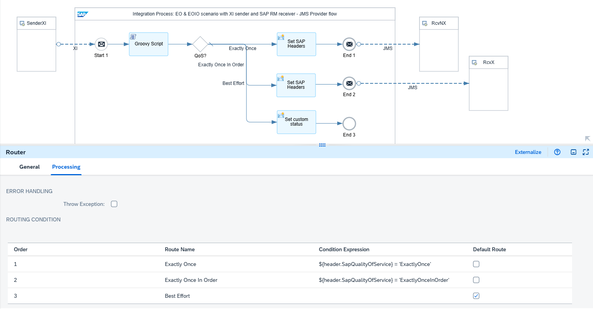
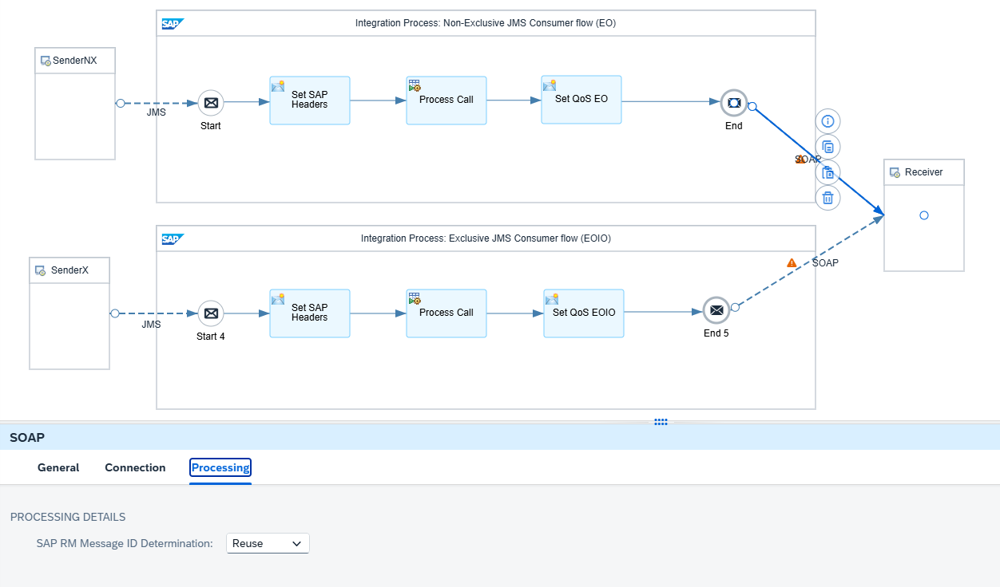

<!-- loio090abf37a3bb456ea0a79e414e9fc7b5 -->

# Sender with XI Protocol and Receiver with SAP RM Protocol

The following assumptions apply to the design of this scenario:

-   The XI sender adapter is used to reliably exchange messages with the sender using the XI 3.0 protocol.
-   The SAP RM receiver adapter is used to reliably exchange messages with the receiver using the SAP RM protocol.
-   The receiver is idempotent, which means that it can detect and ignore duplicate messages.

The XI adapter in Cloud Integration doesn’t natively support Exactly Once In Order delivery. However, you can select the *Handled by Integration Flow* delivery assurance to implement guaranteed delivery within the integration flow:

-   By using the *Handled by Integration Flow* delivery assurance setting, the XI adapter doesn’t add any Quality of Service handling such as persisting the incoming message.
-   The XI sender adapter sets the headers `SapQualityOfService` and `SapQueueId`, which can be used within the integration flow to model the message orchestration.
-   The XI sender adapter saves the protocol-specific message ID in the header `SapMessageIdEx`, which can then be passed to the SAP RM receiver adapter for defining a unique ID for duplicate handling.

See: [Configure the XI Sender Adapter](configure-the-xi-sender-adapter-41a1a57.md)

Since the XI sender adapter doesn’t persist the incoming message when using the *Handled by Integration Flow* delivery assurance, a JMS queue is used which directly stores the messages once they reach the middleware, Cloud Integration.

-   By persisting the messages in a JMS queue, Cloud Integration can carry out the retry of the message delivery if there's an error.
-   In case of Exactly Once delivery, the message is stored in a non-exclusive queue, whereas for Exactly Once In Order delivery an exclusive JMS queue is used. For the latter, the message sequence can be preserved.

The SAP RM protocol extends the plain SOAP protocol to support Exactly Once and Exactly Once In Order delivery by providing SAP proprietary SOAP headers or query parameters.

-   To support Exactly Once delivery, a message ID must be transferred to the SAP RM receiver which is used to detect duplicate messages. The message ID can be either defined as SOAP header with element name `messageId` or as a parameter of the query part of the URL with name `MessageId`. If a message ID is present, the quality of service is implicitly determined as Exactly Once.
-   To support Exactly Once In Order delivery, a queue ID must be transferred to the SAP RM receiver as a parameter of the query part of the URL with name `QueueId`. If a queue ID is present, the quality of service is implicitly determined as Exactly Once In Order.

See [Plain SOAP](https://help.sap.com/docs/SUPPORT_CONTENT/abapconn/3354079746.html).

You can anticipate the following situation: A message fails and is retried automatically until it's delivered successfully. As long as the failed message is in retry, all successor messages are kept on hold to ensure that they don't overtake the predecessor message.

<a name="loio090abf37a3bb456ea0a79e414e9fc7b5__section_wts_z3b_1fc"/>

## Integration Flows Involved

To simulate the communication of sender and receiver systems through Cloud Integration for the different scenarios, the integration package comes with multiple integration flows. To learn more about how these integration flows interact during the processing of a scenario, see [Interaction of the Involved Integration Flows](interaction-of-the-involved-integration-flows-44be68d.md).

<a name="loio090abf37a3bb456ea0a79e414e9fc7b5__section_lvw_sgb_y2c"/>

## Example Scenario

The following example integration flow `Pattern Quality Of Service - EOIO XI to SAP RM` consists of three integration processes.

The first integration process contains an XI sender adapter and a JMS receiver adapter. In the Delivery Assurance tab of the XI sender adapter, the Quality of Service is set to *Handled by Integration Flow*. In a router, the *Quality of Service* is checked. Depending on the header `SapQualityOfService`, the message is either stored in a non-exclusive or in an exclusive JMS queue.

The Groovy script and the content modifier in the integration process model are only used to store the Quality of Service and the queue ID as custom header property, and to define the headers `SAP_Sender` and `SAP_Receiver`, respectively, for an improved monitoring.

> ### Note:  
> In this example scenario, we only focus on the asynchronous message processing, which is for quality of services Exactly Once or Exactly Once In Order. So, in case of synchronous messages which corresponds to quality of service Best Effort, simply end the message processing with an end event. If you want to use the template for Best Effort as well, adapt your integration flow model accordingly.

The two other integration processes read the message from the same JMS queues, so either from the non-exclusive or the exclusive JMS queue, and carry out the flow steps. For both JMS sender adapters, you must ensure that the proper access type is defined according to the access type of the corresponding JMS receiver adapters. Otherwise, the deployment of the integration flow fails.

In the integration process handling the Exactly Once In Order case, the header `SapPlainSoapQoS` and `SapPlainSoapQueueId` must be set to ensure that the SAP RM receiver adapter passes the queue ID to the receiving system.

In a content modifier step right before the SAP RM adapter, the header `SapPlainSoapQoS` needs to be set to either *ExactlyOnce* or *ExactlyOnceInOrder*. Furthermore, for the Exactly Once In Order path, you need to set the `SapPlainSoapQueueId` header. Here, we pass through the headers `SapQualityOfService` and `SapQueueID` from the XI sender adapter to define the message headers as follows:

****

<table>
<tr>
<th valign="top">

Name

</th>
<th valign="top">

Source Type

</th>
<th valign="top">

Source Value

</th>
</tr>
<tr>
<td valign="top">

`SapPlainSoapQoS`

</td>
<td valign="top">

Header

</td>
<td valign="top">

`SapQualityOfService`

</td>
</tr>
<tr>
<td valign="top">

`SapPlainSoapQueueId`

</td>
<td valign="top">

Header

</td>
<td valign="top">

`SapQueueId`

</td>
</tr>
</table>

On the Processing tab of the SAP RM receiver adapters, the SAP RM Message ID Determination property is set to *Reuse*. This ensures that we take over the message ID that's passed from the XI sender with the header `SapMessageIdEx` for duplicate handling. Cloud Integration uses the mapped unique ID as SAP RM Message ID.

> ### Note:  
> To pass through the message headers `SapQualityOfService`, `SapQueueID` and `SapMessageIdEx`, the headers must be added to the list of allowed headers in the runtime configuration of the integration flow.

See: [Configure the SOAP \(SAP RM\) Receiver Adapter](configure-the-soap-sap-rm-receiver-adapter-8366495.md)

These integration flow settings ensure that Cloud Integration passes on a unique ID to the receiver system. If an error occurs during message processing, Cloud Integration retries the message from the JMS queue. Because the retry is performed within the same instance of the message processing log, the message processing log ID and, as a result, the mapped unique ID remain the same.

Furthermore, when reading from the JMS queue with access type *Exclusive*, only one consumer can access the queue at any time. Therefore, all successor messages wait until the predecessor message has been processed successfully. This setting guarantees that messages are processed in the exact order in which they're stored on the JMS queue.

<a name="loio090abf37a3bb456ea0a79e414e9fc7b5__section_wpz_zfb_1fc"/>

## Testing the Scenario

To test the scenario, perform the following steps.

1.  Set up inbound *Basic* authentication for integration flow endpoints.

    See [Basic Authentication with clientId and clientsecret for Integration Flow Processing](../40-RemoteSystems/basic-authentication-with-clientid-and-clientsecret-for-integration-flow-processing-647eeb3.md) and [Setting Up Inbound HTTP Connections \(with Basic Authentication\), Neo Environment](https://help.sap.com/docs/integration-suite/sap-integration-suite/setting-up-inbound-http-connections-with-basic-authentication-neo-environment).

2.  Go to *Manage Security* \> *Security Material* \> *Monitor*, and deploy a *User Credentials* artifact with the following parameters:

    <table>
    <tr>
    <th valign="top">

    Parameter
    
    </th>
    <th valign="top">

    Setting
    
    </th>
    </tr>
    <tr>
    <td valign="top">
    
    *Name*
    
    </td>
    <td valign="top">
    
    `OWN`
    
    </td>
    </tr>
    <tr>
    <td valign="top">
    
    *User*
    
    </td>
    <td valign="top">
    
    Enter the user you specified when you set up inbound basic authentication.
    
    </td>
    </tr>
    <tr>
    <td valign="top">
    
    *Password*
    
    </td>
    <td valign="top">
    
    Enter the password you specified when you set up inbound basic authentication.
    
    </td>
    </tr>
    </table>
    
    > ### Note:  
    > When you check out the integration flows `Pattern Quality Of Service – Mocked Sender` and `Pattern Quality Of Service - EOIO XI to SAP RM`, you notice that the receiver adapters refer to a user credentials artifact with the name `OWN`.
    > 
    > Both integration flows operate on the same tenant and use the same user credentials for inbound requests.

3.  Deploy the three integration flows `Generic Receiver`, `Pattern Quality Of Service – Mocked Sender`, and `Pattern Quality Of Service - EOIO XI to SAP RM`.

4.  In the Postman client, open the *QualityOfService* folder in the *Enterprise Integration Patterns* collection, and run the `QualityOfService - EOIO XI to SAP RM` requests.

    For each Exactly Once In Order request, a message is stored in the exclusive queue with name `EOIO_XI2RM_X`. The Exactly Once requests use the non-exclusive queue `EOIO_XI2RM_NX` for decoupling the message flow. The first and third POST requests set the request parameter `enforceError` to true \(in the Params tab of Postman\) simulating an error situation. In this case, the messages read from the queues automatically run into an error. In the message monitor, you can see that the messages go into Retry and that the custom status is set to `Error enforced`. You can distinguish between the requests by checking the custom header Quality of Service, which is either `ExactlyOnce` or `ExactlyOnceInOrder`. The subsequent Exactly Once In Order message waits until the predecessor message has been either successfully processed or canceled. However, the subsequent Exactly Once message should be successfully processed. This test shows that when using the exclusive queue. the message sequence is kept whereas for the non-exclusive queue, the order doesn’t matter.

5.  For demo purposes, each retry runs into the same enforced error. So, the error can’t be resolved and you should delete it. To do so, first save the message ID of the erroneous message to your clipboard. Then, navigate to the *Message Queues* monitor. To cancel the message, filter for it in the JMS queue monitor using the message ID. Select the JMS message entry of the erroneous message within the exclusive queue `EOIO_XI2RM_X` and choose *Delete*. After a while, the successor message is automatically retried and, if processed successfully, removed from the queue.

6.  Once the system has canceled the first erroneous message and processed the second message successfully, check the message monitor. You should see one message in status *Canceled* and a new message login status *Completed* with sender `JMSExclusive` and receiver `SAPRMReceiver`.

7.  Optionally, you can switch on the trace to be able to verify the overall behavior.

