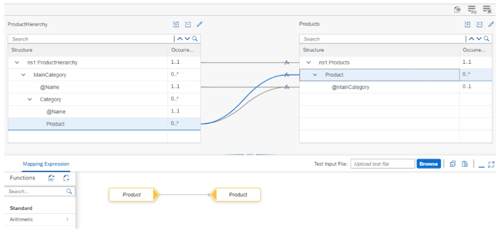
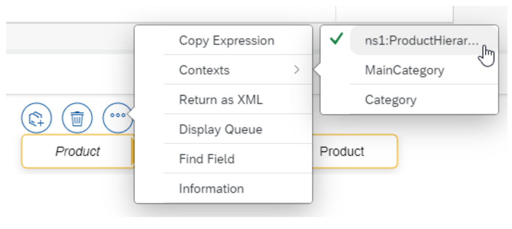
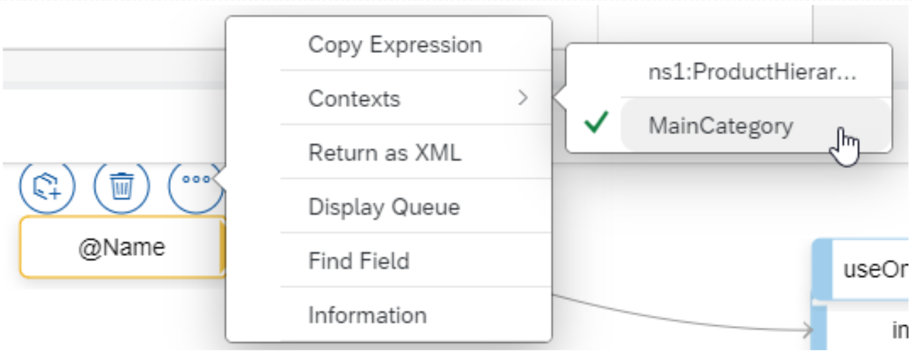
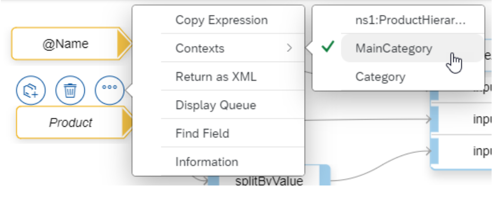
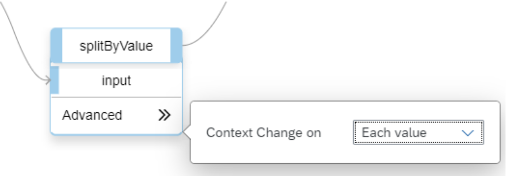
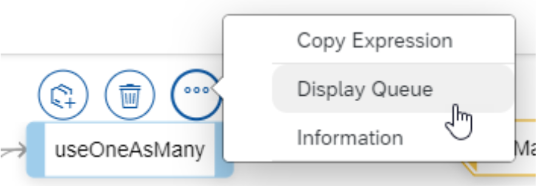

<!-- loio7a238c0b773e4aa19f2fbffb0b545a70 -->

# Set the Mapping Context

Learn how to properly set the mapping context in a message mapping.

This section shows you how the mapping context in a message mapping has to be defined to ensure that the right source values are assigned to the target fields. This is especially important in cases in which the source structure and the target structure differ in terms of the number of occurrences and the level of hierarchy.

For more information about the message mapping, see [Creating Message Mapping](creating-message-mapping-as-a-flow-step-3d5cb7f.md).


<a name="loio7a238c0b773e4aa19f2fbffb0b545a70__section_tgn_341_cnb"/>

## Use Case

Assume you have an incoming message containing product classification information in the following structure:

> ### Sample Code:  
> ```
> <?xml version="1.0" encoding="UTF-8"?>
> <ns0:ProductHierarchy xmlns:ns0="http://demo.sap.com/mapping/context">
> 	<MainCategory Name="Printers and Scanners">
> 		<Category Name="Multifunction printers">
> 			<Product>Multi Print</Product>
> 			<Product>Multi Color</Product>
> 		</Category>
> 		<Category Name="Scanners">
> 			<Product>Power Scan</Product>
> 			<Product>Photo Scan</Product>
> 		</Category>	
> 	</MainCategory>
> 	<MainCategory Name="Computer systems">
> 		<Category Name="Computer system accessories">
> 			<Product>Notebook Lock</Product>
> 			<Product>USB Stick 1 GB</Product>
> 			<Product>USB Stick 2 GB</Product>
> 			<Product>Web cam reality</Product>
> 		</Category>
> 		<Category Name="Notebooks">
> 			<Product>Notebook Basic 15</Product>
> 			<Product>Notebook Pro 15</Product>
> 		</Category>
> 		<Category Name="PCs">
> 			<Product>Gaming Monster</Product>
> 			<Product>Gaming Monster Pro</Product>
> 		</Category>		
> 	</MainCategory>
> 	<MainCategory Name="Computer components">
> 		<Category Name="Graphic cards">
> 			<Product>Hurricane GX</Product>
> 			<Product>Gladiator MX</Product>
> 		</Category>
> 		<Category Name="Telecommunication">
> 			<Product>Modem Hyper Speed</Product>
> 			<Product>ADSL progress T1</Product>
> 			<Product>ISDN direct</Product>
> 		</Category>	
> 	</MainCategory>
> </ns0:ProductHierarchy>
> ```

In a mapping, the message should be flattened into a list of products. Furthermore, for each product, the main category should be assigned as a node attribute. The outcome should look as follows:

> ### Sample Code:  
> ```
> <?xml version="1.0" encoding="UTF-8"?>
> <ns0:Products xmlns:ns0="http://demo.sap.com/mapping/context">
> 	<Product MainCategory="Printers and Scanners">Multi Print</Product>
> 	<Product MainCategory="Printers and Scanners">Multi Color</Product>
> 	<Product MainCategory="Printers and Scanners">Power Scan</Product>
> 	<Product MainCategory="Printers and Scanners">Photo Scan</Product>
> 	<Product MainCategory="Computer systems">Notebook Lock</Product>
> 	<Product MainCategory="Computer systems">USB Stick 1 GB</Product>
> 	<Product MainCategory="Computer systems">USB Stick 2 GB</Product>
> 	<Product MainCategory="Computer systems">Web cam reality</Product>
> 	<Product MainCategory="Computer systems">Notebook Basic 15</Product>
> 	<Product MainCategory="Computer systems">Notebook Pro 15</Product>
> 	<Product MainCategory="Computer systems">Gaming Monster</Product>
> 	<Product MainCategory="Computer systems">Gaming Monster Pro</Product>
> 	<Product MainCategory="Computer components">Hurricane GX</Product>
> 	<Product MainCategory="Computer components">Gladiator MX</Product>
> 	<Product MainCategory="Computer components">Modem Hyper Speed</Product>
> 	<Product MainCategory="Computer components">ADSL progress T1</Product>
> 	<Product MainCategory="Computer components">ISDN direct</Product>
> </ns0:Products>
> ```


<a name="loio7a238c0b773e4aa19f2fbffb0b545a70__section_ym5_rfb_cnb"/>

## Implementation

The example integration flow *Modeling Basics – Mapping Context* is designed in the following way.


The integration flow receives a message through an HTTPS adapter that is then mapped in a message mapping step to the target structure.

The mapping is defined as follows:

The source field *ns1:ProductHierarchy\\MainCategory\\Category\\Product* is mapped to the target field `ns1:Products\Product`.



Within the mapping expression editor, you can set the context for each field in the source structure individually. To ensure that the list of products in the target structure is complete, we need to set the message context accordingly. In the context menu of the source field, we select the message root node as context.



To understand the rational behind this setting, let's see how the message processing behaves:

1.  The XML instance is imported into the queues before the target field mappings are processed. The contexts are separated in the queue by context changes.

2.  The root `node ns1:Products` is generated.

3.  The values within the current context are mapped to the target node `ns1:Products\Product`.

4.  Once the first context has been processed, it is closed along with the `ns1:Products` context in the target structure.


The transformation is completed with the last step because all target structure fields have been processed.

Now, let’s assume that the context of the `Product` source field had been chosen on `Category` level. Then, this would have generated just a subset of the overall list of products, namely those within the first context that is separated by a context change from the next context.

So, depending on how you set the context in the source structure, you get different results.

If you set the context of `ns1:ProductHierarchy\MainCategory\Category\Product` equals `Category` \(default when creating the field mapping\), the result would only contain the products of the first category `Multifunction printers`:

> ### Sample Code:  
> ```
> <?xml version="1.0" encoding="UTF-8"?>
> <ns0:Products xmlns:ns0="http://demo.sap.com/mapping/context">
> 	<Product MainCategory="Printers and Scanners">Multi Print</Product>
> 	<Product MainCategory="Printers and Scanners">Multi Color</Product>
> </ns0:Products>
> ```

If you set the context of `ns1:ProductHierarchy\MainCategory\Category\Product` equals `MainCategory`, the result would only contain the products of the first main category `Printers and Scanners`:

> ### Sample Code:  
> ```
> <?xml version="1.0" encoding="UTF-8"?>
> <ns0:Products xmlns:ns0="http://demo.sap.com/mapping/context">
> 	<Product MainCategory="Printers and Scanners">Multi Print</Product>
> 	<Product MainCategory="Printers and Scanners">Multi Color</Product>
> 	<Product MainCategory="Printers and Scanners">Power Scan</Product>
> 	<Product MainCategory="Printers and Scanners">Photo Scan</Product>
> </ns0:Products>
> ```

If you set the context of `ns1:ProductHierarchy\MainCategory\Category\Product` equals `ns1:ProductHierarchy` \(root\), you get the complete list as shown above.

For mapping the `MainCategory` attribute of the target field `ns1:Products\Product`, we use the standard function `useOneAsMany` in order to duplicate the main category name. The first argument of the function is the value that should be passed to the target, here the `Name` attribute of the `MainCategory` node. The 2nd argument defines how often the value needs to be repeated in the target whereas the 3rd argument defines the context change in the target. Latter both arguments are mapped from the source field `ns1:ProductHierarchy\MainCategory\Category\Product`.


To ensure that the proper main category name is assigned to the products, the context of both the `Name` attribute of the `MainCategory` node and the `Product` field needs to be set to `MainCategory`.





The result of the standard function `useOneAsMany` should have a context change after each value. Otherwise, the 2nd and the 3rd products would be assigned the wrong main categories, namely Computer systems and Computer components, respectively. Also, the rest of the products would have an empty main category attribute. So, we add the standard function `splitByValue` with the option of the Context Change on Each value between the `Product` source field and the 3rd input argument. As mentioned above, the 3rd argument actually defines the context change in the target.



Once you've uploaded a sample file to the message mapping, you can display the context of the mapping steps. Select *Display Queue* from the context menu.



The message queue of the `useOneAsMany` function looks as follows. Here, you can see that the main category `Printers and Scanners` is repeated until there's a context change within the 2nd input argument. According to the context setting above, the context changes when the main category changes as intended.


**Related Information**  


[Creating Message Mapping as a Flow Step](creating-message-mapping-as-a-flow-step-3d5cb7f.md "")

