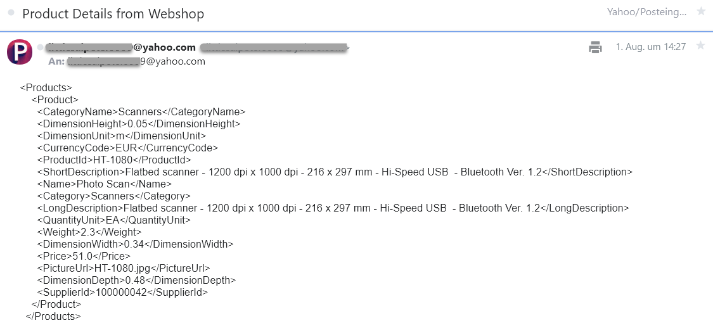

<!-- loio4844baa02d9f4e319dd3916c90a52e28 -->

# Set Up the SOAP Client and Start Message Processing

Set up a SOAP client that represents the sender system.

You can use a SOAP client of your choice to send a SOAP message to SAP Cloud Integration.

When configuring the SOAP client, ensure the following:

-   The authentication is defined in such a way that the SOAP client is authorized to send a request to SAP Cloud Integration and process the integration flow.

    In the SOAP adapter settings for User Role-based authorization, make sure that you specify the same credentials for the user associated with the SOAP client as for the user who is authorized to process the integration flow \(in our example, this is the user who is assigned the role `ESBMessaging.send`\).

-   As the address for the SOAP request, enter the endpoint address that is displayed for the integration flow artifact \(in the *Monitor* section of the Web UI under *Manage Integration Content*\).

-   To define the message structure for our example integration flow, you can use a WSDL file with the content from the info box below. Simply copy and paste the content into a text editor, save the file with extension `.wsdl`, and import this WSDL file into your SOAP client \(if this is supported\).


Send the SOAP request with a dedicated value for the productIdentifier \(for example, HT-1080\).

Check your e-mail account. You should find an e-mail with the following content:



Send another SOAP message with another productIdentifier \(for example, HT-2001\), and you receive details of another product.


<a name="loio4844baa02d9f4e319dd3916c90a52e28__section_ryf_srm_q2b"/>

## WSDL File Defining the Inbound Message

> ### Sample Code:  
> ```
> <?xml version="1.0" encoding="UTF-8"?>
> <wsdl:definitions name="Inbound_Async"
> 	targetNamespace="http://cloudintegration.sap.com/demo" xmlns:p1="http://cloudintegration.sap.com/demo"
> 	xmlns:wsp="http://schemas.xmlsoap.org/ws/2004/09/policy"
> 	xmlns:wsu="http://docs.oasis-open.org/wss/2004/01/oasis-200401-wss-wssecurity-utility-1.0.xsd"
> 	xmlns:wsdl="http://schemas.xmlsoap.org/wsdl/">
> 	<wsdl:documentation />
> 	<wsp:UsingPolicy wsdl:required="true" />
> 	<wsp:Policy wsu:Id="OP_Inbound_Async" />
> 	<wsdl:types>
> 		<xsd:schema targetNamespace="http://cloudintegration.sap.com/demo"
> 			xmlns:xsd="http://www.w3.org/2001/XMLSchema" xmlns="http://cloudintegration.sap.com/demo">
> 			<xsd:element name="Order_MT" type="Order_DT" />
> 			<xsd:complexType name="Order_DT">
> 				<xsd:sequence>
> 					<xsd:element name="productIdentifier" type="xsd:string" />
> 				</xsd:sequence>
> 			</xsd:complexType>
> 		</xsd:schema>
> 	</wsdl:types>
> 	<wsdl:message name="Order_MT">
> 		<wsdl:documentation />
> 		<wsdl:part name="Order_MT" element="p1:Order_MT" />
> 	</wsdl:message>
> 	<wsdl:portType name="Inbound_Async">
> 		<wsdl:documentation />
> 		<wsdl:operation name="Inbound_Async">
> 			<wsdl:documentation />
> 			<wsp:Policy>
> 				<wsp:PolicyReference URI="#OP_Inbound_Async" />
> 			</wsp:Policy>
> 			<wsdl:input message="p1:Order_MT" />
> 		</wsdl:operation>
> 	</wsdl:portType>
> 	<wsdl:binding name="Inbound_AsyncBinding" type="p1:Inbound_Async">
> 		<soap:binding style="document"
> 			transport="http://schemas.xmlsoap.org/soap/http" xmlns:soap="http://schemas.xmlsoap.org/wsdl/soap/" />
> 		<wsdl:operation name="Inbound_Async">
> 			<soap:operation soapAction="http://sap.com/xi/WebService/soap1.1"
> 				xmlns:soap="http://schemas.xmlsoap.org/wsdl/soap/" />
> 			<wsdl:input>
> 				<soap:body use="literal" xmlns:soap="http://schemas.xmlsoap.org/wsdl/soap/" />
> 			</wsdl:input>
> 		</wsdl:operation>
> 	</wsdl:binding>
> </wsdl:definitions>
> 
> ```

