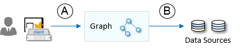

<!-- loio24df2191481e47cdafced83aeba97222 -->

# Setting Up Data Sources

SAP business systems implement their own mechanisms to set up trust, manage users, and validate their identities. For Graph to communicate with these systems as data sources, two steps are required:

1.  The data sources in the landscape must trust Graph as a consumer. Graph relies on SAP BTP; the SAP BTP subaccount, with its SAP Authorization and Trust Management instance, is a central point of trust for the data sources.

    Each data source has a different way of establishing this trust. For example, SAP S/4HANA Cloud, extended edition requires setting up corresponding communication systems by the administrator of the system where theSAP BTP subaccount certificate is uploaded. For more information, see [Connect to Your Business Systems](connect-to-your-business-systems-1a0dd22.md).

2.  An SAP BTP administrator sets up connectivity with each data source in the landscape and configures the security method to be used by Graph \(B\).

    

    Here, Graph leverages SAP BTP's destination service. Business systems trust this service to implement a SAML bearer token flow and Graph uses the destinations to get the system locations and access credentials. Different data sources have different assumptions about the granularity of destinations. For example, SAP S/4HANA Cloud, extended edition requires a destination for each OData service \(API\) using a communication scenario, while only a single destination is needed for an SAP Sales Cloud or SAP SuccessFactors data source. For more information, see [Connect to Your Business Systems](connect-to-your-business-systems-1a0dd22.md).

Destinations can be configured via identity propagation or via a technical user.

When a data source is configured for identity propagation \(also known as principal propagation\) by the administrator, Graph communicates with it using the identity of the human user, which it extracts from the access token received in the request \(A\) from the client application. On the other hand, when configured with a technical user method, Graph will only validate the received access token, and then uses the authentication details specified in the destination record to communicate with the data source \(B\).

For identity propagation, Graph uses a SAML bearer token grant \(option `OAuthSAMLBearer Assertion` for authentication in the destination configuration\). The SAML bearer token is a token exchange method, where the token identifying an already authenticated user in one system \(SAP BTP subaccount\) is exchanged for a token identifying the user in another system \(data source\).

The choice of authentication method using a technical user is determined by the data source and can be as simple as basic user and password authentication.

Overall, identity propagation is a preferred authentication option. In either case, the specific authorizations of the business user or technical user are delegated to the business system, where proper permission assignments \(such as business roles\) are assumed to be in place.

Using a technical user identity to proceed with actions in a business system obscures the real user, making user actions difficult to audit. Also, technical users tend to collect authorizations over time, which may lead to unintended risk. The advantage of identity propagation is that authorization is more fine-grained, matching the roles of the business user. We recommend restricting the use of technical users to the cases where identity propagation is not possible, such as B2C use cases.

Also note that the use of technical users may have an impact on your compliance with the licensing terms and conditions of your SAP software usage.

