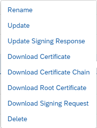

<!-- loio620967bc86fb44c5826a8cafc5a0dd0a -->

# Setting Up the Key Pairs and Certificates

To be able to operate the example integration flows, you need to set up the required key pairs and certificates for the sender and the receiver.

<a name="loio620967bc86fb44c5826a8cafc5a0dd0a__section_pq1_nzb_xkb"/>

## Options to Get the Required Certificates

Client certificates are based on a key pair comprising a private key and a public key. There are the following options to get a key pair:

-   Option 1 \(relevant for outbound communication\):

    For productive tenants, SAP predelivers a key pair with one of the following aliases:

    -   `sap_cloudintegrationcertificate`

    -   `hcicertificate`

    -   `hcicertificate1`

-   Option 2:

    For S users, you can request an SAP Single Sign-On \(SSO\) Passport. You can use the SAP SSO Passport also for client certificate authentication.

    More information: [Single Sign-On with SAP Passports](https://support.sap.com/en/my-support/single-sign-on-passports.html) 

-   Option 3 \(relevant for outbound communication\):

    You can create a new key pair by yourself using the SAP Integration Suite keystore management.

    To create a new key pair, open the *Monitor* section and under *Manage Security* select the *Keystore* tile. Choose *Add*** \> *Key Pair*.

    More information: [Creating X.509 Keys](../40-RemoteSystems/creating-x-509-keys-ec605c7.md)

-   Option 4:

    You can also create a key pair with tools like OpenSSL.

When configuring inbound communication, make sure that the client certificate signing request is signed by a root certificate authority \(CA\) that is supported by the SAP load balancer. The supported CAs are listed under [Load Balancer Root Certificates Supported by SAP](../40-RemoteSystems/load-balancer-root-certificates-supported-by-sap-4509f60.md).

For the sender adapter configuration \(associated with inbound communication\), we recommend the following procedure to set up client certificate authentication \(also used in this guideline\):

Set up a certificate-to-user mapping in combination with *User Role* authorization for calling the integration flow.

> ### Note:  
> There's an alternative option.
> 
> You can directly upload the client certificate to the relevant sender adapter. However, whenever a change is required in this configuration \(for example, because additional client certificates are added\), a redeployment of the integration flow is required. As a result, a short downtime of the integration flow processing can't be avoided.
> 
> Therefore, it isn't recommended to use this option.

<a name="loio620967bc86fb44c5826a8cafc5a0dd0a__section_ifc_vff_ykb"/>

## Tasks

1.  Install the key pair for the sender.

    The procedure depends on the chosen option of getting the key pair.

    -   Option 1:

        The key pair, predelivered by SAP \(option 1\) is already signed by a trusted root CA that is also supported by the SAP load balancer. However, be aware of the fact that private keys can't be exported from the SAP Cloud Integration keystore. Therefore, you can't use this key pair for inbound client certificate authentication. You can only use it to set up outbound communication or in scenarios where SAP Cloud Integration calls SAP Integration Suite . This variant is implemented by the example integration flows.

    -   Option 2:

        You receive an already signed certificate whose signing root CA is trusted by the SAP load balancer. You need to import it into the keystore.

        More information:

        [Uploading a Certificate](uploading-a-certificate-03cf78a.md)

    -   Option 3:

        After creating the key pair, download the certificate signing request. To do that, open the *Monitor* section and under *Manage Security* select the *Keystore* tile.

        Select the newly uploaded key pair and in the Actions column choose *Download*** \> *Download Signing Request*.

        

        Once the certificate signing request has been downloaded \(as `.csr` file\), make sure to get it signed by one of the root CAs, supported by the SAP load balancer. Update the key pair with the signing response file.

        More information: [Updating a Key Pair with a Signing Response](updating-a-key-pair-with-a-signing-response-4242f01.md)

    -   Option 4:

        In this case, you can also use a tool of your choice to generate the certificate signing request. You need to import it into the keystore.

        More information:

        [Uploading a Certificate](uploading-a-certificate-03cf78a.md)

2.  Configure the client certificate-to-user-mapping in the receiver.

    Using SAP BTP cockpit, create a service instance and service key and specify the user and certificate as described under:

    [Client Certificate Authentication for Integration Flow Processing](../40-RemoteSystems/client-certificate-authentication-for-integration-flow-processing-7f84d16.md)

    See also: [Setup Secure HTTP Inbound Connection with Client Certificates and Custom Roles in Cloud Foundry](https://blogs.sap.com/2019/08/14/cloud-integration-on-cf-how-to-setup-secure-http-inbound-connection-with-client-certificates/)

