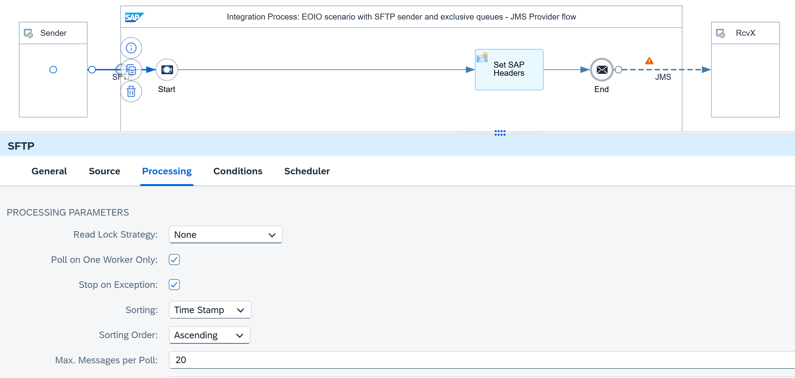
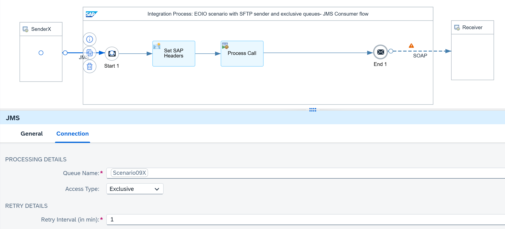

<!-- loio3d7fd37fc51c4cfea5ba05746a93542c -->

# SFTP Sender Scenario

The following assumptions apply for the design of this scenario:

-   The receiver is idempotent, which means that it can detect and ignore duplicate messages.
-   Files are polled from an SFTP server whereas the processing order of the files needs to be preserved.

An SFTP sender adapter is used to poll files from an SFTP server. Configure the SFTP adapter as follows to ensure that files are processed in the required order:

-   The polling process must be performed on one worker node at a time.
-   The sorting order must be set according to your needs.
-   You can either stop processing on exceptions or not. If you stop processing on exceptions, you can poll files in batches, that is, gather multiple files in each poll. Otherwise, select to process one single file per poll.

An exclusive JMS queue is used where the messages are directly stored once they reach the middleware, Cloud Integration. This ensures the following:

-   If you persist the messages in a JMS queue, Cloud Integration can carry out the retry of the message delivery if an error occurs.
-   If you use an exclusive JMS queue, the message sequence can be preserved.

<a name="loio3d7fd37fc51c4cfea5ba05746a93542c__section_hqy_13b_y2c"/>

## Example Scenario

The following example integration flow consists of two integration processes.

The first integration process contains an SFTP sender adapter and a JMS receiver adapter. The messages are polled from the SFTP server and directly stored in a JMS queue after they're received from the sender system. The access type of the JMS queue is defined as *Exclusive*.

On the Processing tab of the SFTP sender adapter, the *Poll on One Worker Only* flag is selected. Whit this, the polling process is performed on a single worker node at a time. If you polled on multiple worker nodes, the order of file processing wouldn’t be guaranteed.

For the sorting and the sorting order, you can select your desired option. Here, we assume that you want to process messages ordered by the time they were stored on the SFTP server.

If you want to gather multiple files in one poll entered in the *Max. Messages per Poll* parameter, select the *Stop on Exception* flag to ensure that failed files aren't overtaken.

> ### Note:  
> If you deselect the *Stop on Exception* flag, the *Max. Messages per Poll* must be `1` to ensure the processing order. However, for an improved runtime behavior, we recommend gathering multiple files in one poll and selecting the *Stop on Exception* flag.

See [Configure the SFTP Sender Adapter](configure-the-sftp-sender-adapter-2de9ee5.md).

The content modifier in the integration process model is only used to define the headers `SAP_Sender` and `SAP_Receiver` for an improved monitoring.

The second integration process reads the message from the same JMS queue and carries out the integration flow steps. Here, ensure that the access type of the JMS queue is defined as *Exclusive* as well. Otherwise, the deployment of the integration flow fails.

On the Processing tab of the SAP RM receiver adapters, set the SAP RM Message ID Determination property to *Map*. As source for SAP RM Message ID, use the header `SAP_MessageProcessingLogID` with the expression `${header.SAP_MessageProcessingLogID}`, which is constant throughout all potential retries from the JMS queues. Cloud Integration uses the mapped unique ID as SAP RM Message ID.

See [Configure the SOAP \(SAP RM\) Receiver Adapter](configure-the-soap-sap-rm-receiver-adapter-8366495.md).

These integration flow settings ensure that Cloud Integration passes on a unique ID to the receiver system. If there's an error during message processing, Cloud Integration retries the message from the JMS queue. Because the retry is performed within the same instance of the message processing log, the message processing log ID and, as a result, the mapped unique ID remain the same.

Furthermore, because the JMS queue has the access type `Exclusive`, only one consumer can access the queue at any time. Therefore, all successor messages keep waiting until the predecessor message was processed successfully. This setting guarantees that messages are processed in the exact order in which they're stored on the JMS queue.

