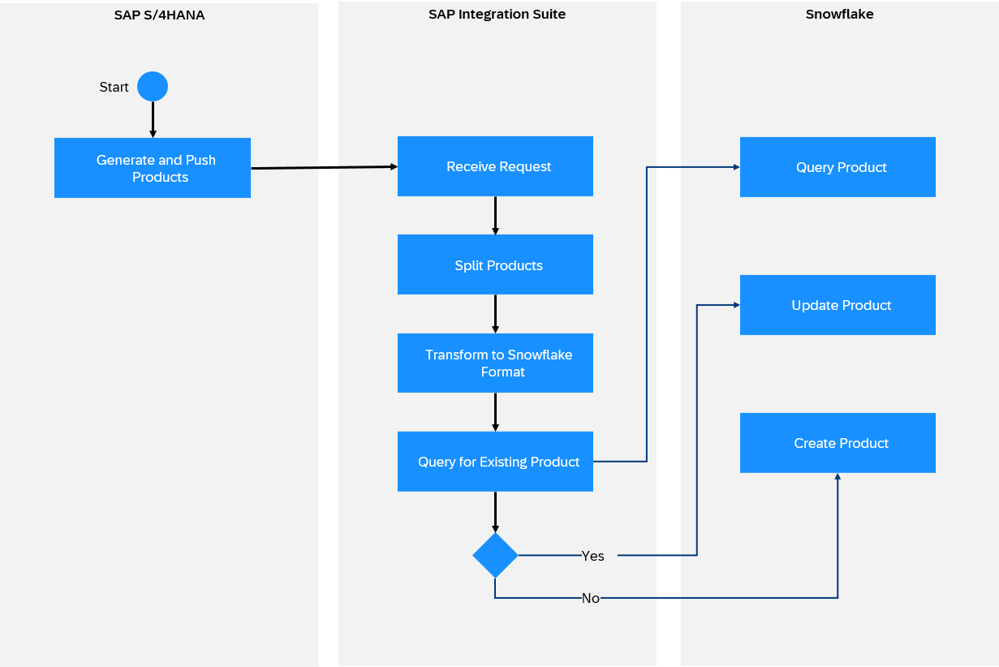

<!-- loio1299e684c3464a0b82626c8ebee79e25 -->

# Snowflake Receiver Adapter

The Snowflake receiver adapter connects SAP Integration Suite to Snowflake.

> ### Note:  
> This adapter is available on SAP Business Accelerator Hub.
> 
> For more information, see [Consuming Integration Adapters from SAP Business Accelerator Hub](consuming-integration-adapters-from-sap-business-accelerator-hub-b9250fb.md).
> 
> The availability of the adapter is dependent on your SAP Integration Suite service plan. For more information about different service plans and their supported feature set, see SAP Notes [2903776](https://launchpad.support.sap.com/#/notes/2903776) and [3188446](https://launchpad.support.sap.com/#/notes/3188446).

> ### Note:  
> This adapter exchanges data with a remote component that might be outside the scope of SAP. Make sure that the data exchange complies with your company’s policies.

Snowflake is a cloud computing-based data company that provides cloud-based data storage and analytics services. The Snowflake adapter helps you exchange data between the two systems.


<a name="loio1299e684c3464a0b82626c8ebee79e25__section_cvk_3z4_tbc"/>

## How the Snowflake Receiver Adapter Works

If you have configured a Snowflake receiver adapter, the data exchange is performed as follows at runtime: SAP sends the request to Snowflake \(this is a receiver system\) through SAP Integration Suite. Snowflake works on the request and sends back the data to SAP.

For Example, SAP S4/HANA generates and pushes the list of Products to be copied to Snowflake. SAP Integration Suite receives the request and transforms it to the required Snowflake format. SAP Integration Suite then queries the existing Products in Snowflake. It executes the UPDATE operation if data exists or else, INSERTS a new record for non-existent Products.




<a name="loio1299e684c3464a0b82626c8ebee79e25__section_bvr_jz4_tbc"/>

## Configuring the Snowflake Receiver Adapter

Once you have created a receiver channel and selected the Snowflake receiver adapter, you can configure the following attributes.

Select the *Connection* tab.

The *Connection* tab contains the connection and the authentication parameters for Snowflake.

**Connection**


<table>
<tr>
<th valign="top">

Parameter

</th>
<th valign="top">

Description

</th>
</tr>
<tr>
<td valign="top">

*Authentication* 

</td>
<td valign="top">

The authentication method used.

Default: *Database Account*

</td>
</tr>
<tr>
<td valign="top">

*Credential Name Alias* 

</td>
<td valign="top">

Specify the name of the *User Credentials* artifact \(to be deployed in the *Monitor* \> *Integrations and APIs* section under *Security Material*\). The *User Credentials* artifact includes the username/password credentials.

</td>
</tr>
<tr>
<td valign="top">

*Address* 

</td>
<td valign="top">

Specify the address of the Snowflake application to be used for the connection. This address typically contains an account identifier. The account identifier is a combination of the organization and account name separated by a hyphen\(`orgname-account_name`\).

Example: `jdbc:snowflake://<mydb-snow143>.snowflakecomputing.comecomputing`

</td>
</tr>
<tr>
<td valign="top">

*Database* 

</td>
<td valign="top">

Specify the name of the database.

Example: `SNOWFLAKE_SAMPLE`

</td>
</tr>
<tr>
<td valign="top">

*Schema* 

</td>
<td valign="top">

Specify the name of the schema to be accessed.

Example: `Public`

</td>
</tr>
<tr>
<td valign="top">

*Warehouse* 

</td>
<td valign="top">

Specify the name of the Snowflake warehouse. If the warehouse provided is not found or incorrect, the system uses the default warehouse.

> ### Note:  
> A warehouse is a cluster of computing resources in Snowflake.


</td>
</tr>
</table>

Select the *Processing* tab.

The *Processing* tab contains all operational-related configurations for the Snowflake adapter.

**Processing**


<table>
<tr>
<th valign="top">

Parameter

</th>
<th valign="top">

Description

</th>
</tr>
<tr>
<td valign="top">

*Operation* 

</td>
<td valign="top">

Specify the type of database operation you want to execute in Snowflake.

</td>
</tr>
<tr>
<td valign="top">

*Table* 

</td>
<td valign="top">

The table on which the operation is to be performed.

Example: `employee`

> ### Note:  
> This is a mandatory field.


</td>
</tr>
<tr>
<td valign="top">

*Response* 

</td>
<td valign="top">

Select the response output format.

Acceptable values: *Application/JSON*, *Application/XML*

</td>
</tr>
<tr>
<td valign="top">

*Response Fields* 

</td>
<td valign="top">

Specify the columns to be returned in the response. Separate the fields with a comma.

Example: `id,firstname,lastname`

> ### Note:  
> If left empty, the asterisk \(`*)` is assumed by default, and all fields of the table are returned.


</td>
</tr>
<tr>
<td valign="top">

*Where Clause* 

</td>
<td valign="top">

Specify the “where” clause to be performed on the table.

Example: `"age >= 25"`

</td>
</tr>
<tr>
<td valign="top">

*Orderby Statement* 

</td>
<td valign="top">

Specify the “order by” clause to sort the result set in ascending\(asc\) or descending\(desc\) order..

Acceptable values: *DESC* and *ASC*

Default: *ASC*

</td>
</tr>
<tr>
<td valign="top">

*Limit* 

</td>
<td valign="top">

Specify the maximum number of rows to be fetched. If no limit is provided all the rows will be sent in the response.

Example: `50`

</td>
</tr>
<tr>
<td valign="top">

*Offset* 

</td>
<td valign="top">

Specify the offset value for the rows to be fetched. Essentially, the number of rows to be ignored before records are retrieved.

> ### Note:  
> The *Offset* field is to be used in conjunction with *Limit*. In such a case, *Offset* value is ignored.


</td>
</tr>
<tr>
<td valign="top">

*Staging Location* 

</td>
<td valign="top">

Select the location for storing data files \(stage\) for loading and unloading data.

Acceptable values: *Amazon S3*, *Google Cloud Storage*, *Microsoft Azure*

</td>
</tr>
<tr>
<td valign="top">

*Access Type* 

</td>
<td valign="top">

The access type for external staging location.

Acceptable values: *Storage Integration*, *AWS IAM User Credentials*

</td>
</tr>
<tr>
<td valign="top">

*Stage* 

</td>
<td valign="top">

Specify the name of stage that stores file.

Example: `INTER_STAGE`

</td>
</tr>
<tr>
<td valign="top">

*File* 

</td>
<td valign="top">

Specify the name of the files to be stored in the *Stage*. Enclose the filenames in single quotes separated by a comma.

Example: `'file.json','file2.json'`

> ### Note:  
> All file extensions must be the same. JSON, CSV, and XML are currently supported. If left empty, all the files are picked up and a single file is created in *Stage*.


</td>
</tr>
<tr>
<td valign="top">

*File Format* 

</td>
<td valign="top">

Select the file format for exporting files using *UNLOAD*. You can choose between *JSON* or *CSV*.

</td>
</tr>
<tr>
<td valign="top">

*On Error* 

</td>
<td valign="top">

Select action when an error is encountered. Possible actions include:

-   *Abort* 

    Stop the operation if any error is found.

-   *Continue* 

    Continue the operation despite errors.

-   *Skip File* 

    Skip the current operation for file or record, if an error is found.


</td>
</tr>
<tr>
<td valign="top">

*Stop on record failure* 

</td>
<td valign="top">

Enable to stop the update operation in case a record fails. If unchecked, Snowflake continues processing the next record.

</td>
</tr>
<tr>
<td valign="top">

*SQL Statement* 

</td>
<td valign="top">

Specify the SQL statement to be executed.

For multiple queries to be executed as a single statement, specify queries in a single line separated by semicolon.

Example:

```
CREATE TABLE PERSON;DROP TABLE DEPARTMENT.
```


</td>
</tr>
<tr>
<td valign="top">

*Multi-statement execute* 

</td>
<td valign="top">

Enable to use multi-statement execution for the execute operation. If unchecked, single-statement execution will be performed.

</td>
</tr>
<tr>
<td valign="top">

*Number of SQL queries* 

</td>
<td valign="top">

Specify the number of SQL queries to be executed. If left at the default value of `0`, the number of statements that will be executed is variable.

</td>
</tr>
<tr>
<td valign="top">

*AWS Key ID Alias* 

</td>
<td valign="top">

Specify the alias for AWS credentials.

This is the name of the *User Credentials* artifact \(to be deployed in the *Monitor* \> *Integrations and APIs* section under *Security Material*\). The *User Credentials* artifact includes the AWS credentials.

</td>
</tr>
<tr>
<td valign="top">

*AWS Secret Key Alias* 

</td>
<td valign="top">

Specify the AWS Secret Key Alias.

</td>
</tr>
<tr>
<td valign="top">

*AWS S3 URI* 

</td>
<td valign="top">

Specify the relative path for S3 bucket to be linked to *Stage*.

Example: `s3://staging-bucket/`

</td>
</tr>
<tr>
<td valign="top">

*Schema* 

</td>
<td valign="top">

Specify the schema of the tables. If left empty, all the tables are returned.

</td>
</tr>
</table>

