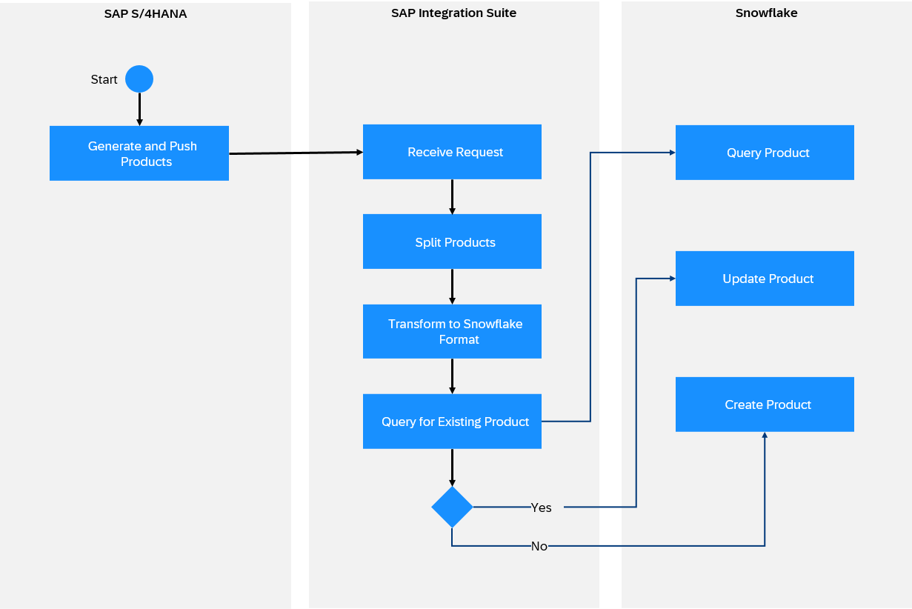

<!-- loio1299e684c3464a0b82626c8ebee79e25 -->

# Snowflake Receiver Adapter

The Snowflake receiver adapter connects SAP Integration Suite to Snowflake.

> ### Note:  
> This adapter is available on SAP Business Accelerator Hub.
> 
> For more information, see [Consuming Integration Adapters from SAP Business Accelerator Hub](consuming-integration-adapters-from-sap-business-accelerator-hub-b9250fb.md).
> 
> The availability of the adapter is dependent on your SAP Integration Suite service plan. For more information about different service plans and their supported feature set, see SAP Notes [2903776](https://launchpad.support.sap.com/#/notes/2903776) and [3188446](https://launchpad.support.sap.com/#/notes/3188446).

> ### Note:  
> This adapter exchanges data with a remote component that might be outside the scope of SAP. Make sure that the data exchange complies with your company’s policies.

Snowflake is a cloud computing-based data company that provides cloud-based data storage and analytics services. The Snowflake adapter helps you exchange data between the two systems.


<a name="loio1299e684c3464a0b82626c8ebee79e25__section_cvk_3z4_tbc"/>

## How the Snowflake Receiver Adapter Works

If you have configured a Snowflake receiver adapter, the data exchange is performed as follows at runtime: SAP sends the request to Snowflake \(this is a receiver system\) through SAP Integration Suite. Snowflake works on the request and sends the data to SAP.

For Example, SAP S4/HANA generates and pushes the list of Products to be copied to Snowflake. SAP Integration Suite receives the request and transforms it to the required Snowflake format. SAP Integration Suite then queries the existing Products in Snowflake. It executes the *Update* operation if data exists or else performs an *Insert* a new record for non-existent Products.




<a name="loio1299e684c3464a0b82626c8ebee79e25__section_bvr_jz4_tbc"/>

## Configuring the Snowflake Receiver Adapter

Once you have created a receiver channel and selected the Snowflake receiver adapter, you can configure the following attributes.

**Connection**


<table>
<tr>
<th valign="top">

Parameter

</th>
<th valign="top">

Description

</th>
</tr>
<tr>
<td valign="top">

*Authentication* 

</td>
<td valign="top">

Select the authentication method to be used:

-   *Database Account*
-   *Key-Pair*


</td>
</tr>
<tr>
<td valign="top">

*Credential Name* 

</td>
<td valign="top">

Specify the name of the *User Credentials* artifact \(to be deployed in the *Monitor* \> *Integrations and APIs* section under *Security Material*\). The *User Credentials* artifact includes the username/password credentials.

</td>
</tr>
<tr>
<td valign="top">

*User* 

\(Only if *Authentication* is set as *Key-Pair*\)

</td>
<td valign="top">

Specify the user associated with the Snowflake account.

</td>
</tr>
<tr>
<td valign="top">

*Private Key Alias*

\(Only if *Authentication* is set as *Key-Pair*\)

</td>
<td valign="top">

Specify the alias pointing to the Key-pair associated to the user.

</td>
</tr>
<tr>
<td valign="top">

*Address* 

</td>
<td valign="top">

Specify the JDBC endpoint URL of the Snowflake application to be used for the connection. This address typically contains an account identifier. The account identifier is a combination of the organization and account name separated by a hyphen\(`orgname-account_name`\).

Example: `jdbc:snowflake://<mydb-snow143>.snowflakecomputing.comecomputing`

</td>
</tr>
<tr>
<td valign="top">

*Database* 

</td>
<td valign="top">

Specify the name of the database.

Example: `SNOWFLAKE_SAMPLE`

</td>
</tr>
<tr>
<td valign="top">

*Schema* 

</td>
<td valign="top">

Specify the name of the schema to be accessed.

Example: `Public`

</td>
</tr>
<tr>
<td valign="top">

*Warehouse* 

</td>
<td valign="top">

Specify the name of the Snowflake warehouse. If the warehouse provided is not found or incorrect, the system uses the default warehouse.

> ### Note:  
> A warehouse is a cluster of computing resources in Snowflake.


</td>
</tr>
<tr>
<td valign="top">

*Connection Parameters*

</td>
<td valign="top">

Specify the optional connection parameters in a query format.

> ### Note:  
> If you need to set parameter values that use spaces, ampersands, equals signs, or other special characters, you should URL-encode the special characters.
> 
> Example: `"?query_tag='folder%3Dfolder1%20folder2%26"`


</td>
</tr>
</table>

**Processing**


<table>
<tr>
<th valign="top">

Parameter

</th>
<th valign="top">

Description

</th>
</tr>
<tr>
<td valign="top">

*Operation* 

</td>
<td valign="top">

Specify the type of operation to be executed in Snowflake.

> ### Example:  
> *Insert*
> 
> -   If you choose to use an XML payload, some guidelines must be followed. You must include the datatype attribute for the fieldname in the Insert payload. Ensure that metadata/row tags are case sensitive and must be in lower case.
> 
>     ```
>     <root>
>     	<metadata>
>     		<fieldname datatype="NUMBER">ID</fieldname>
>     		<fieldname datatype="VARCHAR">FIRST_NAME</fieldname>
>     		<fieldname datatype="VARCHAR">LAST_NAME</fieldname>
>     		<fieldname datatype="VARIANT">EMAIL</fieldname>
>     	</metadata>
>     	<rows>
>     		<row>
>     		<ID>10002</ID>
>     		<FIRST_NAME>Mark</FIRST_NAME>
>     		<LAST_NAME>Adams</LAST_NAME>
>     		<EMAIL>{"subject":"Message","emailContent":"Old Content"}</EMAIL>
>     		</row>
>     		<row>
>     		<ID>10003</ID>
>     		<FIRST_NAME>James</FIRST_NAME>
>     		<LAST_NAME>Castor</LAST_NAME>
>     		<EMAIL>{"subject":"Message","emailContent":"New Content"}</EMAIL>
>     		</row>
>     	</rows>
>     </root>									
>     ```
> 
> -   For XSDs, a structure has been outlined below:
> 
>     > ### Code Syntax:  
>     > ```
>     > <?xml version="1.0" encoding="utf-8"?>
>     > 
>     > <xs:schema attributeFormDefault="unqualified" elementFormDefault="qualified" xmlns:xs="http://www.w3.org/2001/XMLSchema">
>     >   <xs:element name="root">
>     >     <xs:complexType>
>     >       <xs:sequence>
>     >         <xs:element name="metadata">
>     >           <xs:complexType>
>     >             <xs:sequence>
>     >               <xs:element maxOccurs="unbounded" name="fieldname">
>     >                 <xs:complexType>
>     >                   <xs:simpleContent>
>     >                     <xs:extension base="xs:string">
>     >                       <xs:attribute name="datatype" type="xs:string" use="required" />
>     >                     </xs:extension>
>     >                   </xs:simpleContent>
>     >                 </xs:complexType>
>     >               </xs:element>
>     >             </xs:sequence>
>     >           </xs:complexType>
>     >         </xs:element>
>     >         <xs:element name="rows">
>     >           <xs:complexType>
>     >             <xs:sequence>
>     >               <xs:element maxOccurs="unbounded" name="row">
>     >                 <xs:complexType>
>     >                   <xs:sequence>
>     >                     <xs:element name="ID" type="xs:unsignedShort" />
>     >                     <xs:element name="FIRST_NAME" type="xs:string" />
>     >                     <xs:element name="LAST_NAME" type="xs:string" />
>     >                     <xs:element name="EMAIL" type="xs:string" />
>     >                   </xs:sequence>
>     >                 </xs:complexType>
>     >               </xs:element>
>     >             </xs:sequence>
>     >           </xs:complexType>
>     >         </xs:element>
>     >       </xs:sequence>
>     >     </xs:complexType>
>     >   </xs:element>
>     > </xs:schema>
>     > ```
> 
> 
> *Update* 
> 
> -   If you choose to use an XML payload, remember the metadata/row tags are case sensitive and must be used in lowercase.
> 
>     > ### Note:  
>     > For Update, if your XML payload only contains the metadata \(and fieldname\) entries, the datatype will be updated. To update data, include both the metadata and row tags.
> 
>     ```
>     <root>
>     	<metadata>
>     		<fieldname datatype="NUMBER">PERSON_ID</fieldname>
>     		<fieldname datatype="VARCHAR">FIRST_NAME</fieldname>
>     		<fieldname datatype="VARCHAR">LAST_NAME</fieldname>
>     		<fieldname datatype="VARCHAR">EMAIL</fieldname>
>     	</metadata>
>     	<rows>
>     		<row>
>     			<PERSON_ID>1023000</PERSON_ID>
>     			<FIRST_NAME>James</FIRST_NAME>
>     			<LAST_NAME>Ben</LAST_NAME>
>     			<EMAIL>Quarterly Update</EMAIL>
>     			<WHERE>PERSON_ID=1023</WHERE>
>     		</row>
>     		<row>
>     			<PERSON_ID>1011000</PERSON_ID>
>     			<FIRST_NAME>Mark</FIRST_NAME>
>     			<LAST_NAME>Davies</LAST_NAME>
>     			<EMAIL>Quarterly</EMAIL>
>     			<WHERE>PERSON_ID=1011</WHERE>
>     		</row>
>     	</rows>
>     </root>	
>     ```
> 
> -   For XSDs, a structure has been outlined below:
> 
>     > ### Code Syntax:  
>     > ```
>     > <?xml version="1.0" encoding="utf-8"?>
>     > <xs:schema attributeFormDefault="unqualified" elementFormDefault="qualified" xmlns:xs="http://www.w3.org/2001/XMLSchema">
>     >   <xs:element name="root">
>     >     <xs:complexType>
>     >       <xs:sequence>
>     >         <xs:element name="metadata">
>     >           <xs:complexType>
>     >             <xs:sequence>
>     >               <xs:element maxOccurs="unbounded" name="fieldname">
>     >                 <xs:complexType>
>     >                   <xs:simpleContent>
>     >                     <xs:extension base="xs:string">
>     >                       <xs:attribute name="datatype" type="xs:string" use="required" />
>     >                     </xs:extension>
>     >                   </xs:simpleContent>
>     >                 </xs:complexType>
>     >               </xs:element>
>     >             </xs:sequence>
>     >           </xs:complexType>
>     >         </xs:element>
>     >         <xs:element name="rows">
>     >           <xs:complexType>
>     >             <xs:sequence>
>     >               <xs:element maxOccurs="unbounded" name="row">
>     >                 <xs:complexType>
>     >                   <xs:sequence>
>     >                     <xs:element name="PERSON_ID" type="xs:unsignedInt" />
>     >                     <xs:element name="FIRST_NAME" type="xs:string" />
>     >                     <xs:element name="LAST_NAME" type="xs:string" />
>     >                     <xs:element name="EMAIL" type="xs:string" />
>     >                     <xs:element name="WHERE" type="xs:string" />
>     >                   </xs:sequence>
>     >                 </xs:complexType>
>     >               </xs:element>
>     >             </xs:sequence>
>     >           </xs:complexType>
>     >         </xs:element>
>     >       </xs:sequence>
>     >     </xs:complexType>
>     >   </xs:element>
>     > </xs:schema>											
>     > ```


</td>
</tr>
<tr>
<td valign="top">

*Table* 

</td>
<td valign="top">

The table on which the operation is to be performed.

Example: `employee`

> ### Note:  
> This is a mandatory field.


</td>
</tr>
<tr>
<td valign="top">

*Response* 

</td>
<td valign="top">

Select the response output format:

-   *Application/JSON*
-   *Application/XML*


</td>
</tr>
<tr>
<td valign="top">

*Response Fields*

\(Only available when *Operation* is *Select*\)

</td>
<td valign="top">

Specify the columns to be returned in the response. Separate the fields with a comma.

Example: `id,firstname,lastname`

> ### Note:  
> If left empty, the asterisk \(`*)` is assumed by default, and all fields of the table are returned.


</td>
</tr>
<tr>
<td valign="top">

*Where Clause* 

</td>
<td valign="top">

Specify the where clause to be applied on the table.

Example: `age >= 25`

</td>
</tr>
<tr>
<td valign="top">

*Orderby Statement*

\(Only available when *Operation* is *Select*\)

</td>
<td valign="top">

Specify the order by clause to sort the result set in ascending\(asc\) or descending\(desc\) order..

Syntax: `column_name ASC|DESC`

Example: `id` DESC

</td>
</tr>
<tr>
<td valign="top">

*Limit*

\(Only available when *Operation* is *Select*\)

</td>
<td valign="top">

Specify the maximum number of rows to be fetched. If no limit is provided all the rows will be sent in the response.

Example: `50`

</td>
</tr>
<tr>
<td valign="top">

*Offset*

\(Only available when *Operation* is *Select*\)

</td>
<td valign="top">

Specify the offset value for the rows to be fetched. Essentially, the number of rows to be ignored before records are retrieved.

> ### Note:  
> The *Offset* field is to be used in conjunction with *Limit*, otherwise *Offset* value is ignored.


</td>
</tr>
<tr>
<td valign="top">

*Access Type*

\(Only available when *Operation* is *Bulk Upsert* or *Unload*\)

</td>
<td valign="top">

Select the access type for *Bulk Upsert*/*Unload*:

-   *External Stage* references a stage referencing an external cloud storage location.
-   *External Location*uses an external cloud storage location
-   *Internal Stage* references a stage inside your Snowflake environment.
-   *Storage Integration* is a Snowflake object that stores a generated identity and access management \(IAM\) entity for your external cloud storage.


</td>
</tr>
<tr>
<td valign="top">

*Location*

\(Only available when *Access Type* is *External Location*\)

</td>
<td valign="top">

Select the location for storing data files \(stage\) for loading and unloading data:

-   *Amazon S3* 
-   *Google Cloud Storage*
-   *Microsoft Azure*


</td>
</tr>
<tr>
<td valign="top">

*URI*

\(Only available when *Access Type* is *External Location* or *Storage Integration*\)

</td>
<td valign="top">

Specify the relative path to be linked to Stage.

Example: `s3://staging-bucket/`

</td>
</tr>
<tr>
<td valign="top">

*Storage Integration*

\(Only available when *Access Type* is *Storage Integration*\)

</td>
<td valign="top">

Specify the name of the Storage Integration object in Snowflake.

</td>
</tr>
<tr>
<td valign="top">

*Path*

</td>
<td valign="top">

-   For *File Staging* operation, specify the path for file staging.
-   For *Unload* or *Bulk Upsert* operation, specify the path which is a prefix for files being referenced in stage.


</td>
</tr>
<tr>
<td valign="top">

*Stage*

</td>
<td valign="top">

Specify the name of internal or external stage in Snowflake.

</td>
</tr>
<tr>
<td valign="top">

*File Name* 

</td>
<td valign="top">

Specify the name of the file.

Example: `'data.csv'`

> ### Note:  
> -   *Bulk Upsert* operation allows you to specify more than one file. Enclose the filenames in single quotes separated by a comma.
> 
>     Example: `'file.json','file2.json'`
> 
> -   All the file extensions must be the same. If left empty, all the files are picked up.
> -   Avoid using this parameter in conjunction with `FILES` option under *Optional Parameters*. Using both will result into two `FILES` cvalues that result in an invalid query.


</td>
</tr>
<tr>
<td valign="top">

*File Name Prefix*

\(Only available when *Operation* is *Unload*\)

</td>
<td valign="top">

Specify the name of the file to be unloaded \(without an extension\). The extension will be appended to the filename as a suffix depending on the file format of the stage.

> ### Note:  
> If you use this in combination with Optional Parameters `SINGLE = TRUE`, you can unload your data into a single file, the filename in this case is exactly what you specify here without any additional suffixes.


</td>
</tr>
<tr>
<td valign="top">

*Optional Parameters* 

</td>
<td valign="top">

Specify one or more optional parameters for *Bulk Upsert* or *Unload*.

Example for *Bulk Upsert*:

`FORCE = TRUE MATCH_BY_COLUMN_NAME = CASE_INSENSITIVE FILE_FORMAT = (TYPE = JSON)`

For information on valid options usage, see [Copy into table](https://docs.snowflake.com/en/sql-reference/sql/copy-into-table)

Example for *Unload*:

`OVERWRITE = TRUE FILE_FORMAT = (TYPE = JSON, COMPRESSION = NONE)`

For information on valid options usage, see [copy into location](https://docs.snowflake.com/en/sql-reference/sql/copy-into-location)

</td>
</tr>
<tr>
<td valign="top">

*Stop on record failure* 

</td>
<td valign="top">

Enable to stop the update operation in case a record fails. If unchecked, Snowflake continues processing the next record.

> ### Note:  
> The *Update* operation does not throw an error message if a non-existent ID is provided even when *Stop on record failure* is enabled.


</td>
</tr>
<tr>
<td valign="top">

*SQL Statement* 

</td>
<td valign="top">

Specify the SQL statement to be executed.

> ### Note:  
> For *Execute* operation for single statement SQL queries, ensure that the query only spans a single line. For multiple queries to be executed as a single statement, specify queries in a single line separated by semicolon.

Example:

```
CREATE TABLE PERSON;DROP TABLE DEPARTMENT
```


</td>
</tr>
<tr>
<td valign="top">

*Multi-statement execute* 

</td>
<td valign="top">

Enable to use multi-statement execution for the *Execute* operation. If unchecked, single-statement execution will be performed.

</td>
</tr>
<tr>
<td valign="top">

*Number of SQL queries* 

</td>
<td valign="top">

Specify the number of SQL queries to be executed. If left at the default value of `0`, the number of statements that will be executed is variable.

</td>
</tr>
<tr>
<td valign="top">

*AWS Key ID Alias*

\(Only available when *Location* is *Amazon S3*\)

</td>
<td valign="top">

Specify the alias for Access Key ID.

This is the name of the *User Credentials* artifact \(to be deployed in the *Monitor* \> *Integrations and APIs* section under *Security Material*\). The *User Credentials* artifact includes the AWS credentials.

</td>
</tr>
<tr>
<td valign="top">

*AWS Secret Key Alias*

\(Only available when *Location* is *Amazon S3*\)

</td>
<td valign="top">

Specify the AWS Secret Key Alias.

</td>
</tr>
<tr>
<td valign="top">

*AWS S3 URI*

\(Only available when *Location* is *Amazon S3*\)

</td>
<td valign="top">

Specify the relative path for S3 bucket to be linked to *Stage*.

Example: `s3://staging-bucket/`

</td>
</tr>
<tr>
<td valign="top">

*Azure SAS Token Alias*

\(Only available when *Location* is *Microsoft Azure*\)

</td>
<td valign="top">

Specify the alias that stores Azure SAS Token to connect to Microsoft Azure cloud storage.

</td>
</tr>
<tr>
<td valign="top">

*Schema* 

</td>
<td valign="top">

Specify the schema of the tables. If left empty, all the tables are returned.

</td>
</tr>
<tr>
<td valign="top">

*Command*

</td>
<td valign="top">

Specify the response output format:

-   *Put*
-   *Get*
-   *List*


</td>
</tr>
</table>

