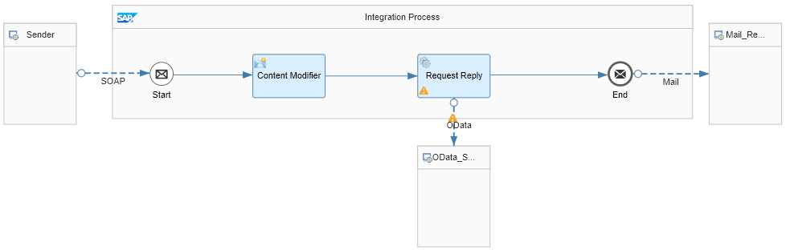

<!-- loioad2409e012fc4005a009b4937ad85451 -->

# SOAP Sender Adapter: Example Integration Flow

> ### Note:  
> With the following steps, you can easily modify and extend the basic integration flow that was introduced in the Getting Started section of this documentation.
> 
> More information: [Getting Started with Integration Flow Development](https://help.sap.com/viewer/368c481cd6954bdfa5d0435479fd4eaf/Cloud/en-US/e5724cd84b854719973afe0356ea128b.html "Learn how to develop and run your first integration flow.") :arrow_upper_right:

You can easily modify the integration flow described in the Getting Started section by adding a SOAP client as sender.

The figure shows the integration flow model that you get as a result of this exercise.

In the modified integration flow, a SOAP client instead of a Timer event triggers message processing.

This is how the integration flow processes the message at runtime:

1.  The SOAP client \(represented by the Sender shape\) sends a Simple Object Access Protocol \(SOAP\) message toSAP Cloud Integration through a SOAP \(SOAP 1.x\) sender channel.

    The SOAP message contains a product identifier.

2.  The Content Modifier creates a message header \(which we also call `productIdentifier`\) and writes the actual value of the `productIdentifier` element into it. This header will be used in the subsequent step.

3.  The Request Reply step passes the message to an external data source and retrieves data \(about products\) from there.

    The external data source \(which is represented by the lower `WebShop` shape\) supports the Open DataProtocol \(OData\). For our scenario, we use the ESPM WebShop, which is based on the Enterprise Sales and Procurement Model \(ESPM\) provided by SAP. The demo application can be accessed at the following address: [https://espmrefapps.hana.ondemand.com/espm-cloud-web/webshop/](https://espmrefapps.hana.ondemand.com/espm-cloud-web/webshop/) 

4.  An OData receiver channel is used for the connection to the OData source. To query for exactly one product \(for the product identifier provided with the inbound message\), the header that was created in the preceding Content Modifier is used.

5.  The OData API provides the details of one specific product, which is identified by the actual value of the `productIdentifier` field \(provided with the inbound SOAP message\).

6.  Finally, the result of the request is forwarded to an e-mail account using the Mail receiver adapter \(the e-mail server is represented by the right `Mail …` shape in the integration flow model\).

**Related Information**  

[Create the SOAP Sender Channel](create-the-soap-sender-channel-7b8f5fd.md "Create a SOAP channel to define how the sender calls the integration flow.")

[Set Up the SOAP Client and Start Message Processing](set-up-the-soap-client-and-start-message-processing-4844baa.md "Set up a SOAP client that represents the sender system.")

