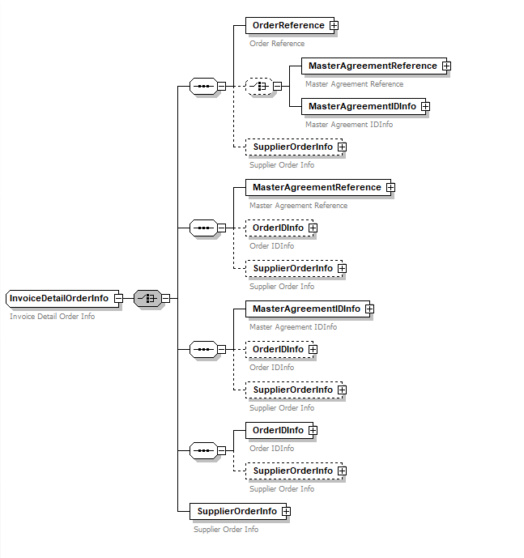

<!-- loio9b595f2cda064e149eba034b94e5bf4a -->

# Special Cases

This chapter covers the special conditions that could occur when working with a message implementation guideline.

<a name="loio9b595f2cda064e149eba034b94e5bf4a__section_ufs_3mr_1qb"/>

## Recursive Nodes

A recursive node is a node in the message structure which creates an infinite recursion in the structure.

There could be two kinds of recursions:

-   **Self-recursion**: The node points to its parent Complex Type.

-   **Chained-recursion**: The node points to a different Complex Type, but one or more elements in the referred Complex Type again points to first Complex Type.

As the node creates an infinite substructure, it cannot be displayed in MIG Editor and also it cannot be used directly in other situations such as Mapping Guidelines. SAP Integration Suite does not currently support recursive nodes. However, self-recursive nodes can be imported as part of Custom Messages and can be displayed in the message structure. But they still cannot be used in a MIG and hence selecting that node in the structure is disabled.

<a name="loio9b595f2cda064e149eba034b94e5bf4a__section_ncj_5y5_nsb"/>

## Repeating Elements

The XSD Standard allows a special situation on schema level in which a group node can contain a child node with the same identifier multiple times. This is only possible if these repeating nodes appear in different choice branches and if this can be uniquely resolved at runtime. Also, all these repeating nodes must be identical in their details and can not be customized differently.

If your MIG contains such a node, then the relevant information can be found under the *Documentation* section.

In such cases, the payload validation will not be possible as the XSD will be considered invalid according to the XSD specification. The validation can be achieved if your MIG uses only one node from the choice branches so that there is only one node with the same identifier. This can be done by selecting the checkbox of the respective node in your MIG structure.

