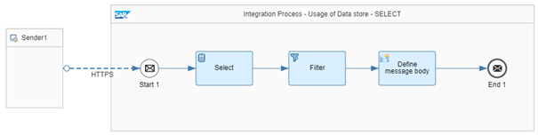
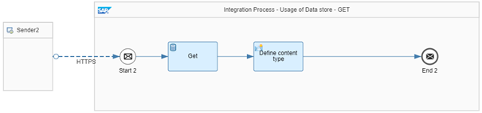

<!-- loio604f7b106328476c909d02f6724260a6 -->

# Store/Retrieve Messages in/from the Data Store

Learn how to store and retrieve messages into/from the data store.

This section shows you how to use data store operations such as *Write*, *Select*, *Get*, and *Delete*.

For more information about the data store operations, see [Define Data Store Operations](define-data-store-operations-79f63a4.md).

> ### Note:  
> When you test the *Select*, *Get* and *Delete* data store operations with Postman, always start with the write operation \(Postman request 'Write to data store'\) to ensure that the data store contains an entry.


<a name="loio604f7b106328476c909d02f6724260a6__section_t2l_vt2_knb"/>

## Implementation

The example integration flow *Modeling Basics - Usage Of Data Store* contains 4 integration processes, one for each of the data store operations. Each integration process has its own endpoint so that you can trigger the data store operations individually.


### Write Operation


The integration flow receives a message through an HTTP adapter. The incoming message contains a *productIdentifier* element that is used in the outbound call.

> ### Sample Code:  
> ```
> <root>
>     <productIdentifier>HT-1000</productIdentifier>
>     <productIdentifier>HT-1001</productIdentifier>
>     <productIdentifier>HT-1002</productIdentifier>
>     <productIdentifier>HT-1003</productIdentifier>
> </root>
> 
> ```

In the first step, in the *General splitter*, the message is broken up into 4 individual messages with the following XPath expression:


<table>
<tr>
<th valign="top">

Expression Type

</th>
<th valign="top">

XPATH

</th>
</tr>
<tr>
<td valign="top">

XPath Expression

</td>
<td valign="top">

//productIdentifier

</td>
</tr>
</table>

A *Content Modifier* stores the 'productIdentifier' in the productID exchange property. This property is needed in the *Request Reply step*.

**XPath Expression**


<table>
<tr>
<th valign="top">

Name

</th>
<th valign="top">

Type

</th>
<th valign="top">

Data Type

</th>
<th valign="top">

Value

</th>
</tr>
<tr>
<td valign="top">

productID

</td>
<td valign="top">

XPath

</td>
<td valign="top">

java.lang.String

</td>
<td valign="top">

//productIdentifier

</td>
</tr>
</table>

In a *Request Reply step*, product data is read from an external source through the OData protocol \(using the OData Receiver adapter\).

For our scenario, we use the ESPM WebShop, which is based on the Enterprise Sales and Procurement Model \(ESPM\) provided by SAP. The demo application can be accessed at the following address: [https://refapp-espm-ui-cf.cfapps.eu10.hana.ondemand.com/webshop/index.html](https://refapp-espm-ui-cf.cfapps.eu10.hana.ondemand.com/webshop/index.html).

The HTTP request for 'productID' is defined as follows:


<table>
<tr>
<td valign="top">

Address

</td>
<td valign="top">

[https://refapp-espm-ui-cf.cfapps.eu10.hana.ondemand.com/espm-cloud-web/espm.svc](https://refapp-espm-ui-cf.cfapps.eu10.hana.ondemand.com/espm-cloud-web/espm.svc) 

</td>
</tr>
<tr>
<td valign="top">

Operations Details

</td>
<td valign="top">

GET

</td>
</tr>
<tr>
<td valign="top">

Resource Path

</td>
<td valign="top">

Products

</td>
</tr>
<tr>
<td valign="top">

Query Options

</td>
<td valign="top">

`$select=ProductId,Name,Category,Price&$filter=ProductId eq '${property.productID}'`

</td>
</tr>
</table>

In the *Write step*, the 4 messages are written to the data store 'ModelingBasics-UsageOfDataStore':


<table>
<tr>
<td valign="top">

Data Store Name

</td>
<td valign="top">

ModelingBasics-UsageOfDataStore

</td>
</tr>
<tr>
<td valign="top">

Visibility

</td>
<td valign="top">

Global

</td>
</tr>
<tr>
<td valign="top">

Entry ID

</td>
<td valign="top">

`${xpath.//Products/Product/ProductId}`

</td>
</tr>
<tr>
<td valign="top">

Retention Threshold for Alerting \(in d\)

</td>
<td valign="top">

2

</td>
</tr>
<tr>
<td valign="top">

Expiration Period \(in d\)

</td>
<td valign="top">

90

</td>
</tr>
</table>

The ProductId is picked from the message as a unique identifier for the entry \(Entry ID\) with the help of an XPath expression. If nothing is provided, the system generates a random GUID for this entry.


### Select Operation

Select is used to retrieve multiple messages from the data store in 1 bulk.



The integration flow receives a message through an HTTP adapter. The incoming message contains 'count' – the number of messages selected from the data store.

> ### Sample Code:  
> ```
> <root>
>     <count>4</count>
> </root>
> 
> ```

The Select step is defined as follows:


<table>
<tr>
<td valign="top">

Data Store Name

</td>
<td valign="top">

ModelingBasics-UsageOfDataStore

</td>
</tr>
<tr>
<td valign="top">

Visibility

</td>
<td valign="top">

Global

</td>
</tr>
<tr>
<td valign="top">

Number of Polled Messages

</td>
<td valign="top">

`${xpath.//count}`

</td>
</tr>
<tr>
<td valign="top">

Delete On Completion

</td>
<td valign="top">

no

</td>
</tr>
</table>

The 'Number of Polled Messages' is picked from the message using XPath.

With the steps *Filter* and *Define message body*, selected data storage entries are combined into 1 message.

The *Filter step* uses the Product with value type *Nodelist* and the following XPath expression: `/messages/message/Products/Product`.

In the *Content Modifier step* 'Define message body', the root node ‚Products‘ is added to the message body:

> ### Sample Code:  
> ```
> <Products>
>     ${in.body}
> </Products>
> 
> ```

To present the response in the XML format, the message header 'content-type' is defined as follows in the 'Message Header' tab:


<table>
<tr>
<td valign="top">

Header Name

</td>
<td valign="top">

Type

</td>
<td valign="top">

Value

</td>
</tr>
<tr>
<td valign="top">

content-type

</td>
<td valign="top">

constant

</td>
<td valign="top">

application/xml

</td>
</tr>
</table>


### Get Operation

Get is used to get a specific entry from the data store.



The integration flow receives a message through an HTTP adapter. The incoming message contains a 'ProductID', which should be queried from the data store.

> ### Sample Code:  
> ```
> <root>
>     <ProductID>HT-1001</ProductID>
> </root>
> 
> ```

The *Get step* is defined as follows:


<table>
<tr>
<td valign="top">

Data Store Name

</td>
<td valign="top">

ModelingBasics-UsageOfDataStore

</td>
</tr>
<tr>
<td valign="top">

Visibility

</td>
<td valign="top">

Global

</td>
</tr>
<tr>
<td valign="top">

Entry ID

</td>
<td valign="top">

`${xpath.//ProductID}`

</td>
</tr>
<tr>
<td valign="top">

Delete On Completion

</td>
<td valign="top">

No

</td>
</tr>
<tr>
<td valign="top">

Throw Exception on Missing Entry

</td>
<td valign="top">

Yes

</td>
</tr>
</table>

To present the response in the XML format, in the *context modifier step* 'Define content type' the message header 'content-type' is defined as follows:


<table>
<tr>
<td valign="top">

Header name

</td>
<td valign="top">

Type

</td>
<td valign="top">

Value

</td>
</tr>
<tr>
<td valign="top">

content-type

</td>
<td valign="top">

Constant

</td>
<td valign="top">

application/xml

</td>
</tr>
</table>


### Delete Operation

Delete allows to delete messages from the data store.


The integration flow receives a message through an HTTP adapter. The incoming message contains a 'ProductID', which should be deleted from the data store.

> ### Sample Code:  
> ```
> <root>
>     <ProductID>HT-1000</ProductID>
> </root>
> 
> ```

The *Delete step* is defined as follows:


<table>
<tr>
<td valign="top">

Data Store Name

</td>
<td valign="top">

ModelingBasics-UsageOfDataStore

</td>
</tr>
<tr>
<td valign="top">

Visibility

</td>
<td valign="top">

Global

</td>
</tr>
<tr>
<td valign="top">

Entry ID

</td>
<td valign="top">

`${xpath.//ProductID/text()}`

</td>
</tr>
</table>

To present the response in the XML format, in the context modifier step 'Define content type' the message header 'content-type' is defined as follows:


<table>
<tr>
<td valign="top">

Header Name

</td>
<td valign="top">

Type

</td>
<td valign="top">

Value

</td>
</tr>
<tr>
<td valign="top">

content-type

</td>
<td valign="top">

Constant

</td>
<td valign="top">

application/xml

</td>
</tr>
</table>

**Related Information**  


[Define Data Store Operations](define-data-store-operations-79f63a4.md "You can use the data store to temporarily store messages.")

[HTTP Receiver Adapter](http-receiver-adapter-2da452e.md "Use the HTTP receiver adapter to communicate with target systems using HTTP message protocol.")

[Content Filter](content-filter-6fd4a86.md "Assume that you get an order from a partner in a standard format that you've agreed upon. The message contains numerous fields that are required for communicating with your partner, however your backend system only needs a small fraction of the fields.")

[Content Modifier Basics](content-modifier-basics-b0576a8.md "")

[Define General Splitter](define-general-splitter-a6c1916.md "")

