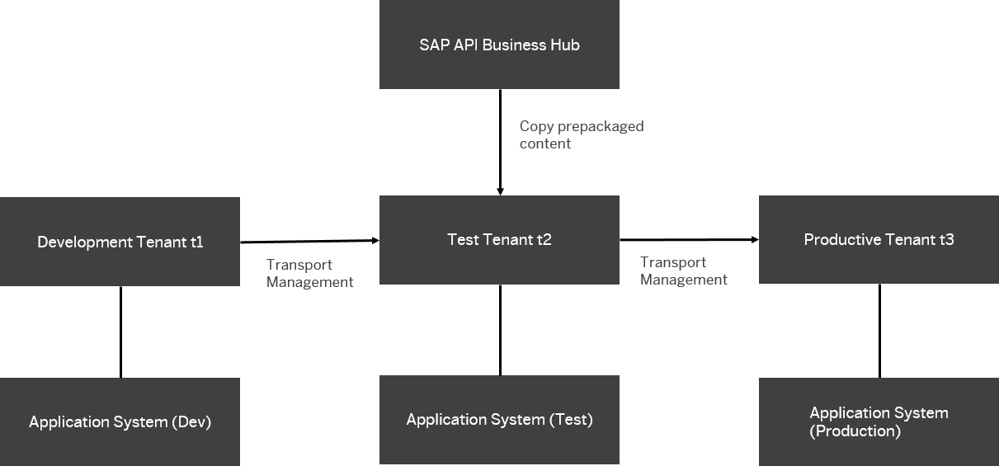

<!-- loio185a52a93f094d92853e88aef8f7cf5f -->

# Subscribe Only a Single Tenant to SAP Business Accelerator Hub

To control the impact of integration content updates, subscribe only a single tenant \(typically the one used for testing\) to SAP Business Accelerator Hub. That way, the other tenants in the system landscape are updated with the latest version of the content only after it has been tested in the tenant that is connected to SAP Business Accelerator Hub.

The prepacked integration content packages on the tenant are subscribed to SAP Business Accelerator Hub to ensure that new versions of the content are copied over automatically when available.

Once a new version of the content package is available, the update of the content on the customer tenant is initiated by SAP, the content publisher.

There are 2 different content update modes, and which one is configured for an integration package depends on the choices of the content publisher:

<table>
<tr>
<th valign="top">

Update Mode.

</th>
<th valign="top">

Description

</th>
</tr>
<tr>
<td valign="top">

Automatic update

</td>
<td valign="top">

The content consumer \(customer\) can't control when the content is updated.

No user interaction is required \(by the content consumer\) in order to perform the content update on the tenant. The updated content is automatically pushed to the tenant.

According to the settings made by the content publisher, the corresponding artifacts on the customer tenant are marked with the date when the automatic update is applied.

</td>
</tr>
<tr>
<td valign="top">

Manual update

</td>
<td valign="top">

As soon as an update has been made available by the content publisher, the system notifies the consumer of the package about updates. In such a case, an *Update Available* text is displayed in green color under the name of the affected artifacts.

Notified that way, the content consumer can decide whether to perform the update.

To perform the update, the content consumer needs to select the integration artifact and choose the *Update* function.

</td>
</tr>
</table>

For more information on integration package updates, see [Updates for SAP's Integration Packages](updates-for-sap-s-integration-packages-5e41ce8.md).

Typically, a content consumer has multiple tenants that serve different purposes, for example:

-   1 tenant where content is developed

-   1 tenant where the content is tested

-   1 tenant where the productive integration scenarios are executed

To make sure that the content consumer keeps maximum control over the impact of content updates initiated by SAP, a landscape like sketched in the following figure is recommended.

In this setup, only a single customer tenant \(typically the test tenant\) is subscribed to SAP Business Accelerator Hub and consumes updates from there. Once an update is consumed and tested, the content consumer can transport the updated content to the other tenants.

You can use the transport management options provides for SAP Integration Suite to supply the other tenants with the content. This way the content consumer has full control over when to update the prepackaged integration content in the landscape.

For more information on the transport management options, see [Content Transport](content-transport-e3c79d6.md).

> ### Note:  
> **Differences between configured and edited content during update**
> 
> The content consumer can use prepackaged content in the following ways:
> 
> -   Editing integration content
> 
>     The content consumer changes the integration flows \(copied to its *Design* workspace\) in such a way that integration flow components \(steps or adapters\) are added or removed, or parameters \(of integration flow components\) are changed.
> 
>     If a customer edits an integration flow \(originally obtained from a predefined integration package\), no further updates are obtained anymore from SAP for this integration flow. This mode is indicated by a grayed out *Update Available* text \(displayed under the artifact name\).
> 
> -   Configuring integration content
> 
>     In many cases, customers use predefined content by SAP in such a way that they only configure the externalized parameters of the predefined integration flows \(for example, to adapt addresses in channels to their system landscape settings\).
> 
>     In such a case, the content consumer doesn't need to change the integration flow model.
> 
>     For packages that contain exclusively content that is configured, content updates are available further-on.
> 
>     Some packages are prepared by the content publisher in such a way that content consumers aren't allowed to edit integration artifacts. In such a case, the content consumer can only configure the artifacts.

