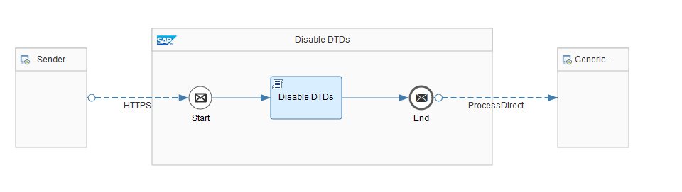

<!-- loioa990e2cdba9046f4a4a656e19aa328c2 -->

# Switch Off Resolving of External Entities

Make sure that processing of doctype declarations in your integration flow is disabled if you parse XML data in a Script step.


<a name="loioa990e2cdba9046f4a4a656e19aa328c2__section_omc_dhs_tjb"/>

## Use Case

Any application that parses XML data is prone to the risk of XML External Entity \(XXE\) processing attacks.

To overcome this issue, take one of the following measures to protect integration flows that contain Script steps \(using Groovy Script or JavaScript\) against XXE Processing attacks:

-   Don't use XML parsing \(for example, DocumentBuilderFactory\) at all.

-   Switch off the processing of external entities.


<a name="loioa990e2cdba9046f4a4a656e19aa328c2__section_ycv_hhs_tjb"/>

## Implementation

The simplest approach to avoid the processing of external entities, is to disallow the processing of doctype declarations completely, as shown in the *Apply Security - Disable DTDs* integration flow.



The Script step of this integration flow contains the following script:

> ### Sample Code:  
> ```
> import com.sap.gateway.ip.core.customdev.util.Message; 
> import javax.xml.parsers.DocumentBuilderFactory; 
> import javax.xml.parsers.DocumentBuilder; 
> import javax.xml.parsers.ParserConfigurationException; 
> import org.xml.sax.InputSource; 
> import java.io.StringReader; 
> def Message processData(Message message) { 
>     def dbf = DocumentBuilderFactory.newInstance(); 
>     // disallow the processing of doctype declarations 
>     def FEATURE = "http://apache.org/xml/features/disallow-doctype-decl"; 
>     dbf.setFeature(FEATURE, true); 
>     def db = dbf.newDocumentBuilder(); 
>     def is = new InputSource(message.getBody()); 
>     def doc = db.parse(is); 
>     message.setBody(doc); 
>     return message; 
> } 
> ```

This script completely switches off the processing of doctype declarations. If this is not an option, you need to switch off at least the processing of the external entities as described in [https://cheatsheetseries.owasp.org/cheatsheets/XML\_External\_Entity\_Prevention\_Cheat\_Sheet.html](https://cheatsheetseries.owasp.org/cheatsheets/XML_External_Entity_Prevention_Cheat_Sheet.html).

If you use the Postman Collection provided with the integration package, you have 2 options to run the scenario.

-   Request `DisableDTDs - Use External Entity`

    This request provides a payload that contains a doctype declaration. In the message monitoring application, this integration flow goes into status `Failed` \(and the error message contains the phrase `DOCTYPE is disallowed`\).

-   Request `DisableDTDs`

    This request provides a payload that doesn't contain any doctype declaration. In the message monitoring application, this integration flow goes into status `Completed`.


For general considerations on the XEE attack, see:

-   [https://en.wikipedia.org/wiki/XML\_external\_entity\_attack](https://en.wikipedia.org/wiki/XML_external_entity_attack)

-   [https://www.owasp.org/index.php/XML\_External\_Entity\_\(XXE\)\_Processing](https://www.owasp.org/index.php/XML_External_Entity_(XXE)_Processing)


The OWASP Cheat Sheet for XXE: [https://cheatsheetseries.owasp.org/cheatsheets/XML\_External\_Entity\_Prevention\_Cheat\_Sheet.html](https://cheatsheetseries.owasp.org/cheatsheets/XML_External_Entity_Prevention_Cheat_Sheet.html)

SAP Help Portal documentation about the Script step: [Define a Local Script Step](define-a-local-script-step-03b32eb.md)

