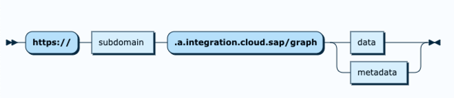
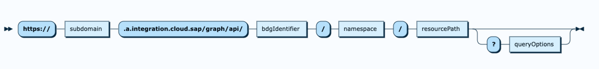

<!-- loio79162b241b6345d79639c6911d6df1c2 -->

# The Graph OData V4 API

Graph supports the OData v4 protocol to access business data graphs.

> ### Note:  
> Graph converts the OData v2 protocol to OData v4.

OData \(Open Data Protocol\) is a widely used OASIS standard that defines a set of best practices for using RESTful data APIs. For more information, see [OData](odata-37e592e.md).

The complete OData v4 syntax supported by Graph is available in the form of syntax diagrams. For more information, see [Graph Syntax](https://navigator.graph.sap/syntax).

To access a business data graph, you use the following Graph URL:



Where the subdomain represents the subdomain that is assigned to the tenant, the *BDG-identifier* is a customer-specific identifier of a business data graph for a specific landscape, as provisioned by the enterprise key user. This is often a version number \(for example, v1, v2\), or it indicates a type of landscape \(for example, dev and stage\), but it can be an arbitrary string.

The full OData data URL is as follows:



A common example may be: `https://is-demo-kjsbzgso-57c46d694dff43deabe46431e745b4ef.a.integration.cloud.sap/graph/api/staging/sap.graph/Product?$top=3`

The Graph API uses the standard HTTP verbs to interact with endpoints.


<table>
<tr>
<th valign="top">

Method

</th>
<th valign="top">

Description

</th>
</tr>
<tr>
<td valign="top">

`GET` 

</td>
<td valign="top">

Read data from a resource. It can be either a whole list, or a specific resource.

</td>
</tr>
<tr>
<td valign="top">

`POST` 

</td>
<td valign="top">

Create a new resource.

</td>
</tr>
<tr>
<td valign="top">

`PATCH` 

</td>
<td valign="top">

Update a resource with new values.

</td>
</tr>
<tr>
<td valign="top">

`DELETE` 

</td>
<td valign="top">

Delete a resource.

</td>
</tr>
</table>

You should provide the following HTTP headers in all communications to Graph:

```json
headers: { 
    "Authorization": "Bearer … ", 
    "Accept": "application/json", 
    "Accept-Encoding": "gzip", 
    "Accept-Language": "…" 
  } 
```

The most important of these is the *Authorization* header, through which an access token is provided to Graph. See [Authentication](authentication-79aabda.md) for more details.

*Accept-Encoding* is important to ensure that traffic from Graph to your app is compressed, and the *Accept-Language* header is used by Graph to automatically return the matching language strings of localized attributes.


<a name="loio79162b241b6345d79639c6911d6df1c2__section_nxv_5k1_fcc"/>

## Cross-Site Request Forgery \(CSRF\)

You do not need to send a Cross-Site Request Forgery \(CSRF\) token to the Graph API and you won't receive a CSRF token from the Graph API.

If your connected business systems require a CSRF token, the Graph API will automatically get the token from your business system using a preflight `HEAD` request.

