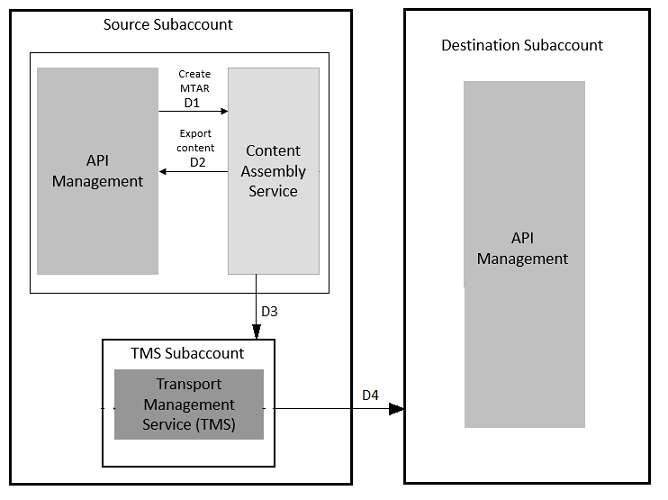

<!-- loioeb83118123534ed891280f5b7b104469 -->

# Transport APIs and Its Related Artifacts

API artifacts and their respective application-specific content, can be reused across multiple tenants using the transport mechanism.

You can use the SAP Cloud Transport Management service \(TMS\) for exporting, importing, and shipping the APIs and its related artifacts from the development or test environment to production environment. For example, you can design and test API portal content on the test tenant and then use the Cloud Transport Management service to move the content to the target tenant.

This block diagram shows how the content is selected and transported when the Transport Management service is enabled for the first time to transport APIs and its related artifacts from the development or test environment to the production environment:

-   [Creating Content Assembly Service Destination](creating-content-assembly-service-destination-3a6a81e.md)
-   [Creating API Management Destination](creating-api-management-destination-3fd86c7.md)
-   [Creating Transport Management Destination](creating-transport-management-destination-6c94d89.md)
-   [Create a Deploy Service Destination in Cloud Transport Management Service Subaccount](create-a-deploy-service-destination-in-cloud-transport-management-service-subaccount-09b1eec.md)

> ### Note:  
> In this case, you have to create a separate subaccount for Transport Management service.

This block diagram shows how the content is selected and transported when the Transport Management service is already enabled for other SAP offerings and you’re trying to use it for transporting APIs and its related artifacts from the development or test environment to the production environment:

> ### Note:  
> In this case, you don't have to create a separate subaccount for Transport Management service. You can continue to use the Transport Management service in the source subaccount.

Once the user initiates transport of the desired API content , the following events take place:

D1- API Management makes an API call to the Content Assembly Service to inform about the transport.

D2 - Content Assembly Service then makes an API call to fetch the API content from Integration Suite workspace. The Content Assembly Service wraps the API content for transport.

D3- The Content Assembly Service makes a second API call to push the API content to the Transport Management service \(TMS\).

D4- The SAP Transport Management service makes an API call to the Deploy Service. The Deploy Service calls the API Management in the destination subaccount to import the package into the API Management workspace within the Integration Suite.

