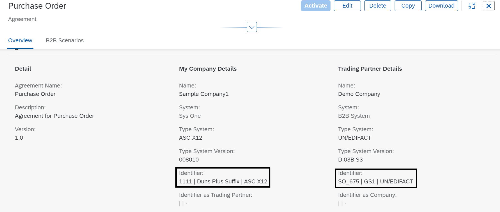
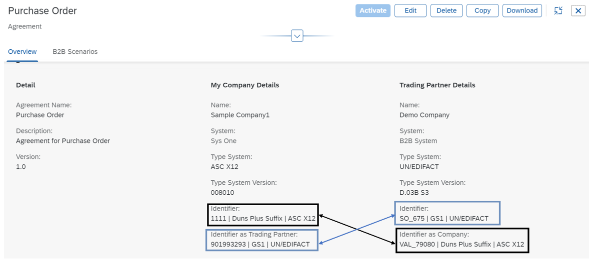

<!-- loio783e93516b484ce89781cd5bd9a5b4b6 -->

# Understanding Identifiers in Agreement

Let us learn how identifiers work in a trading partner agreement.

*Identifier*

An identifier is used to uniquely identify the trading partner when exchanging messages and also defines how to exchange documents. You can view the identifier details under the *Identifier* tab of a Company/Trading Partner profile. The identifier consists of a group of fields that help with the identification of a particular trading partner during the B2B transactions. They are:

-   *Identification*

    A name or value that identifies the trading partner within the given identification scheme.

-   *Type System*

    The type system defines how to exchange the business documents in a transaction. The types include

    -   ASC X12

    -   SOAP
    -   UN/EDIFACT
    -   IDoc

    Selecting the type determines the B2B standard based on which the B2B transaction takes place.

-   *Scheme Name* and *Scheme Code*

    This constitutes the reference framework within which the trading partners are uniquely identified. In general, a trading partner can be identified in many different ways, for example, by their name, by their identification number or by their employee details. But to be able to identify the trading partner uniquely, we need to have a frame of reference that suggests that the number that is displayed is the identification number. These are some standard codes that can be used in defining the *Identification* of your identifier.

-   *Agency Name* and *Agency Code*

    Defines the identification scheme and issues names for the trading partners to be identified. The name and code are a part of the scheme name.


An identifier can be referred as the sender or receiver identifier depending on the inbound or outbound direction of the business transaction activity.

In a B2B transaction these identifiers help the system understand and identify the partners involved in a transaction and they also have certain definitions and standards.

*Agreement using ASC X12 and UNEDIFACT Identifier*

Let us take a look at the Trading Partner Agreement in detail to understand further. A trading partner agreement is defined as a binding agreement between Company and the Trading Partner for transacting messages over a specific B2B protocol. Here both the Company and the Trading Partner can be the initiator or reactor of an agreement.

While creating a trading partner agreement, you come across fields such as *Identifier*, *Identifier as Company* and *Identifier as Trading Partner*. What are they and how do we define them?

Say, for example, we have an agreement Purchase Order with Company Sample Company1 and Trading Partner Demo Company. Now the company sets its identifier as *1111 | Duns Plus Suffix | ASC X12* which means:

-   1111 stands for the company's Identification

-   Duns Plus Suffix represents the scheme name
-   ASC X12 represents the B2B standard or the message encoding that would be used for sending messages from the company

Now the trading partner has set its identifier as *SO\_675 | GS1 | UNEDIFACT* where

-   SO\_675 stands for trading partner identification

-   GS1 is the scheme name
-   UNEDIFACT is the B2B standard or the message encoding that B would use for sending messages.

The Scheme Name and the B2B Standard together become the *Identifier Code Qualifier*. The qualifier is used to provide additional information about the identifier of the trading partner. Each scheme has an unique code associated with it. For example, the code of Duns Plus Suffix is 14. So, in our company : *1111 | Duns Plus Suffix | ASC X12*, *1111* is the Identifier and *Duns Plus Suffix | ASC X12* together is the code qualifier for the company. Similary, *GS1 | UNEDIFACT* is the code qualifier for the trading partner. The code for GS1 is 14.



Since we have two different message encoding for both the parties in the agreement, we need to set another identifer for both the company and trading partner so that receiving messages from one another can be made easy. This is where the field *Identifier as Trading Partner* and *Identifier as Company* comes into play for the company and trading partner respectively.

For the company, you need to set the field *Identifier as Trading Partner* with the encoding same as that of the identifier of the trading partner which is UNEDIFACT. Similarly, for the trading partner, you need to set the field *Identifier as Company* with the encoding same as that of the identifier of the company which is ASC X12.

Now the agreement overview would look like this:



Now we have set the parameters right for a message exchange between the trading partners in an agreement. When and how are these values picked? The next step after defining your trading partner agreement is to activate the agreement. The activation of the agreement is when the business transaction gets executed leading to the document exchange. In simple words, the mail is being sent from the sender to the receiver. How and where to send it? Here comes the identifier. The identifier values may not exactly be used during runtime but they play a vital role in helping the system execute the business transaction.

Let us take a look at the payload when the message is sent from the Company \(Sender\) to the Trading Partner \(Receiver\).

*ASC X12 Payload* 

> ### Sample Code:  
> ```
> ISA*00*          *00*          *14*1111          *14*VAL_79080      
> *210526*1236*U*00401*000004688*0*P*^~GS*IN*AW_SND_B2B_SYS*MCC_REC_B2B_SYS*20210526*1236*1843*X*008010~ST*810*000006638~BIG*20091130*02709444*20091021*2562120~REF*VR*9999~N1*ST*AW DISTRIBUTION, INC*54*N101~N1*RE*MyCloudCompany*9*23320228920~ITD*01*15*****60~DTM*011*20091128~FOB*PP*OR*FREDERICKPA 17026~IT1**83*CA*33.72*CP*UI*01000999999*PI*999999~PID*F****Item Description~PO4*12~TDS*277077*277077*277077~SAC*A*ZZZZ***2799*******02***SPOILS/DAMAGES~ISS*83*CA~CTT*1~SE*16*000006638~GE*1*1843~IEA*1*000004688~
> ```

Here `*14*1111` specifies the sender Identifier 1111 and the code qualifier 14. Similarly `*14*VAL_79080` specifies the receiver Identifier VAL\_79080 and the code qualifier 14.

Now, let us take a look at the payload when the message is sent from the Trading Partner \(Sender\) to the Company \(Receiver\).

> ### Sample Code:  
> ```
> UNB+UNOC:3+SO_675:14+901993293:14+210503:1251+2120000032++++1++1'UNH+00620+INVOIC:D:03B:UN'BGM+004:::10000+4500000188+004'DTM+137:2021-02-05:101'RFF+ON'DTM+171:23800'NAD+SU+1000255::1'NAD+BS+10101011::10+++Superstore AG'TAX+V1++++:::16.000'MOA+1:1.80:EUR'CUX+2:EUR'CUX+2:AFN'PAT+1++1:::100.0'PCD+1:100.0'PAT+22++1:::0'PCD+1:0'LIN+000010++TG11:002'PIA+1+TG11:002'QTY+47:1.000:PCE'MOA+203:10.0:EUR'PRI+AAA:100.0'PRI+AAB:101.0'RFF+ON:4500000188:000010'RFF+DQ:0080000039:000010'TAX+V1++++:::16.000'UNS+D'MOA+128:11.60:EUR'UNT+27+00620'UNZ+1+2120000032'
> ```

The values `SO_675:14+901993293:14` specify the sender identifier SO\_675, the code qualifier 14, receiver identifier 901993293 and the receiver code qualifier 14.

*Agreement using SOAP and IDOC Identifiers*

Let us take another example of an agreement where the transaction happens betweenw identifiers of type SOAP and IDOC.


Let us assume that the agreement consists of two transactions:

-   One from the Company to the Trading Partner

-   One from the Trading Partner to the Company

Once you activate the agreement, the communication for the first transaction would use SOAP adapter. Let us take a look at message header section of the payload:

> ### Sample Code:  
> ```
> 
>     <MessageHeader>
>         <ID>{{$randomBankAccount}}</ID>
>         <CreationDateTime>{{$isoTimestamp}}</CreationDateTime>
>         <SenderBusinessSystemID>S4HANACloudSender</SenderBusinessSystemID>
>         <RecipientBusinessSystemID>ED_B2BReceiverSystemID</RecipientBusinessSystemID>
>         <SenderParty>
>             <InternalID>SO-MY221003</InternalID>
>         </SenderParty>
>         <RecipientParty>
>             <InternalID>SO-MY221123</InternalID>
>         </RecipientParty>
>     </MessageHeader>
> 
> ```

The `<InternalID>` tag picks up and displays the identifier of the sender and receiver under `<SenderParty></SenderParty>` and `<RecipientParty></RecipientParty>` tags respectively. The values are SO-MY221003 and SO-MY221123 respectively.

Similarly for the second transaction where the communication is sent from the trading partner to the company using IDOC adapter, the payload would be:

> ### Sample Code:  
> ```
> <EDI_DC40 SEGMENT="1">
>             <TABNAM>EDI_DC40</TABNAM>
>             <MANDT>500</MANDT>
>             <DOCREL>1809_FPS02</DOCREL>
>             <DIRECT>2</DIRECT>
>             <IDOCTYP>ORDERS05</IDOCTYP>
>             <MESTYP>ORDERS</MESTYP>
>             <SNDPOR>SAPDE0</SNDPOR>
>             <SNDPRT>KU</SNDPRT>
>             <SNDPRN>ID-MY221001</SNDPRN>
>             <RCVPOR>SAPDE0</RCVPOR>
>             <RCVPRT>KU</RCVPRT>
>             <RCVPRN>ID-MY221122</RCVPRN>
>         </EDI_DC40>
>        
> ```

In this payload, the `<DOCREL>` tag picks up the type system version of the trading partner which is 1809\_FPS02. The `<SNDPRN>` picks up the sender identifier which is ID-MY221001 and the `<RCVPRN>` picks up the receiver identifier which is ID-MY221122.

You need to always ensure providing the right identifier details in an agreement. If the values are incorrect, the transaction may fail.

