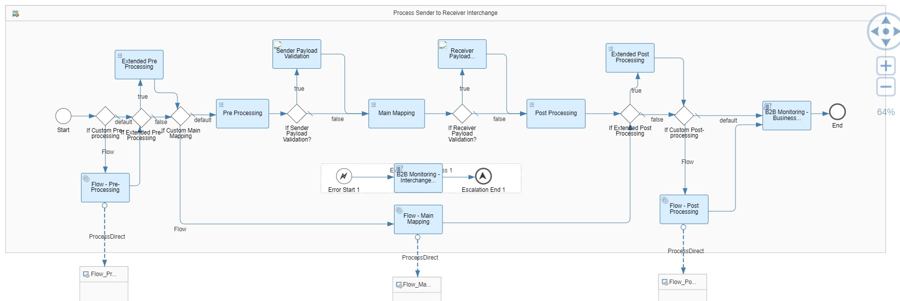

<!-- loio883b3ee83a3b4669bee0a47bb5990053 -->

# Understanding the ProcessDirect Adapter

The application allows you to use your custom integration flow for the B2B scenario using ProcessDirect adapter. This chapter explains how the process works.

Before we start with our scenario, there are few concepts we need to understand:

*What is a ProcessDirect Adapter*

Let us say, you have two integration flows in your tenant and you want a communication to be established between them without any network overhead. ProcessDirect adapter helps you achieve fast and direct communication between integration flows of the same tenant without routing through the load balancer.

A ProcessDirect adapter can be a sender or receiver adapter depending on the direction of the messag flow.

The Interchange Processing Flow in our package uses this adapter to enable customisation of your integration flows.



Now, when you enable *Custom Integration Flow* in your agreement, it means that another integration flow will picked up by the ProcessDirect adapter instead of this generic integration flow. Once you enable this option, you also need to provide the name of your integration flow that has to be connected with using the adapter. This name is then picked up by the ProcessDirect adapter during runtime and the corresponding integration flow is called. Such connection is established through the address mentioned in the *Connection* tab of the adapter. The option to use custom integration flow is provided in 3 steps here:

-   Pre-Processing

-   Main Mapping
-   Post-Processing

The custom integration flows are used in the intermediate step of the entire process; which means the adapter sends a message to the custom integration flow and in turn receives a response from that integration flow which is then used in the next step of the process. To meet this requirement, we use *Request-Reply*.

Request-Reply flow step sends a message to the custom integration flow and waits for a reply. The custom integration flow performs its own integration process and then sends the resulting message to the Request-Reply. The request-reply then sends this message to the next step of the Interchange process flow.

Refer the following links to understand more about the ProcessDirect adapter:

-   [ProcessDirect Adapter](https://help.sap.com/docs/CLOUD_INTEGRATION/368c481cd6954bdfa5d0435479fd4eaf/74457187451f431298355fbbf807d086.html)

-   A [blog](https://blogs.sap.com/2018/02/14/processdirect-adapter/) on ProcessDirect adapter


<a name="loio883b3ee83a3b4669bee0a47bb5990053__section_bft_3sx_lyb"/>

## Use Case for the Process Direct Adapter

We have now understood how ProcessDirect adapter works. The application also allows you to configure dynamic parameters in your agreement. These parameters are later consumed by custom integration flow. This use case might pave way to the following questions:

-   From which PID/ID can one read the dynamic parameters from Partner Directory?

-   And after fetching the dynamic parameters from PD, how can one convert it into a readable string \(because dynamic parameters are stored in binary format in PD\) and then use it in a groovy script?

Consider the following sample code:

> ### Sample Code:  
> ```
> 
> import com.sap.gateway.ip.core.customdev.util.Message;
> import com.sap.it.api.pd.PartnerDirectoryService;
> import com.sap.it.api.ITApiFactory;
> import com.sap.it.api.pd.BinaryData;
> import groovy.json.JsonSlurper;
> 
> def Message processData(Message message) {
>     def headers = message.getHeaders();
>     def partnerId = headers.get("SAP_TPM_ACTIVITYPARTNERID");
>     def service = ITApiFactory.getApi(PartnerDirectoryService.class, null);
>     def customActivityParams = service.getParameter("SAP_TPM_CustomActivityParams", partnerId, BinaryData.class);
>     if (customActivityParams != null){
>         def jsonRoot = new JsonSlurper().parseText(new String(customActivityParams.getData()));
>         message.setProperty("CustomKey", jsonRoot.MyTest1);
>     }
>     return message;
> }
> 
> ```

Here `"SAP_TPM_ACTIVITYPARTNERID"` is the header that maintains the PID and `"SAP_TPM_CustomActivityParams"` is the ID. Both the values are fixed strings.

The code contains the dynamic parameter key `”MyTest1”` and the corresponding value `“val23”`. If you want to apply the above groovy script to a custom integration flow, then you can store the value `“val23”` to an exchange property named `“CustomKey”`.

To learn more about such use cases, see [Script Use Cases](https://help.sap.com/docs/cloud-integration/sap-cloud-integration/script-use-cases).

And if you want to know more on script APIs, see [Script API](https://help.sap.com/doc/a56f52e1a58e4e2bac7f7adbf45b2e26/Cloud/en-US/index.html).


<a name="loio883b3ee83a3b4669bee0a47bb5990053__section_xtc_43r_zyb"/>

## Pointers to Consider

Here are few things to consider when using this ProcessDirect adapter for your sender and receiver scenarios:

-   The groovy scripts in the package is not public to the customer. It is recommended to use caution while applying the groovy code to your custom integration flows.

-   The step *1b* is used for internal purposes. So it is not recommended to call the ProcessDirect in step 1b but you can utilise the adapter in step *1a* which is *Step 1 - Sender Process Direct Communication Flow V2*.
-   You can transfer all the camel header properties that you define in your custom integration flows to ProcessDirect Step 1a, but if your camel header property name is the same as SAP's camel header property \(with prefix *SAP\_*\), then the property value might be overwritten by the Generic integration flow. To avoid this, it is recommended to use a different property name in the camel header.
-   The computed PID can be used not only in Step 2 ProcessDirect, but also in Step 3 ProcessDirect of the integration flow.

