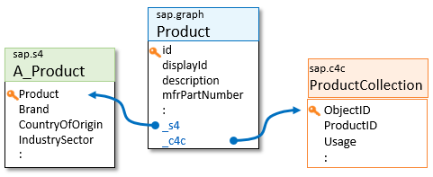

<!-- loio1cded7b0394642a6b8c88b20a03f5f21 -->

# Unified Entities

Certain business objects \(primarily master data, such as customer or product descriptions\) are commonly replicated in multiple SAP systems, sometimes under different names. What one system calls `Product`, another may refer to as `ProductCollection`, `Material`, or even `supplierPart`. They all represent the same product object instance, with common attributes like its name and description, but then each SAP system manages additional, system-specific aspects: SAP S/4HANA maintains details of the manufacture and inventory of products, SAP Sales Cloud is concerned with the conditions of selling or using the product \(for example, the skills required by a sales team\), and SAP Ariba manages elaborate buyer-supplier pricing. Enterprises must synchronize the different representations of the same object, which often have different keys in the different systems, leading to high complexity for application developers as well.

Developers often only need the common attributes of such business objects and are mystified by the different system representations and key sequences of the same data. To address this, Graph introduces unified entities. Unified entities define the common and most widely used attributes of a business object, using a consistent and easier to understand structure and naming convention. Unified attributes are accessed under the `sap.graph` namespace.

Developers of extension apps use these common attributes, regardless of where this data resides. Under the hood, Graph maps these attributes to one of the data sources in the landscape, but this doesn't concern the developer. Consequently, the use of unified entities results in SAP-extending apps that are portable and reusable across a wide range of customer landscapes.

Unified entities have association attributes that connect them to the system-specific representations of the same object \(`_s4` and `_c4c`\). These associations effectively provide developers with a consolidated and navigable 360° view of all the attributes of these objects in SAP. To access an attribute such as `Brand`, the app simply issues a `sap.graph/Product(123)/_s4/Brand` request. Of course, SAP S/4HANA system-specific attributes are only available if such a system is part of the underlying enterprise landscape. Graph handles key mapping complexities under the hood. For more information, see [Data Locating Policy](data-locating-policy-28d2c2c.md).

Whether or not an entity is read-only depends on various parameters of your landscape. The metadata of your business data graph tells you which entities are writable.

Citizen developers use low-code tools to access the unified entities. Advanced developers with more complex requirements can follow the edges of the graph to use detailed system-specific attributes.

In summary, unified entities play two roles:

1.  They provide consistent and simplified access to the *common* attributes of a multi-sourced business object. This simplified and common information provides sufficient detail for many extension applications. It is written without worrying about the differences and more complex variations of the system-specific models, making these applications portable over a broad range of landscape configurations.

2.  They "connect" the system-specific entities via explicit associations. This provides developers of extension applications a comprehensive 360° perspective of how objects are managed in their enterprise and supports powerful cross-system queries of system-specific attributes.

SAP is gradually introducing new unified entities, along with the extended support of Graph for more SAP systems. The initial release of Graph supportsSAP S/4HANA, SAP Sales Cloud, and SAP SuccessFactors.

To all Graph developers, the business data graph looks and behaves like a single, giant, consistent, navigable SAP system, accessible via a single API and access protocol, ignoring the physical landscape of data source system instances.

