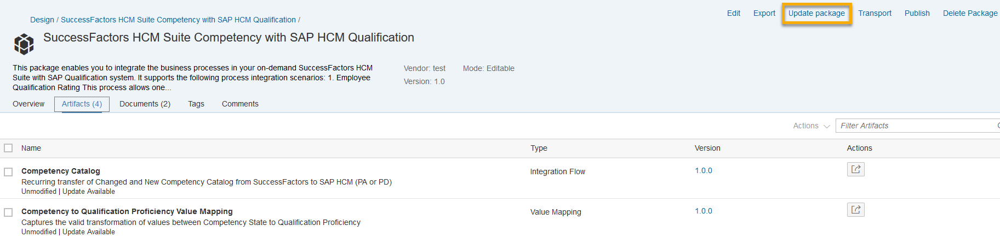
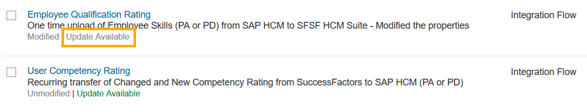

<!-- loio5e41ce8d978048ec873d235647285dee -->

# Updates for SAP's Integration Packages

SAP provides preshipped content to address various integration scenarios. You can copy these integration packages from the *Discover* section to the *Design* space. SAP also publishes updates with new enhancements and bug fixes.

Whenever there's an update \(planned or available\) for the content that you've copied into your workspace, you're informed by a label that is displayed your corresponding artifact along this documentation.

> ### Note:  
> You see a notification for all updates performed on all standard content packages that have been copied from the *Discover* view to the *Design* view of your tenant. This is even the case if the content isn't deployed on your tenant.

There are two modes through which the package update is done:

1.  Manual

2.  Automatic
    1.  Immediate

    2.  Scheduled

> ### Note:  
> The update mode is defined by the content package publisher.
> 
> Only in case of a manual update, you've the option not to implement the change. In case of an automatic update, the update is always applied.
> 
> In case of non-configure-only content, you've the option to revert back to an older version, regardless of the update mode. However, in case of automatic update you don't receive any automatic update of this content anymore.

<a name="loio5e41ce8d978048ec873d235647285dee__section_eqb_slp_1jb"/>

## Manual

1.  If you've copied a package into your *Design* space and an update is available, only then *Update Available* label appears next to the package name.

    

2.  Open the package and choose *Update Package*.

    

> ### Note:  
> If an artifact is already deployed on the tenant, and you trigger a manual update for that content package, the manual update process also updates the deployed instance of the artifact in addition to the stored instance in the *Design* view.

<a name="loio5e41ce8d978048ec873d235647285dee__section_bxr_lvv_1jb"/>

## Automatic

If the content is set to update automatically, the update of the packages in the Design space happens in one of two ways.

### Automatic Update - Immediate

The package gets updated within 12 hours. Updates are pushed immediately when the update includes important bug fixes. These packages have the label *Will be updated within 12 hrs* next to their names.

### Automatic Update - Scheduled

The content of the package is set to be updated on a particular date as configured during publication. Packages that are scheduled to update automatically have the label *Will be updated on <date\>*.

You can always update the package manually even if the package is set to be updated automatically.

> ### Note:  
> If an artifact is already deployed on the tenant, and an automatic update is released for that content package, the automatic update process also updates the deployed instance of the artifact in addition to the stored instance in the *Design* view.

<a name="loio5e41ce8d978048ec873d235647285dee__section_tjp_mdx_1jb"/>

## Post Update

After successful update, the updated packages display the last modified details alongside the package names, and the design-time artifacts are replaced with the new updated content.

If the artifacts contain previously deployed content, the update procedure triggers the deployment of the new design-time content. If the deployment of updated design-time content fails, then the system retries the deployment three times with an interval of 1 hour. With every iteration, if the deployment fails, the artifact is rolled back to the previously deployed runtime version.

If this happens, your tenant contains content with a newer version of the design time, as there's no rollback of the design time content to an older version.

You need to manually deploy the newly updated design-time content. If the manual deployment also fails, contact your tenant administrator with the relevant log details of the issue.

<a name="loio5e41ce8d978048ec873d235647285dee__section_t3c_4fx_1jb"/>

## Updates for Edited Content

We recommend to only configure the standard integration content.

In some scenarios, you can customize the content according to your needs. But once the artifact is modified, it does no longer receive any updates. Such artifacts appear with the grayed-out label of *Update Available*.

> ### Note:  
> -   Package update only updates the content of the package. All attributes and configured externalized parameters of the package maintained by the user are retained.
> 
> -   Updates are available even if the packages are renamed.
> -   A renamed artifact does no longer receive any updates.

