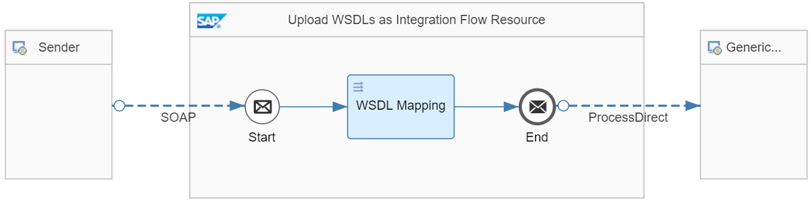
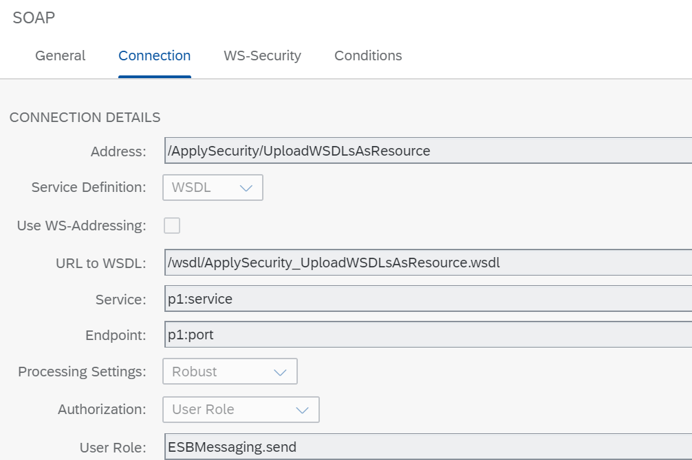

<!-- loio9c22b39bbde4488e8ca7e362c241c2fe -->

# Upload WSDLs as Integration Flow Resource

When using SOAP \(sender and receiver\) channels in integration flows, make sure to not reference external Web Services Description Language files \(WSDLs\). Always upload and use WSDLs as integration flow resources. Also make sure that potentially external referenced XSD definitions are either resolved as part of the uploaded WSDL or are also uploaded as additional resource.

For WSDL-based source and target structures of mapping steps, the same guideline applies. While for the mapping it's enforced that the WSDLs are uploaded as resources of the integration flow, still you need to make sure, that external XSD definitions are resolved as part of the uploaded WSDL.

> ### Note:  
> In most cases, uploading a WSDL file isn't required for the configuration of the SOAP sender adapter. Typically, the better option is to choose the *Manual* as *Service Definition* and to configure the SOAP adapter independent of any WSDL. Uploading a WSDL makes sense in cases you like to apply specific WS Security settings that can be further specified in the WSDL.


<a name="loio9c22b39bbde4488e8ca7e362c241c2fe__section_dh3_jp5_dlb"/>

## Use Case

When a WSDL URL is specified in the adapter configuration, it's resolved \(including any further external XSD references\) at the time the integration is started \(for example, on deployment\). If any of those external references isn't available or accessible at this point of time, integration flow deployment fails. Additionally, the server hosting the external WSDL document could be hacked and the WSDL could be replaced.

In case an integration flow needs to be redeployed \(for example, after a software update\), there's the risk of being exposed to denial-of-service attacks. Therefore, always make sure to upload self-contained WSDL documents as resource of the integration flow. This measure increases the robustness of deployment and therefore integration flow availability.


<a name="loio9c22b39bbde4488e8ca7e362c241c2fe__section_dtx_vp5_dlb"/>

## Implementation

SAP Integration Suite offers 3 areas where you can use WDSLs to define the message structure:

-   SOAP-based adapters \(both directions\)

    For any integration flow that uses SOAP-based adapters, the schema of the message can be defined via a WSDL specification. This specification can either be given by a URL pointing to the hosted WSDL definition. Alternatively, a WSDL file can be uploaded from the local file system.

-   Mapping definitions \(source and target schema\)

    When you define a mapping, the SAP Integration Suite mapping tool enforces you to upload WSDL files. However, references to external resources, like XSD schema definitions are supported as well.

-   OData API definition

    When a WSDL is used for OData API definitions, it's resolved at import time and an EDMX scheme is created. This scheme is used to define the OData API provider implementation. Therefore, the issue mitigated by this guideline doesn't apply for the OData API provisioning case.


This guideline illustrates how to perform the following tasks:

-   Uploading WSDL resources to an integration flow

-   Using WSDL resources in a SOAP sender adapter

-   Using WSDL resources in a mappings step


The *Apply Highest Security Standards – Upload WSDLs as Integration Flow Resource* integration flow shows how to implement this guideline.

The integration flow combines a SOAP sender adapter with a mapping step.

> ### Note:  
> A SOAP sender adapter doesn't require an explicit schema definition because a WSDL for a “any” message type is automatically generated for the exposed endpoint. Nevertheless, with this example integration flow we illustrate the WSDL resource upload for the sender channel. That way, there's no need for a 2nd example integration flow. The technical mechanics regarding WSDL resource upload and usage are the same for sender and receiver channel configuration of the SOAP adapter.



When inspecting the SOAP sender adapter \(tab *Connection*\), you notice that an uploaded WSDL resource is used. It's good practice to address the WSDL relative to the integration flow \(the address starts with `/wsdl/`\). Avoid using absolute \(external\) addresses \(even though it isn't prevented by the system\).



When inspecting the *Resources* tab of the integration flow, you notice the uploaded `ApplySecurity_UploadWSDLsAsResource.wsdl` file that is also selected in the SOAP sender adapter.

> ### Note:  
> When you design your own integration flow, you can upload a WSDL file in the following ways:
> 
> -   When configuring the adapter, choose *Select* and in the following dialog choose *Upload from File System* to browse for the WSDL file on your local disk.
> 
> -   Upload the WSDL in the *Resources* view and then select the resource when configuring the adapter.
> 
> 
> Note that in this example a WSDL is used that includes an external `Types.xsd` file. In this case, both files must first be uploaded in the *Resource* view \(in one single `.zip` file\). Make sure that the import of the `Types.xsd` is specified with a relative path in the WSDL file.

The WSDL file \(`ApplySecurity_UploadWSDLsAsResource.wsdl`\) has the following structure:

> ### Sample Code:  
> ```
> <?xml version="1.0" encoding="UTF-8"?>
> <wsdl:definitions
> 	xmlns:tns="http://cpi.sap.com/guidelines/examples"
> 	xmlns:wsdl="http://schemas.xmlsoap.org/wsdl/"
> 	xmlns:xsd="http://www.w3.org/2001/XMLSchema">
>   
>   <wsdl:types>
>     <xsd:schema targetNamespace="http://cpi.sap.com/guidelines/examples">
>       <xsd:include schemaLocation="Types.xsd"/>
>     </xsd:schema>
>   </wsdl:types>
>   
>   <wsdl:message name="InvokeOneWay">
>     <wsdl:part name="InvokeOneWayRequest" element="tns:Person">
>     </wsdl:part>
>   </wsdl:message>
> . . .
> 
> ```

The XSD file \(`Types.xsd`\) has the following structure:

> ### Sample Code:  
> ```
> <?xml version="1.0" encoding="UTF-8"?>
> <xsd:schema 
> 	elementFormDefault="qualified"
> 	targetNamespace="http://cpi.sap.com/guidelines/examples"
> 	xmlns:xsd="http://www.w3.org/2001/XMLSchema">
> 
> 	<xsd:element name="Person" type="Person"/>
> 
> 	<xsd:complexType name="Person">
> 		<xsd:sequence>
> 			<xsd:element name="FirstName" type="xsd:string"/>
> 			<xsd:element name="LastName" type="xsd:string"/>
> 		</xsd:sequence>
> 	</xsd:complexType>
> </xsd:schema>
> 
> ```

For the mapping definition \(in the *WSDL Mapping* step\), the source and target message schema are uploaded as resource to the integration flow.

The mapping step concatenates 2 elements from the source message \(`FirstName` and `LastName`\) to a single element in the target message \(`PersonSingleName`\).

> ### Note:  
> When designing your own integration flow, you need to upload the schema definitions for source and target message structure in any case.
> 
> However, it's also supported to have external references from uploaded WSDLs to other files. Make sure to either also upload such external content with relative paths or to resolve all definitions in one single WSDL file. The latter method applied for the target message WSDL schema definition of the example flow.
> 
> Note that in a productive scenario you usually don't use a WSDL resource uploaded in a SOAP sender adapter for a mapping definition. This design has been chosen for this example scenario for purposes of simplicity.

To execute the integration flow, you send the following example message body from the HTTP client \(Postman\) to the integration flow endpoint:

> ### Sample Code:  
> ```
> <soapenv:Envelope
> 	xmlns:soapenv="http://schemas.xmlsoap.org/soap/envelope/" 
> 	xmlns:cpiex="http://cpi.sap.com/guidelines/examples">
>    <soapenv:Header/>
>    <soapenv:Body>
>       <cpiex:Person>
>          <cpiex:FirstName>John</cpiex:FirstName>
>          <cpiex:LastName>Doe</cpiex:LastName>
>       </cpiex:Person>
>    </soapenv:Body>
> </soapenv:Envelope>
> 
> ```

The `Person` structure with components `FirstName` and `LastName`

You can verify the concatenated single name by inspecting the entry of the is mapped to a concatenated single person name.*UploadWSDLsAsResource* DataStore:

> ### Sample Code:  
> ```
> <?xml version="1.0" encoding="UTF-8"?>
> <ns0:PersonSingleName xmlns:ns0="http://cpi.sap.com/guidelines/examples">John Doe</ns0:PersonSingleName>
> 
> ```

**Related Information**  


[Configure the SOAP \(SOAP 1.x\) Sender Adapter](configure-the-soap-soap-1-x-sender-adapter-a178913.md "The SOAP (SOAP 1.x) sender adapter enables a SAP BTP tenant to exchange messages with a sender system that supports Simple Object Access Protocol (SOAP) 1.1 and 1.2.")

[Configure the SOAP \(SOAP 1.x\) Receiver Adapter](configure-the-soap-soap-1-x-receiver-adapter-57f7b34.md "The SOAP (SOAP 1.x) receiver adapter enables a SAP BTP tenant to exchange messages with a receiver system that supports Simple Object Access Protocol (SOAP) 1.1.")

[Manage Resources](manage-resources-b5968b2.md "")

[Creating Message Mapping as a Flow Step](creating-message-mapping-as-a-flow-step-3d5cb7f.md "")

[Cloud Integration – Usage of WSDLs in the SOAP Adapter](https://blogs.sap.com/2018/06/28/cloud-integration-usage-of-wsdls-in-the-soap-adapter/)

