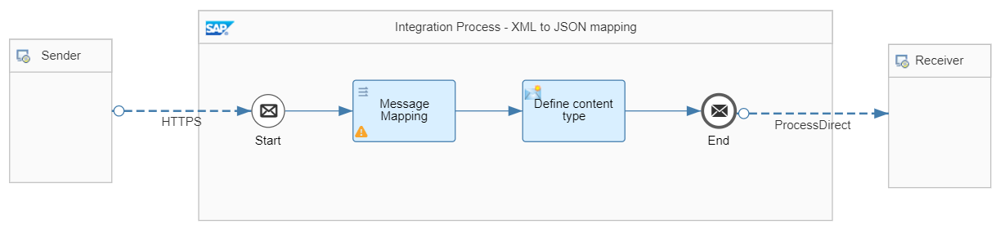
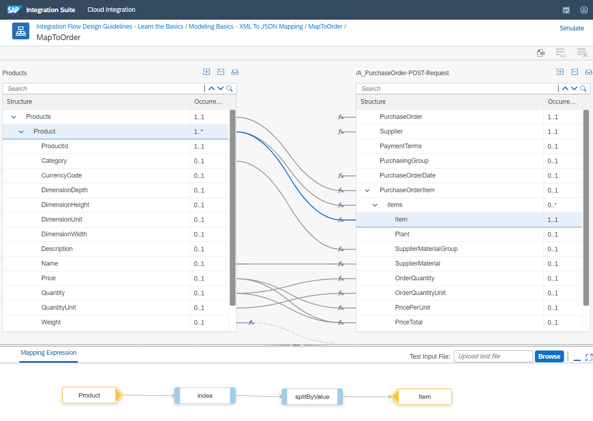

<!-- loiofb7c1df576d94516937ce773c456068a -->

# Use a Message Mapping to Map XML to JSON

In this section, we'll show you how to map an XML message to JSON format using a message mapping.In this section, we'll show you how to map an XML message to JSON format using a message mapping.


<a name="loiofb7c1df576d94516937ce773c456068a__section_qqt_h2k_tpb"/>

## Definition

The message-mapping step supports different types of schema definitions such as XSD, WSDL, EDMX, and Swagger/OpenAPI Spec JSON. If you like to map from or to a JSON format, you can add a Swagger/OpenAPI Spec JSON file to your source or target structure. Here, we support JSON files based on OpenAPI Spec versions 2.0 and 3.0 and especially the JSON definition files of the REST APIs that are published on SAP Business Accelerator Hub at [https://api.sap.com](https://api.sap.com/).

For more information about the message mapping and on which message structures aren’t supported when it comes to JSON mappings, see [Creating Message Mapping as a Flow Step](creating-message-mapping-as-a-flow-step-3d5cb7f.md).


<a name="loiofb7c1df576d94516937ce773c456068a__section_z1b_cfk_tpb"/>

## Implementation

The sample *Modeling Basics - XML To JSON Mapping* integration flow contains a message mapping that maps product information to a purchase order. Once mapped, the message is passed to the *Generic Receiver* that stores the message on the data store.



The incoming product file can contain multiple products. For each product, an item is created whereas the item number is incremented automatically. The source structure is an XML file whereas the target structure should be in JSON format. In our example, we used a JSON specification originated from SAP Business Accelerator Hub which – for simplicity reasons – we've modified.




<a name="loiofb7c1df576d94516937ce773c456068a__section_a3l_jfk_tpb"/>

## Executing the Scenario

As a prerequisite, besides deploying the actual integration flow, you need to deploy the generic receiver integration flow that is provided within the same package.

If you use Postman together with the Postman collection provided with the package, expand the collection folder`MappingXMLToJSON`. Here, you find a request with an OrderId and a SupplierId as headers, and an XML file with two products as body. If you run the scenario, you find a new entry in the data store `ModelingBasics-MappingXMLToJSON` that contains the mapped JSON file. The file looks like this:

> ### Sample Code:  
> ```
> {
>     "PurchaseOrderItem": {
>         "items": [
>             {
>                 "SupplierMaterialGroup": "Scanners",
>                 "Item": "10",
>                 "PriceTotal": "178",
>                 "ItemWeightUnit": "KG",
>                 "ItemNetWeight": "2.40",
>                 "PricePerUnit": "89.00",
>                 "OrderQuantityUnit": "EA",
>                 "SupplierMaterial": "Power Scan",
>                 "OrderQuantity": "2"            },
>             {
>                 "SupplierMaterialGroup": "Scanners",
>                 "Item": "20",
>                 "PriceTotal": "676",
>                 "ItemWeightUnit": "KG",
>                 "ItemNetWeight": "3.20",
>                 "PricePerUnit": "169.00",
>                 "OrderQuantityUnit": "EA",
>                 "SupplierMaterial": "Jet Scan Professional",
>                 "OrderQuantity": "4"
>             }
>         ]
>     },
>     "PurchaseOrderDate": "2021/05/27",
>     "PurchaseOrder": "10001234",
>     "Supplier": "100000042"
> }
> 
> ```

Optionally, you can simulate the message mapping via the integration flow simulation feature, see [Simulation of an Integration Flow](simulation-of-an-integration-flow-2e2210b.md). To do so, simply copy and paste the body from the Postman request into the simulation input dialog. Don’t forget to also maintain the two headers. Once the simulation has run, you can check the outcome by selecting the envelope at the simulation end point.


**Related Information**  


[Creating Message Mapping as a Flow Step](creating-message-mapping-as-a-flow-step-3d5cb7f.md "")

[Simulation of an Integration Flow](simulation-of-an-integration-flow-2e2210b.md "The simulation feature allows you to test an integration flow or its subset and see if you can get the desired outcome even before you deploy the integration flow. Based on the simulation result, you can decide to deploy the integration flow or resolve any errors.")

