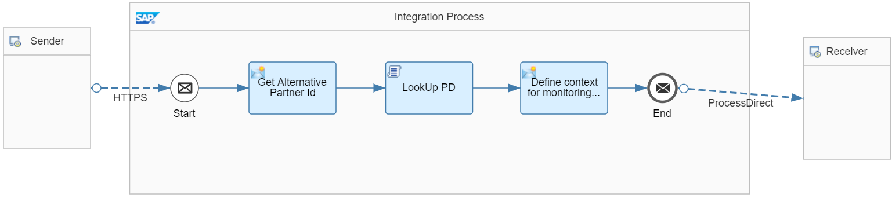

<!-- loio01a784c181ef4867a8440d6364547bb3 -->

# Use an Alternative Partner Id to Retrieve Partner Information

Use an alternative partner id parameter to read information about a partner \(for example, the PID\) from the Partner Directory.

This parameter is partner-specific so the integration flow can be used for different partners.

> ### Remember:  
> The maximum length of an Alternative Partner Id is 255 characters.

To illustrate this rule, check out the *Partner Directory - Alternative Partner Id* integration flow. It is modeled as shown in the figure.



The integration flow performs the following steps:

1.  It receives a request from the corresponding Postman collection. This request provides the alternative partner id \(`AlternativePid`\) in the request body.

    > ### Sample Code:  
    > ```
    > <Order>
    > 	<Header>
    > 		<Agency>AgencyA</Agency>
    > 		<Scheme>SchemeA</Scheme>
    > 		<AlternativePid>Partner123</AlternativePid>
    > 	</Header>
    > 	<Items>
    > 		<item>
    > 			<ProductId>Product</ProductId>
    > 			<Description>Description</Description>
    > 			<Price>10.00</Price>
    > 			<Qtty></Qtty>
    > 		</item>
    > 	</Items>
    > </Order>
    > ```

2.  The Content Modifier *Get Alternative Partner Id* reads the actual values of the elements `AlternativePid`, `Agency`, and `Scheme` from the payload and stores them as properties.

    ****


    <table>
    <tr>
    <th valign="top">

    Property
    
    </th>
    <th valign="top">

    XPath Expression
    
    </th>
    <th valign="top">

    Description
    
    </th>
    </tr>
    <tr>
    <td valign="top">
    
    Agency
    
    </td>
    <td valign="top">
    
    `/Order/Header/Agency` 
    
    </td>
    <td valign="top">
    
    Name of organization that defines the identification scheme and issues names for the objects to be identified.
    
    </td>
    </tr>
    <tr>
    <td valign="top">
    
    Scheme
    
    </td>
    <td valign="top">
    
    `/Order/Header/Scheme` 
    
    </td>
    <td valign="top">
    
    Constitutes the reference framework within which objects are uniquely identified by names.
    
    </td>
    </tr>
    <tr>
    <td valign="top">
    
    AlternativePid
    
    </td>
    <td valign="top">
    
    `/Order/Header/AlternativePid` 
    
    </td>
    <td valign="top">
    
    The \(unique\) ID or name in the given identification scheme.
    
    </td>
    </tr>
    </table>
    
    For more information on these entities, check out the following SAP Community blog: [Cloud Integration – Partner Directory – Partner Dependent XML Structures and IDs](https://blogs.sap.com/2017/08/22/cloud-integration-partner-directory-partner-dependent-xml-structures-and-ids/).

3.  The Groovy Script step *LookUp PD* uses the properties defined in the previous step to look up the PID for the partner in the Partner Directory.

    > ### Sample Code:  
    > ```
    > import com.sap.gateway.ip.core.customdev.util.Message;
    > import java.util.HashMap;
    > import com.sap.it.api.pd.PartnerDirectoryService;
    > import com.sap.it.api.ITApiFactory;
    > 
    > def Message processData(Message message) {
    > 
    >     def service = ITApiFactory.getApi(PartnerDirectoryService.class, null); 
    >     if (service == null){
    >         throw new IllegalStateException("Partner Directory Service not found");
    >     }
    >     
    >     //Agency, Scheme & Alternative Partner Id
    >     def properties = message.getProperties(); 
    >     def Agency = properties.get("Agency");
    >     if (Agency == null){
    >         throw new IllegalStateException("Agency not found for the sent message");   
    >     }
    >     def Scheme = properties.get("Scheme");
    >     if (Scheme == null){
    >         throw new IllegalStateException("Scheme not found for the sent message");   
    >     }
    >     def AlternativePid = properties.get("AlternativePid");
    >     if (AlternativePid == null){
    >         throw new IllegalStateException("AlternativePid not found for the sent message");   
    >     }
    >     
    >     // map alternative partner ID to partner id
    >     def pid = service.getPartnerId(Agency, Scheme, AlternativePid);
    >     if (pid == null){
    >         throw new IllegalStateException("Partner ID not found for agency "+Agency+" , scheme "+Scheme+", and  id " + AlternativePid);   
    >     }
    >     message.setProperty("pid", pid);  
    > 
    >     return message;
    > }
    > ```

4.  The Content Modifier *Define context for monitoring purposes* sets the `context` and `receiver` headers for the subsequent *Generic Receiver* integration flow.

    The headers are defined with the following expressions:

    ****


    <table>
    <tr>
    <th valign="top">

    Header
    
    </th>
    <th valign="top">

    Expression
    
    </th>
    <th valign="top">

    Description
    
    </th>
    </tr>
    <tr>
    <td valign="top">
    
    context
    
    </td>
    <td valign="top">
    
    `PartnerDirectory-AlternativePartnerId`
    
    </td>
    <td valign="top">
    
    Defines the Data Store name. In this case, the name reflects this guideline.
    
    </td>
    </tr>
    <tr>
    <td valign="top">
    
    receiver
    
    </td>
    <td valign="top">
    
    Partner $\{property.pid\}
    
    </td>
    <td valign="top">
    
    Defines the Data Store entry ID. In this case, the value is given by the partner ID from the Partner Directory.
    
    </td>
    </tr>
    </table>
    
5.  Finally, the integration flow calls the *Generic Receiver* integration flow.


To process the integration flow, perform the following steps:

1.  Deploy the integration flows *Partner Directory - Alternative Partner Id* and *Generic Receiver*.

2.  Start the Postman Runner and select collection *CPI Partner Directory Example Flows*.

3.  Select folder *Alternative Partner Id* in the folder structure for the relevant cloud environment \(under *Neo Environment* \> *Integration Flows \(Neo\)* or *CF Environment* \> *Integration Flows \(CF\)*\).

4.  Start the Postman runner for this folder.


On successful processing, the integration flow creates the following Data Store entry:

-   Data Store name: *PartnerDirectory-AlternativePartnerId*

-   Data Store entry ID: *Partner <PID\>*


