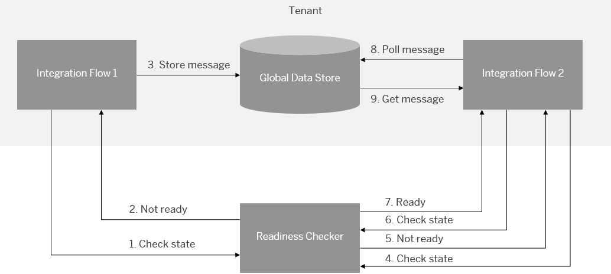
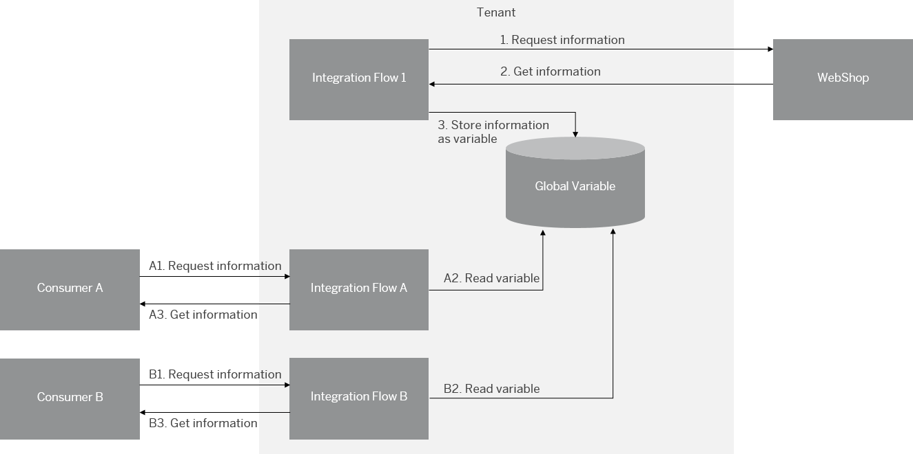
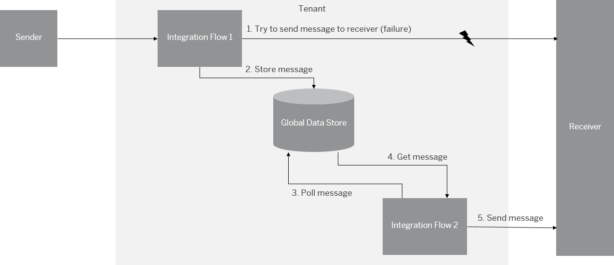

<!-- loio853d4ddebeac4afa947cbe755b42c280 -->

# Use Cases for Data Store and Variables

<a name="loio853d4ddebeac4afa947cbe755b42c280__section_kyf_hll_ynb"/>

## Store and Pickup

Assume that no one of the communication partners involved in the integration scenario can open its firewall for calls from outside. That means, a communication partner needs to fetch data from the cloud.

In such a case, you can implement a scenario where 2 integration flows are involved in the following way.

1.  Integration flow 1 stores a message \(received from a connected sender component\) in the data store.

2.  Integration flow 2 \(initiated by an external call or a Data Store sender adapter\) actively polls the message from the data store.

    You can use the Data Store sender adapter to allow SAP Integration Suite to consume messages from a data store. This feature helps you to enable asynchronous decoupling of inbound and outbound processing by using the data store as temporary storage. When configuring the Data Store sender adapter, you can specify parameters such as the poll interval that determines the time to wait before consuming messages from the data store. You can also define the retry behavior.

3.  Integration flow 2 gets the message from the data store.

In this scenario, the time when a message is picked up by integration flow 2 isn't known. It's recommended that the scenario is designed in a way that integration flow 2 removes the message only after having received a confirmation of the receiver systems.

<a name="loio853d4ddebeac4afa947cbe755b42c280__section_arl_q4l_ynb"/>

## Store for Later Pick Up

Assume that your business case requires a message to be "parked" for a certain time \(for example, because the associated backend isn't ready yet to process the message\). For example, in an integration scenario a message is processed and finally sent to a receiver. However, in case the receiver cannot be reached, the message is stored in the data store. At a later point in time \(when the receiver is ready\), the message is picked up and sent to the receiver.

To illustrate such a setup, let us imagine a component \(Readiness Checker\) that "tells" the integration scenario whether processing can continue or not.

In this setup, Cloud Integration waits for a state change before continuing message processing at certain steps. The actual state is requested from a remote component \(*Readiness Checker*\).

Both integration flows request a status \(*Ready* or *Not Ready*\) from the Readiness checker and only continue processing the message in the *Ready* case.

In case the status is *Not Ready*, integration flow 1 stores the message in the data store \(to be picked up later by integration flow 2\).

Integration flow 2 repeatedly requests the actual status from the Readiness Checker and continues to do so \(controlled by a scheduler\) as long until the Readiness Checker provides the status *Ready*. Only then, it continues message processing. In this case, it takes the message from the data store and continues message processing. In the figure, we assume that after the 2nd request the status *Ready* is provided as response.

1.  Integration flow 1 requests the actual state from the Readiness Checker.

    In case the status *Ready* is provided as response, integration flow 1 continues processing as designed for the success case, and we're done.

2.  The Readiness Checker provides the status *Not Ready* as response.

3.  Integration flow 1 stores \("parks"\) the message in the data store.

4.  Integration flow 2 requests the actual state from the Readiness Checker for the first time.

5.  The Readiness Checker provides the status *Not Ready* as response \(let's assume this\).

6.  After a certain time period, integration flow 2 requests the actual state from the Readiness Checker again.

7.  Let us assume that now the Readiness Checker provides the status *Ready* as response.

8.  Integration flow 2, in this case, picks up the message from the data store.

9.  Integration flow 2 reads the message from the data store \(and continues processing\).

<a name="loio853d4ddebeac4afa947cbe755b42c280__section_r4t_ysm_ynb"/>

## Store Data Once, Read Multiple Times

Assume that in your integration scenario multiple remote systems \(consumers\) need to access data from another remote component \(provider\). Furthermore, you like to avoid that all consumers perform individual requests to get the same data from the provider.

In such a case, you can request the information from the provider once \(with 1 integration flow\) and store the information as a global variable \(using the Write Variables step\). Global variables are stored in the same database as Data Store content \(see [Using Data Storage Features When Designing Integration Flows](using-data-storage-features-when-designing-integration-flows-a836b4e.md)\).

The consumers can access the information from the global variable \(through additional integration flows\) instead of performing separate calls to the provider.

The figure shows a setup where information from the WebShop \(which is the provider component\) is requested by multiple consumers.

1.  Integration flow 1 requests the information from the provider.

    As an example, think of a scenario where a product price is ready on a daily basis from the WebShop by an integration flow.

2.  As a response, integration flow 1 gets the information.

3.  Integration flow 1 stores the information as global variable.

Each consumer \(consumer A or consumer B in our example setup\) can access the information from the global variable instead of calling the provider again.

<a name="loio853d4ddebeac4afa947cbe755b42c280__section_pqq_bzm_ynb"/>

## Asynchronous Decoupling of Messages - Option 1

Some sender systems can’t perform a retry in case there's a failure in transferring the message.

To support such a use case, you can implement a scenario like depicted in the figure.

In the scenario, a global data store is used.

1.  Integration flow 1 receives the message from the sender and stores it in the data store \(using the *Data Store Write* step\).

2.  Integration flow 2 \(using the Data Store sender adapter\) actively polls the message from the data store. Alternatively, this step can also be triggered by a *Timer* step with a scheduler.

3.  Integration flow 2 reads the message from the data store.

4.  Integration flow 2 sends the message to the receiver.

In this scenario, integration flow 2 has to remove the message \(using a *Data Store Delete* step\) only if the message is transferred successfully to the receiver.

<a name="loio853d4ddebeac4afa947cbe755b42c280__section_cmm_dzm_ynb"/>

## Asynchronous Decoupling of Messages - Option 2

An alternative usage of the data store to asynchronously decouple inbound from outbound processing is shown in the following figure.

In this scenario, integration flow 1 stores the message in the data store only in case it can't be delivered to the receiver \(failure case\). This measure guarantees that the "expensive" operation that involved database persistence is only performed if necessary.

Integration flow 2 checks regularly for failed messages that need to be resent to the receiver. In detail, the following steps are processed.

In the scenario, a global data store is used.

1.  Integration flow 1 tries to send the message to the receiver, but this step fails.

2.  Integration flow 1 stores the message in the data store.

    To handle exceptions, integration flow 1 is designed in such a way that an exception subprocess takes over this step \(see [Handle Exceptions](handle-exceptions-ca95c61.md)\).

3.  Integration flow 2 \(using the Data Store sender adapter\) actively polls the message from the data store. Alternatively, this step can also be triggered by a *Timer* step with a scheduler.

4.  Integration flow 2 reads the message from the data store.

5.  Integration flow 2 sends the message to the receiver.

**Related Information**  

[Data Store Sender Adapter](data-store-sender-adapter-4f5ef3f.md "This adapter enables Cloud Integration to consume messages from a data store. This feature helps you to enable asynchronous decoupling of inbound and outbound processing by using the data store as temporary storage.")

[Define Data Store Operations](define-data-store-operations-79f63a4.md "You can use the data store to temporarily store messages.")

[Define Write Variables](define-write-variables-de04b75.md "You define variables to share data across different integration flows (deployed on the same tenant).")

