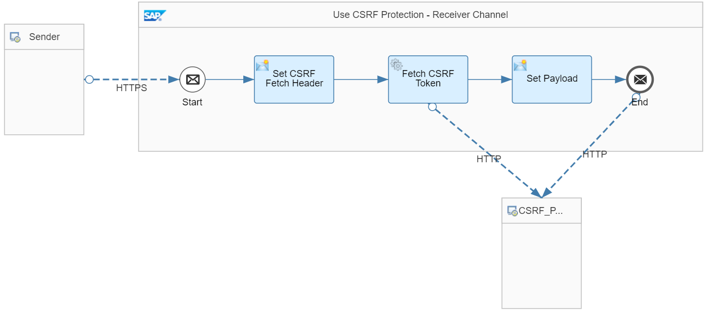
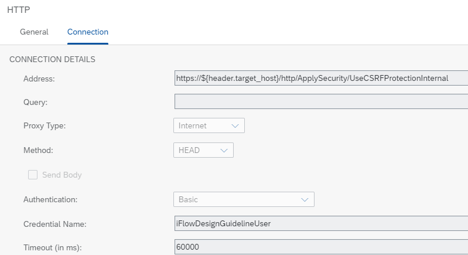
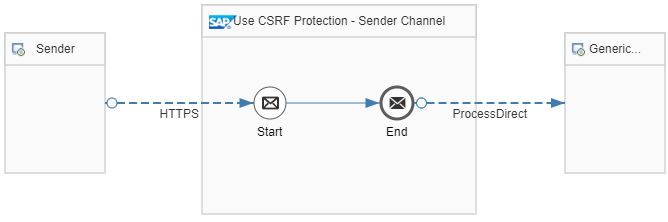

<!-- loioa0765d56b6024f29a41a3a747f993499 -->

# Use CSRF Protection

When using HTTPS-based sender channels to enable integration flows to receive HTTP requests, make sure to protect the system against cross site request forgery \(CSRF\) attacks.

HTTP-based adapters are subject to CSRF attacks \(see: [Cross Site Request Forgery \(CSRF\) on OWASP.org](https://owasp.org/www-community/attacks/csrf)\). Therefore, they offer the possibility to be protected against such attacks. This option \(parameter *CSRF Protected*\) is enabled by default. When an integration flow can be called via modifying HTTP requests \(POST, PUT, DELETE, PATCH\), make sure that the *CSRF Protected* option is always activated.

> ### Note:  
> When dealing with receiver adapters that support CSRF protection, apply the following rules:
> 
> -   It's determined by the configuration of the receiver system if CSRF protection for the outbound connection is required or not. If supported and required by the receiver, keep the *CSRF Protected* option enabled in the receiver adapter \(if the receiver adapter offers this feature\) or explicitly implement CSRF token handling.
> 
>     If CSRF protection isn't required by the receiver, you also don’t need to configure the outbound connection accordingly. In this case, such a setting doesn't increase the security level of your scenario. Moreover, the scenario can even fail if you have configured CSRF token handling but the receiver doesn't expect any CSRF fetch request.
> 
> -   Activating HTTP session reuse is a **prerequisite** for the operation of the CSRF-protected scenario.
> 
>     To configure this setting, enable the option *HTTP Session Reuse* for the integration flow \(in tab *Runtime Configuration* when clicked outside the *Integration Process* shape of the integration flow model\). When specifying this setting, make also sure to keep the *CSRF Protected* option enabled \(if the receiver system connected with the adapter supports and requires this option\).

<a name="loioa0765d56b6024f29a41a3a747f993499__section_hk3_zbd_vkb"/>

## Implementation

This guideline applies to both the sender and receiver channel direction and is illustrated by the following 2 reference integration flows:

-   *Apply Security - Use CSRF Protection - Receiver Channel*

-   *Apply Security - Use CSRF Protection - Sender Channel*

Both integration flows communicate with each other as shown in the figure.

As indicated, integration flow *Apply Security - Use CSRF Protection - Receiver Channel* \(which is initially called by the HTTP client\) calls integration flow *Apply Security - Use CSRF Protection - Sender Channel*. Although we assume that you deploy both integration flows on the same tenant, the communication exceeds the borders of the tenant and is passed through the load balancer \(as described under [Setting Up Inbound HTTP Connections (Integration Flow Processing), Neo Environment](https://help.sap.com/viewer/368c481cd6954bdfa5d0435479fd4eaf/Cloud/en-US/778c7e7835ff46408aafe0d499720dc7.html "You can use various sender adapters (for example, the SOAP adapters, the IDoc adapter, and the HTTP adapter) to connect the tenant to a sender system so that the sender can send messages to Cloud Integration over the HTTP protocol.") :arrow_upper_right:\). From the perspective of the first integration flow, the message is sent towards a remote tenant \(using the HTTP receiver adapter\). Likewise, from the perspective of the 2nd integration flow, the message is received from a remote component. This behavior is different than when using ProcessDirect adapters for the communication between the integration flows.

CSRF protection is enabled on sender and receiver channel side:

-   On sender channel side, for the involved HTTPS sender adapters *CSRF Protected* is enabled.

-   On receiver channel side, for the involved HTTP receiver channel, the CSRF token flow needs to be explicitly modeled.

Note the following prerequisite to run the integration flows: To allow integration flow *Apply Security - Use CSRF Protection - Receiver Channel* to call integration flow *Apply Security - Use CSRF Protection - Sender Channel*, you need to configure and deploy a *User Credentials* artifact. This artifact contains the credentials of a user that has the *ESBMessaging.send* user role assigned. You can use the same user that is also used to run the Postman collection for the example integration flows. The name of the *User Credentials* must be named `iFlowDesignGuidelineUser`.

Reference integration flow *Apply Security - Use CSRF Protection - Receiver Channel* is modeled in the following way:

For the HTTP receiver channel, the CSRF token handling must be modeled explicitly. In other words, integration flow *Apply Security - Use CSRF Protection - Receiver Channel* needs to explicitly retrieve the CSRF token \(in a header\) from the receiver \(implemented by integration flow *Apply Security - Use CSRF Protection - Sender Channel*\).

> ### Tip:  
> If you use an OData receiver adapter instead, no explicit modeling of the CSRF token handling is required. In that case, you can simply enable the option *CSRF Protected* \(*Connection* tab\).

To implement this step, the integration flow is designed in the following way:

1.  Content Modifier *Set CSRF Fetch Header* sets a header `x-csrf-token` with value `fetch`.

    In addition to that, the payload is stored as a property \(so that it is available after the subsequent *Fetch CSRF Token* call\).

2.  The Request Reply step *Fetch CSRF Token* calls integration flow *Apply Security - Use CSRF Protection - Sender Channel* \(through an HTTP receiver adapter\) to fetch the CSRF token.

    In the HTTP receiver adapter \(*Connection* tab\), method *HEAD* is selected which specifies the connection in such a way that a header is requested from the target system.

    > ### Note:  
    > Alternatively, you can also use the HTTP *GET* method for this step. Consider the case that, before placing a POST request, you first like to fetch data from the remote component using a GET request. In this case, you can use the GET request \(that is anyway required by the scenario\) to also fetch the CSRF token. That way, you can reduce the number of required communication steps in your scenario to a minimum.

    In order to be able to respond to this request in the expected way, the target system expects a header `x-csrf-token` with value `fetch` that has been set in the preceding Content Modifier.

    

3.  Content Modifier *Set Payload* sets the payload based on the property created in the previous Content Modifier.

4.  The retrieved CSRF token header is automatically kept and forwarded to the final call to the receiving integration flow \(modeled as the 2nd HTTP receiver connection\).

> ### Note:  
> Note that the header is only kept within the same Camel exchange. In the course of more complex integration scenarios, it's possible that multiple Camel exchanges are opened within the same integration flow \(for example, when in a multicast pattern several routes are opened\). In this case, you need to make sure that the header `x-csrf-token` can be passed on to the final receiver.

Reference integration flow *Apply Security - Use CSRF Protection - Sender Channel* is modeled in the following way:

This integration flow forwards the received message to the generic receiver integration flow \(to store the message content as Data Store entry\).

Before deployment, verify that the option *CSRF Protected* is enabled in the HTTPS sender adapter \(*Connection* tab\).

For more information, check out the following sources:

[Cross-Site Request Forgery \(CSRF\) Prevention Cheat Sheet](https://owasp.org/www-project-cheat-sheets/cheatsheets/Cross-Site_Request_Forgery_Prevention_Cheat_Sheet.html)

[Authentication](authentication-bd2fbd5.md) \(SAP Help Portal\)

