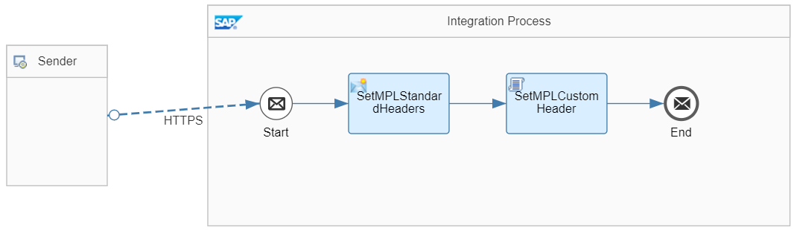
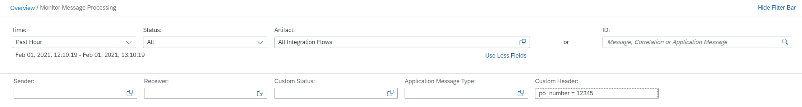
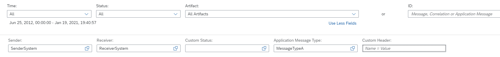

<!-- loiod4b5839670ce4866a770f7cadac063db -->

# Use Custom Header Properties to Search for Message Processing Logs

Write custom header properties to store business- or payload-related information in the message processing log \(MPL\).

In the message monitor, you can option search the processed messages based on the following identifiers:

-   Message ID

-   Correlation ID

-   Application ID


Whereas the former 2 IDs hold technical identifiers, you can use the application ID to store business-related information. You also have the option to define custom header properties to store further business- or payload-related information in the message processing log \(MPL\). Custom header properties can be written via scripting.


<a name="loiod4b5839670ce4866a770f7cadac063db__section_yxn_4ty_jnb"/>

## Implementation

The standard message monitor supports search based on custom header properties \(see [Monitor Message Processing](monitor-message-processing-314df3f.md)\). In addition, the search is also supported via the Cloud Integration OData API, see [Message Processing Logs](message-processing-logs-827a2d7.md).

To illustrate this rule, see the *Scripting – MPL Custom Header* integration flow. This integration flow represents the use case where custom header properties are written to the message processing log by means of scripts.



To call this integration flow, use the corresponding request from the Postman collection provided with the integration package.

```
<order>
<sender>SenderSystem</sender>
<receiver>ReceiverSystem</receiver>
<messagetype>MessageTypeA</messagetype>
<messageID>AABBCCDD</messageID>
<po_number>12345</po_number>
<productID>123</productID>
</order>
```

The integration flow creates new header values based on the XML payload.

The *SetMPLStandardHeaders* Content Modifier is configured in the following way \(in the *Message Header* tab\):


<table>
<tr>
<th valign="top">

Name

</th>
<th valign="top">

Type

</th>
<th valign="top">

Data Type

</th>
<th valign="top">

Value

</th>
</tr>
<tr>
<td valign="top">

po\_number

</td>
<td valign="top">

XPath

</td>
<td valign="top">

java.lang.String

</td>
<td valign="top">

/order/po\_number

</td>
</tr>
<tr>
<td valign="top">

SAP\_Sender

</td>
<td valign="top">

XPath

</td>
<td valign="top">

java.lang.String

</td>
<td valign="top">

/order/sender

</td>
</tr>
<tr>
<td valign="top">

SAP\_Receiver

</td>
<td valign="top">

XPath

</td>
<td valign="top">

java.lang.String

</td>
<td valign="top">

/order/receiver

</td>
</tr>
<tr>
<td valign="top">

SAP\_MessageType

</td>
<td valign="top">

XPath

</td>
<td valign="top">

java.lang.String

</td>
<td valign="top">

/order/messagetype

</td>
</tr>
<tr>
<td valign="top">

SAP\_ApplicationID

</td>
<td valign="top">

XPath

</td>
<td valign="top">

java.lang.String

</td>
<td valign="top">

/order/messageID

</td>
</tr>
</table>

The *SetMPLCustomHeader* Script step stores payload-based information in a custom header property.

```
import com.sap.gateway.ip.core.customdev.util.Message;

def Message processData(Message message) {
    
	def messageLog = messageLogFactory.getMessageLog(message);
	if(messageLog != null){

		def po_number = message.getHeaders().get("po_number");		
		if(po_number!=null){
			messageLog.addCustomHeaderProperty("po_number", po_number);		
        }
	}
	return message;
}
```

The `MessageLogFactory` class is used to create the `messageLog` object. The `addCustomHeaderProperty` function can then be used to add custom header fields. In this case, a custom header field is created for the `po_number`.

Once the message has been processed, use the corresponding request from the Postman collection to get the message for a particular `po_number` value. Since the custom header properties are stored as name/value pairs, the request looks like this:

`https://{{cpi_designtime_url}}/itspaces/odata/api/v1/MessageProcessingLogCustomHeaderProperties?$filter=Name eq 'po_number' and Value eq '12345'&$expand=Log&$format=json`

> ### Note:  
> In the URL Postman variable, `cpi_designtime_url` is used. You need to maintain this variable in your Postman environment. It holds the Cloud Integration host name of the Web UI. Use the part of the browser address before the string `/itspaces` when you’ve opened the Cloud Integration Web UI \(for example: `mytenant.tmn.hci.eu1.hana.ondemand.com`\).


<a name="loiod4b5839670ce4866a770f7cadac063db__section_bdc_hb1_n4b"/>

## Finding Messages for a Custom Header

To find messages for a custom header, perform the following steps.

1.  Go to the *Monitor* section of Cloud Integration and select a tile under *Monitor Message Processing*.

2.  Click *Use More Fields*.

3.  In the *Custom Header* field, enter the filter in the following form:

    `<custom header name> = <custom header value>`

    Example:

    `po_number = 12345`

    

    In addition, search fields for sender, receiver, message type, and application ID are also available. Try searching messages using the values saved in headers in the *SetMPLStandardHeaders* Content Modifier.

    

    The values of those headers are visible in the *Properties* section of the message monitor for all trace levels.

    


