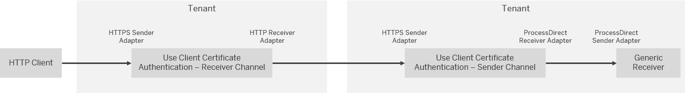
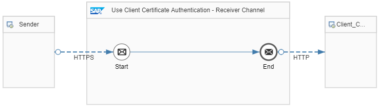

<!-- loio3d46d45ab3b34581bebf9dddfafe47d5 -->

# Use Secure Authentication Methods

SAP Integration Suite offers a range of authentication methods when accessing integration flow endpoints \(adapter sender channels\), connecting to external systems via adapter receiver channels, as well as when consuming public OData APIs. Depending on the adapter and channel type, the following authentication options are supported \(the list is roughly ordered from low to high security\):

-   None \(e.g. OData, AMQP, HTTP, SOAP, …\)

-   Basic Authentication

-   Principal Propagation

-   SASL \(e.g. AMQP\)

-   OAuth Authentication \(token based; e.g. OData, AMQP\)

-   Client Certificate Authentication

-   Public Key Authentication \(e.g. SFTP\)

Just as it’s recommended to always prefer secure transport protocols, this guideline suggests preferring the more secure authentication methods wherever possible. Be aware of the pros and cons of each authentication method.

> ### Note:  
> SAP Integration Suite recommends to avoid using generic user roles for sender-side authorization of an integration flow execution. You must create a custom role for inbound communication. For more information, see [Managing User Roles](managing-user-roles-4e86f0d.md).

<a name="loio3d46d45ab3b34581bebf9dddfafe47d5__section_u4t_jnk_bcc"/>

## No Authentication

No authentication is the most insecure method and is to be avoided. Anybody can send messages to the endpoint, e.g. faking messages or overloading the endpoint processing for denial of service. If authentication isn't possible, consider other means for securing your communication – e.g. via signatures and encryption on message level \(see guide for Message Level Security\).

Note that inbound communication to CPI must always be authenticated, so this option is currently only available for outbound receiver adapters.

<a name="loio3d46d45ab3b34581bebf9dddfafe47d5__section_mzm_nnk_bcc"/>

## Basic Authentication

The standard **Basic Authentication** is supported by all sender and receiver channels, whenever it’s appropriate for the chosen transport protocol. Basic authentication has several drawbacks:

-   Even if transport level security is used, clear text passwords can be retrieved on intermediate network hops \(for example, load balancers\) that terminate the TLS connection.

-   Short and poorly designed passwords can easily be unveiled by brute-force attacks.

-   The user can be locked because of too many failed login attempts, which opens the door for denial-of-service attacks.

For these reasons, always consider using more secure authentication methods, if available.

<a name="loio3d46d45ab3b34581bebf9dddfafe47d5__section_o1j_pnk_bcc"/>

## Principal Propagation

Principal Propagation uses SAML assertions to forward existing login information from another Identity Provider to CPI \(or from CPI to another receiver\). The authentication depends on a trust relation to the issuing Identity Provider.

<a name="loio3d46d45ab3b34581bebf9dddfafe47d5__section_h2s_qnk_bcc"/>

## SASL

**SASL** \(Simple Authentication and Security Layer\) is a framework that includes multiple authentication mechanisms and also allows for data encryption and integrity-checking.

<a name="loio3d46d45ab3b34581bebf9dddfafe47d5__section_a5t_qnk_bcc"/>

## OAuth

**OAuth Authentication** flows are based on tokens, which allow a resource owner to grant restricted access to clients. These flows are designed to support technical communications. Some benefits of OAuth compared to basic authentication:

-   Secret credentials are only exchanged with a trusted authorization server and not with every endpoint.

-   The lifetime of tokens is limited. This limits damage in case such a token gets exposed.

OAuth authentication is supported for the following adapters:

-   Sender channel: SOAP \(SOAP 1.x\), SOAP \(SAP RM\), HTTPS

-   Receiver channel: OData, AMQP, HTTP, SuccessFactors, Twitter, and Facebook adapters

<a name="loio3d46d45ab3b34581bebf9dddfafe47d5__section_b35_qnk_bcc"/>

## Client Certificate

**Client Certificate Authentication** is based on a public/private key cryptography. It therefore does not require a shared secret, which could be guessed or unveiled by brute-force attacks. Client Certificate Authentication is supported by the following HTTP transport protocol-based adapters:

-   SOAP, IDoc, HTTP, SuccessFactors, SAP XI, AS2, OData

How to setup client certificate authentication is described in more detail in this guideline and illustrated by an example integration flow.

<a name="loio3d46d45ab3b34581bebf9dddfafe47d5__section_tdw_qnk_bcc"/>

## Public Key

**Public Key Authentication** is currently supported exclusively by the SFTP adapter \(sender and receiver channel\). The security of Public Key Authentication is comparable to client certificate authentication.

<a name="loio3d46d45ab3b34581bebf9dddfafe47d5__section_xqg_ynk_bcc"/>

## Implementation Example with Client Certificate Authentication

This guideline applies to both inbound and outbound communication and is illustrated by 2 integration flows. As illustrated in the figure, the 1st integration flow *Use Client Certificate Authentication – Receiver Channel* calls the 2nd integration flow *Use Client Certificate Authentication – Sender Channel*.

> ### Note:  
> As a prerequisite to execute the example integration flows, you need to perform initial steps to get the required keys and certificates in place and to define the certificate-to-user mapping.
> 
> More information: [Setting Up the Key Pairs and Certificates](setting-up-the-key-pairs-and-certificates-620967b.md)

To minimize the configuration effort, the example uses 2 integration flows on the same tenant to demonstrate client certificate-based authentication. Here, one integration flow calls the other one in a local roundtrip on the same SAP Cloud Integration tenant.

Integration flow *User Client Certificate Authentication – Receiver Channel* is designed in the following way:

As original sender, we propose to use an HTTP client such like Postman. The integration flow is called with an HTTP GET operation \(so that no CSRF protection is required as described under [Use CSRF Protection](use-csrf-protection-a0765d5.md)\).

The integration flow simply forwards the request to the 2nd integration flow *Use Client Certificate Authentication – Sender Channel* using an HTTP receiver channel.

As *Address*, the following URL is specified:

`https://${header.target_host}/http/ApplySecurity/UseClientCertAuthInternal`

As *Authentication* the option *Client Certificate* is selected.

As value for the *Private Key Alias* parameter, a dynamic expression is specified. The private key alias points to the key pair entry that was created as prerequisite. In a productive scenario, you would directly enter the name of this keystore entry.

Since the name of the keystore alias depends on the option chosen for the key pair creation, we can't anticipate the dedicated name. Therefore, in the example integration flow, this parameter is dynamically defined using a header \(in the expression `${header.keystore_alias}`\). That way, you can set the keystore alias name in Postman \(as `keystore_alias_for_client_cert_auth` variable value in the Postman environment\).

If no value is specified for the *Private Key Alias* parameter, the keystore is checked for appropriate key pair entries. The first match \(that can be validated by any of the accepted CAs of the receiver system\) is used automatically.

In a productive scenario, usually you need to additionally download and deploy the server certificate root CA into the keystore \(in case it isn't yet available there\).

Integration flow *User Client Certificate Authentication – Sender Channel* is designed in the following way:

For the HTTP sender channel, *User Role* authorization with the predefined user role `ESBMessaging.send` is used. Alternatively, you can specify a custom role if the user mapped for the client certificate has the chosen custom role.

The example integration flow can be used without further effort because a certificate has been mapped to the user as prerequisite: the certificate \(received from the first integration flow\) is mapped to the user \(that has assigned role `ESBMessging.send` or a custom role\) even before the message enters the adapter inbound processing.

<a name="loio3d46d45ab3b34581bebf9dddfafe47d5__section_crg_ynk_bcc"/>

## More Information

The following SAP Community blogs provide more information:

**Basic Authentication:**

-   [Inbound](https://help.sap.com/viewer/368c481cd6954bdfa5d0435479fd4eaf/Cloud/en-US/2c4c2d98e9de4b92a3b3af2ba9483909.html)

-   [Outbound](https://help.sap.com/viewer/368c481cd6954bdfa5d0435479fd4eaf/Cloud/en-US/a5d77b12ff16483c965cce936aa1b698.html)

**Client Certificate Authentication:**

-   Inbound: [Client Certificate Authentication, Neo Environment](https://help.sap.com/viewer/368c481cd6954bdfa5d0435479fd4eaf/Cloud/en-US/c1eeeab4877147ffa6a5997c76eaaaca.html)

-   Outbound: [Client Certificate Authentication](https://help.sap.com/viewer/368c481cd6954bdfa5d0435479fd4eaf/Cloud/en-US/c4e4a1570d6b4896b7426f67ae053a5e.html)

-   [How to Setup Secure HTTP Inbound Connection with Client Certificates](https://blogs.sap.com/2017/06/05/cloud-integration-how-to-setup-secure-http-inbound-connection-with-client-certificates/)

-   [How to Setup Secure Outbound HTTP Connection using Keystore Monitor](https://blogs.sap.com/2017/06/19/cloud-integration-how-to-setup-secure-outbound-http-connection-using-keystore-monitor/)

-   [Cloud Integration – Keystore Monitor now available for Tenant Administrator](https://blogs.sap.com/2017/06/19/cloud-integration-keystore-monitor-now-available-for-tenant-administrator/) 

-   [Setup Secure HTTP Inbound Connection with Client Certificates and Custom Roles in Cloud Foundry](https://blogs.sap.com/2019/08/14/cloud-integration-on-cf-how-to-setup-secure-http-inbound-connection-with-client-certificates/)

**OAuth Authentication:** [OAuth 2.0](https://help.sap.com/viewer/368c481cd6954bdfa5d0435479fd4eaf/Cloud/en-US/382313443b8d4453b0fd536b82b9e15d.html)

-   [OAuth Client Credentials Grant](https://help.sap.com/viewer/368c481cd6954bdfa5d0435479fd4eaf/Cloud/en-US/cf611eca57744d29be588b7d4ec900e1.html?q=OAuth)

-   Blog: [Blog: Cloud Integration – Inbound HTTP Connections using OAuth Client Credentials Grant](https://blogs.sap.com/2019/02/14/cloud-integration-inbound-http-connections-using-oauth-client-credentials-grant/)

-   [OAuth 2.0 website](https://oauth.net/2/)

**SFTP with Public Key Authentication:**

-   [How SFTP Works](https://help.sap.com/viewer/368c481cd6954bdfa5d0435479fd4eaf/Cloud/en-US/fc8467b6dc7e40479d3d568cd79a3c1c.html?q=%22Public%20Key%20Authentication%22)

-   [Inbound SFTP With Public Key Authentication](https://help.sap.com/viewer/368c481cd6954bdfa5d0435479fd4eaf/Cloud/en-US/97e2baafd4184e98916f246c373af3bf.html)
-   [Outbound SFTP With Public Key Authentication](https://help.sap.com/viewer/368c481cd6954bdfa5d0435479fd4eaf/Cloud/en-US/d96b2d7720eb469ca39133cc40cff6d7.html)

