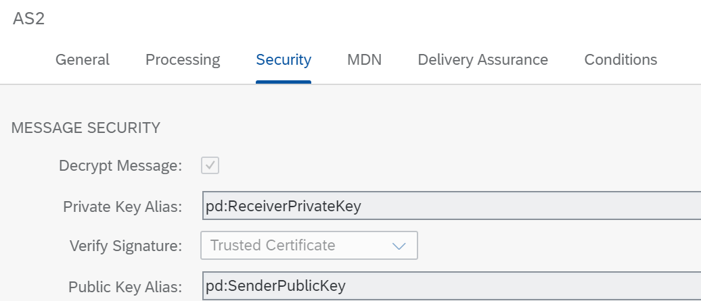

<!-- loio2cd252c075d74d08b4b551ac500b7833 -->

# Use the AS2 Adapter with Dynamic Encryption and Signature Verification

Send a message to Cloud Integration through the AS2 adapter. Depending on the sending partner, the message is signed or encrypted or both with the corresponding keys.

To illustrate this rule, check out the *Partner Directory - AS2 Dynamic Keys* integration flow. It's modeled as shown in the figure.


The integration flow performs the following steps:

1.  It receives a request through an AS2 sender adapter.

    If you check out tab *Security* of the adapter, you notice that private and public key alias names are defined based on expressions pointing to the Partner Directory.

    

    The Partner Id is determined according to the sending user \(Authorized User\), as explained for the integration flow *Partner Directory – Authorized User* \(see [Fetch the Partner Info from the Partner Directory](fetch-the-partner-info-from-the-partner-directory-a44a1f9.md)\).

    The option *Decrypt Message* is enabled. Note that, however, the setting of this parameter is overwritten if entity `AS2_inbound_decrypt_message` is defined in the Partner Directory. Possible values: `true | false`

    For parameter *Verify Signature*, the option *Trusted Certificate* is selected.

    Note that, however, the setting of this parameter is overwritten if entity `AS2_inbound_verify_signature` is defined in the Partner Directory. Possible values: `notRequired | trustedCertificate | trustedRootCertificate`

    For parameter *Private Key Alias*, the expression `pd:ReceiverPrivateKey` is specified. If parameter `AS2_inbound_decrypt_message` is set to `true` in the Partner Directory, make sure that the string parameter `ReceiverPrivateKey` is also defined in the Partner Directory. In that case, the parameter must contain the alias of a private key in the keystore.

    For parameter *Public Key Alias*, the expression `pd:SenderPublicKey` is specified. If parameter `AS2_inbound_verify_signature` is set to `trustedCertificate` or `trustedRootCertificate` in the Partner Directory, make sure that the Mendelson Public Key or the Root Certificate of it are uploaded as base64-encoded parameter `SenderPublicKey` in the Partner Directory.

    > ### Note:  
    > Based on these settings, it can be determined per sender if for the partner id assigned to the user \(associated with the sender\) the message is decrypted and its signature verified.

2.  The Groovy Script step *LookUp PD* executes the following script.

    > ### Sample Code:  
    > ```
    >     import com.sap.gateway.ip.core.customdev.util.Message;
    >     import java.util.HashMap;
    >     import com.sap.it.api.pd.PartnerDirectoryService;
    >     import com.sap.it.api.ITApiFactory;
    > 
    > def Message processData(Message message) {
    > 
    >     def service = ITApiFactory.getApi(PartnerDirectoryService.class, null); 
    >     if (service == null){
    >         throw new IllegalStateException("Partner Directory Service not found");
    >     }
    > 	
    >     // Partner Authorization
    >     def headers = message.getHeaders();
    >     def user = headers.get("SapAuthenticatedUserName");
    >     if (user == null){
    >         throw new IllegalStateException("User is not set in the header 'SapAuthenticatedUserName'")      
    >     }
    >     def Pid = service.getPartnerIdOfAuthorizedUser(user);
    >     if (Pid == null){
    > 		throw new IllegalStateException("No partner ID found for user "+user);
    >     }
    >     message.setProperty("pid", Pid);    
    > 
    >     return message;
    > }
    > ```

3.  The Content Modifier *Define context for monitoring purposes* sets the `context` and `receiver` headers for the subsequent *Generic Receiver* integration flow.

    The headers are defined with the following expressions:

    ****


    <table>
    <tr>
    <th valign="top">

    Header
    
    </th>
    <th valign="top">

    Expression
    
    </th>
    <th valign="top">

    Description
    
    </th>
    </tr>
    <tr>
    <td valign="top">
    
    context
    
    </td>
    <td valign="top">
    
    `PartnerDirectory-AS2DynamicKeys`
    
    </td>
    <td valign="top">
    
    Defines the Data Store name. In this case, the name reflects this guideline.
    
    </td>
    </tr>
    <tr>
    <td valign="top">
    
    receiver
    
    </td>
    <td valign="top">
    
    `Partner ${property.pid}` 
    
    </td>
    <td valign="top">
    
    Defines the Data Store entry ID. In this case, the value is given by the partner ID from the Partner Directory.
    
    </td>
    </tr>
    </table>
    
4.  Finally, the integration flow calls the *Generic Receiver* integration flow.


To process the integration flow, you need to install and configure Mendelson as described at: [Install and Configure Mendelson](install-and-configure-mendelson-cfa038e.md).

On successful processing, the integration flow creates the following Data Store entry:

-   Data Store name: *PartnerDirectory-AuthorizedUser*

-   Data Store entry ID: *Partner <PID\>*


