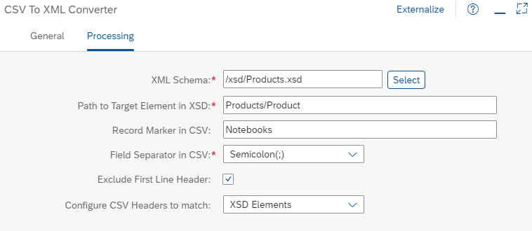

<!-- loio7ad518d41b2f438c9696908c7e0208f9 -->

# Use the CSV to XML Converter

Learn how to transform a CSV file into an XML format.

This section shows you how you can configure the CSV to XML converter.

For more information about the CSV to XML converter, see [Configure CSV to XML Converter](configure-csv-to-xml-converter-fe33888.md).


<a name="loio7ad518d41b2f438c9696908c7e0208f9__section_q3q_xnh_smb"/>

## Implementation

To showcase the capabilities of the CSV to XML converter, we use a simple scenario in which product information provided as comma-separated text file is converted into an XML message.

The example integration flow *Modeling Basics – CSV To XML Converter* is designed the following way:


The example scenario works as follows:

The integration flow receives a message through an HTTPS adapter. The message body is a text file providing product information whereas the first row contains the parameter names. A sample file looks as follows.

```
Category;ProductId;DimensionWidth;WeightUnit;DimensionUnit;DimensionHeight;DimensionDepth;Weight;Name
Notebooks;HT-1000;0.3200;KG;m;0.0300;0.1800;4.200;Notebook Basic 15
Notebooks;HT-1001;0.2900;KG;m;0.0310;0.1700;4.500;Notebook Basic 17
PDAs/Organizers;HT-1007;0.3200;KG;m;0.0300;0.2200;0.200;1UMTS PDA
Notebooks;HT-1010;0.3300;KG;m;0.0300;0.2000;4.300;Notebook Professional 15
Scanners;HT-1081;0.3100;KG;m;0.0700;0.4300;2.400;Power Scan
Scanners;HT-1082;0.3300;KG;m;0.1200;0.4100;3.200;Jet Scan Professional
Multifunction printers;HT-1085;0.4500;KG;m;0.2200;0.4200;23.200;Copymaster
Speakers;HT-1090;0.1200;KG;m;0.1600;0.1000;3.000;Surround Sound
Speakers;HT-1091;0.1300;KG;m;0.1750;0.1100;1.400;Blaster Extreme

```

This message is now to be transformed into an XML message. The CSV to XML Converter flow step is configured as follows.

An XSD file has been selected that fits to the parameter names of the CSV format. If you click the *Select* button, you've the option to upload an XSD file from the file system. This is then added to the resources of the integration flow.

Each row in the CSV file creates a new `Product` node. Therefore, as *Path to Target Element in XSD* the XPath expression *Products/Product* is specified.

We only like to include the products of category Notebooks. So, as *Record Marker in CSV* we select the value *Notebooks*. Note, the marker always needs to be the first value in the row.

In our case, the values are separated via a semicolon. Therefore, as *Field Separator in CSV* the option *Semicolon \(;\)* is selected.

The first row in the text file contains the parameter names. Therefore, the *Exclude First Line Header* check box is selected. Otherwise, a product containing the parameter names would be created.

The values within the CSV file are to be assigned to the right elements in the XSD format. So, we select *Configure CSV Headers* to match the *XSD Elements* from the drop-down list.



After the conversion, the message body looks as follows:

```
<?xml version='1.0' encoding='UTF-8'?>
<Products>
	<Product>
		<ProductId>HT-1000</ProductId>
		<Name>Notebook Basic 15</Name>
		<Category>Notebooks</Category>
		<DimensionUnit>m</DimensionUnit>
		<DimensionDepth>0.1800</DimensionDepth>
		<DimensionHeight>0.0300</DimensionHeight>
		<DimensionWidth>0.3200</DimensionWidth>
		<Weight>4.200</Weight>
		<WeightUnit>KG</WeightUnit>
	</Product>
	<Product>
		<ProductId>HT-1001</ProductId>
		<Name>Notebook Basic 17</Name>
		<Category>Notebooks</Category>
		<DimensionUnit>m</DimensionUnit>
		<DimensionDepth>0.1700</DimensionDepth>
		<DimensionHeight>0.0310</DimensionHeight>
		<DimensionWidth>0.2900</DimensionWidth>
		<Weight>4.500</Weight>
			<WeightUnit>KG</WeightUnit>
	</Product>
	<Product>
		<ProductId>HT-1010</ProductId>
		<Name>Notebook Professional 15</Name>
		<Category>Notebooks</Category>
		<DimensionUnit>m</DimensionUnit>
		<DimensionDepth>0.2000</DimensionDepth>
		<DimensionHeight>0.0300</DimensionHeight>
		<DimensionWidth>0.3300</DimensionWidth>
		<Weight>4.300</Weight>
		<WeightUnit>KG</WeightUnit>
	</Product>
</Products>

```


<a name="loio7ad518d41b2f438c9696908c7e0208f9__section_dws_xph_smb"/>

## Other Configuration Options

**Exclude First Line Header deselected**

If the CSV file doesn't contain a header row, you need to deselect the *Exclude First Line Header* check box. In this case, the values in each row need to be in the order of the elements defined within the XSD file to ensure that the values are properly assigned to the respective elements.

**Matching option CSV Fields Sequence**

If you select *CSV Fields Sequence* as an option for the *Configure CSV Headers to match* configuration, the values within each row are assigned to the XSD elements in the order of its appearance within the CSV file. So, like for the Exclude First Line Header deselected option above, you need to ensure that the values in each row are in the order of the elements defined within the XSD file.

If you configure a marker in the CSV To XML Converter flow step, you need to add a new marker header and marker value to the CSV file as first value within each row. The marker is used for filtering the content but isn’t mapped to the actual XML format, see sample file.

**Record marker**

The record marker needs to be the first value within each row. In this case, the category has been chosen as record marker that is also an element within the XSD. Note, the marker doesn't necessarily need to be an element in the XSD. You can define a dedicated field for the record marker, like Marker in the example below. Also, you may have further values within each CSV row that do not necessarily need to be defined as elements in the XSD, like Price in the example below. Those as well as the marker is not mapped. If you choose the same settings as described above except for the *Record Marker in CSV* equals *Yes*, the following text file provides the same XML output.

```
Marker;Category;ProductId;DimensionWidth;WeightUnit;DimensionUnit;DimensionHeight;DimensionDepth;Weight;Name;Price
Yes;Notebooks;HT-1000;0.3200;KG;m;0.0300;0.1800;4.200;Notebook Basic 15;530.00
Yes;Notebooks;HT-1001;0.2900;KG;m;0.0310;0.1700;4.500;Notebook Basic 17;550.00
No;PDAs/Organizers;HT-1007;0.3200;KG;m;0.0300;0.2200;0.200;1UMTS PDA;130.00
Yes;Notebooks;HT-1010;0.3300;KG;m;0.0300;0.2000;4.300;Notebook Professional 15;599.00
No;Scanners;HT-1081;0.3100;KG;m;0.0700;0.4300;2.400;Power Scan;280.00
No;Scanners;HT-1082;0.3300;KG;m;0.1200;0.4100;3.200;Jet Scan Professional;250.00
No;Multifunction printers;HT-1085;0.4500;KG;m;0.2200;0.4200;23.200;Copymaster;225.00
No;Speakers;HT-1090;0.1200;KG;m;0.1600;0.1000;3.000;Surround Sound;120.00
No;Speakers;HT-1091;0.1300;KG;m;0.1750;0.1100;1.400;Blaster Extreme;130.00

```

**Related Information**  


[Configure CSV to XML Converter](configure-csv-to-xml-converter-fe33888.md "")

