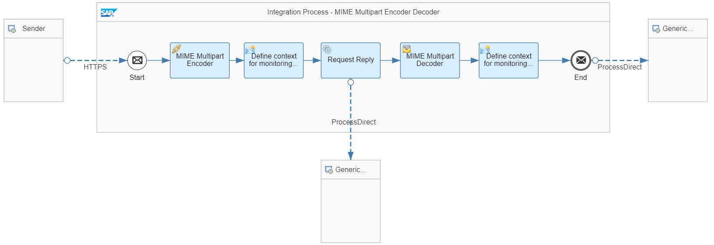
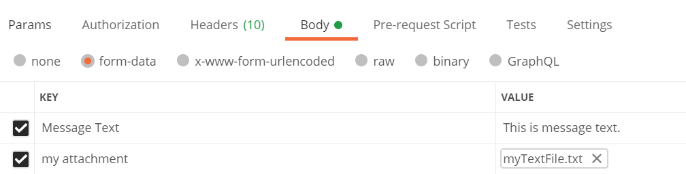

<!-- loioc3fc1f535e1a42008f6e8c45d1841206 -->

# Use the MIME Multipart Encoder and Decoder

Learn how to transform an inbound message with attachment into a MIME Multipart message and how to transform back this format into a message with attachment.

This section shows you how you can configure the MIME Multipart Encoder and Decoder.

For more information about the MIME Multipart Encoder and Decoder, see [Define a MIME Multipart Encoder](define-a-mime-multipart-encoder-8c12a8e.md).


<a name="loioc3fc1f535e1a42008f6e8c45d1841206__section_hjn_prv_bnb"/>

## Implementation

The scenario receives an inbound message with a text attachment, transforms the message into the MIME Multipart format, and, finally, transforms back the MIME Multipart message into a message with attachment.

The example integration flow *Modeling Basics - MIME Multipart Encoder Decoder* is designed the following way:



The example scenario works as follows:

The integration flow receives a message with a text attachment through the HTTPS sender adapter.

The *MIME Multipart Encoder* step transforms the message into a MIME Multipart message.

The Content Modifier *Define context for monitoring purposes* sets the context for the *Generic Receiver* integration flow. It defines the following headers:


<table>
<tr>
<th valign="top">

Header

</th>
<th valign="top">

Value

</th>
</tr>
<tr>
<td valign="top">

context

</td>
<td valign="top">

ModelingBasics-MIMEMultipart

</td>
</tr>
<tr>
<td valign="top">

receiver

</td>
<td valign="top">

Encoded

</td>
</tr>
</table>

Using these headers, the *Generic Receiver* integration flow \(called by the following Request Reply step and ProcessDirect channel\) stores the encoded message in the Data Store *ModelingBasics-MIMEMultipart* with the entry ID *Encoded*.

The *MIME Multipart Decoder* step transforms back the MIME Multipart message into a message with attachment.

The Content Modifier *Define context for monitoring purposes* sets the context for the *Generic Receiver* integration flow. It defines the following headers:


<table>
<tr>
<th valign="top">

Header

</th>
<th valign="top">

Value

</th>
</tr>
<tr>
<td valign="top">

context

</td>
<td valign="top">

ModelingBasics-MIMEMultipart

</td>
</tr>
<tr>
<td valign="top">

receiver

</td>
<td valign="top">

Decoded

</td>
</tr>
</table>

Using these headers, the *Generic Receiver* integration flow \(called by the following ProcessDirect channel\) stores the decoded message in the Data Store *ModelingBasics-MIMEMultipart* with the entry ID *Decoded*.

To execute the scenario, perform the following steps:

1.  Create a text \(.txt\) file with any content and store it on your computer.

    Let's assume the text file contains the following sentence:

    `This is the content of my attached text file.`

2.  Import the Postman collection provided with the integration package and select the POST request in folder *MIMEMultipartEncoderDecoder*.

3.  Select the *body* tab, select *form-data* and position the cursor in a cell in the *Key* column and choose *File* \(as shown in the following screenshot\).

    

4.  In the column *Value*, click *Select files* and browse for your text file.

    The text file is attached to the request as shown in the following screenshot.

    

    As shown in the screenshot, you can also add a name for the attachment in column *Key*.

    When you send an example message as indicated in the screenshot, the HTTP client \(Postman\) sends 2 texts to Cloud Integration: One text as part of the message body, and another one as content of a text file attached to the message.

5.  Make sure you have deployed the integration flow *Modeling Basics - MIME Multipart Encoder Decoder* and run the Postman request.

6.  As a result, 2 Data Store entries in Data Store *ModelingBasics-MIMEMultipart* are created.

    When you download the entries and open the *body* part, you find the following content \(for the assumed content of the text file as mentioned above\).

    -   The *Encoded* entry contains the following content:

        > ### Sample Code:  
        > ```
        > Date: Wed, 23 Sep 2020 11:56:58 +0000 (UTC)
        > Message-ID: <519428214.31.1600862218263@vsa7762665.od.sap.biz>
        > MIME-Version: 1.0
        > Content-Type: multipart/related; 
        > 	boundary="----=_Part_30_1608268558.1600862218261"
        > SAP_MessageProcessingLogID: AF9rOAp4C34Vo-gN4RDd50ZIHTFz
        > SAP_MplCorrelationId: AF9rOArrIrYofMHTSVedYvHxw0Cc
        > SAP_PregeneratedMplId: AF9rOAoYxU3MiD7V8QsI1X9h67Gt
        > 
        > ------=_Part_30_1608268558.1600862218261
        > Content-Type: application/octet-stream
        > Content-Transfer-Encoding: base64
        > 
        > LS0tLS0tLS0tLS0tLS0tLS0tLS0tLS0tLS0tLTcwMjg2MTM1OTM0NTExMTkwNTM1Mjk5Mw0KQ29u
        > dGVudC1EaXNwb3NpdGlvbjogZm9ybS1kYXRhOyBuYW1lPSJtZXNzYWdlIHRleHQiDQoNClRoaXMg
        > aXMgbWVzc2FnZSB0ZXh0Lg0KLS0tLS0tLS0tLS0tLS0tLS0tLS0tLS0tLS0tLTcwMjg2MTM1OTM0
        > NTExMTkwNTM1Mjk5Mw0KQ29udGVudC1EaXNwb3NpdGlvbjogZm9ybS1kYXRhOyBuYW1lPSJteSBh
        > dHRhY2htZW50IjsgZmlsZW5hbWU9Im15VGV4dEZpbGUudHh0Ig0KQ29udGVudC1UeXBlOiB0ZXh0
        > L3BsYWluDQoNClRoaXMgaXMgdGhlIGNvbnRlbnQgb2YgbXkgYXR0YWNoZWQgdGV4dCBmaWxlLg0K
        > LS0tLS0tLS0tLS0tLS0tLS0tLS0tLS0tLS0tLTcwMjg2MTM1OTM0NTExMTkwNTM1Mjk5My0tDQo=
        > 
        > ------=_Part_30_1608268558.1600862218261--
        > 
        > ```

    -   The *Decoded* entry contains the following content:

        > ### Sample Code:  
        > ```
        > ----------------------------702861359345111905352993
        > Content-Disposition: form-data; name="message text"
        > 
        > This is message text.
        > ----------------------------702861359345111905352993
        > Content-Disposition: form-data; name="my attachment"; filename="myTextFile.txt"
        > Content-Type: text/plain
        > 
        > This is the content of my attached text file.
        > ----------------------------702861359345111905352993--
        > ```


    You notice the content of the attached text file \(`This is the content of my attached text file.`\) has been decoded and is shown as part of the Data Store entry.


