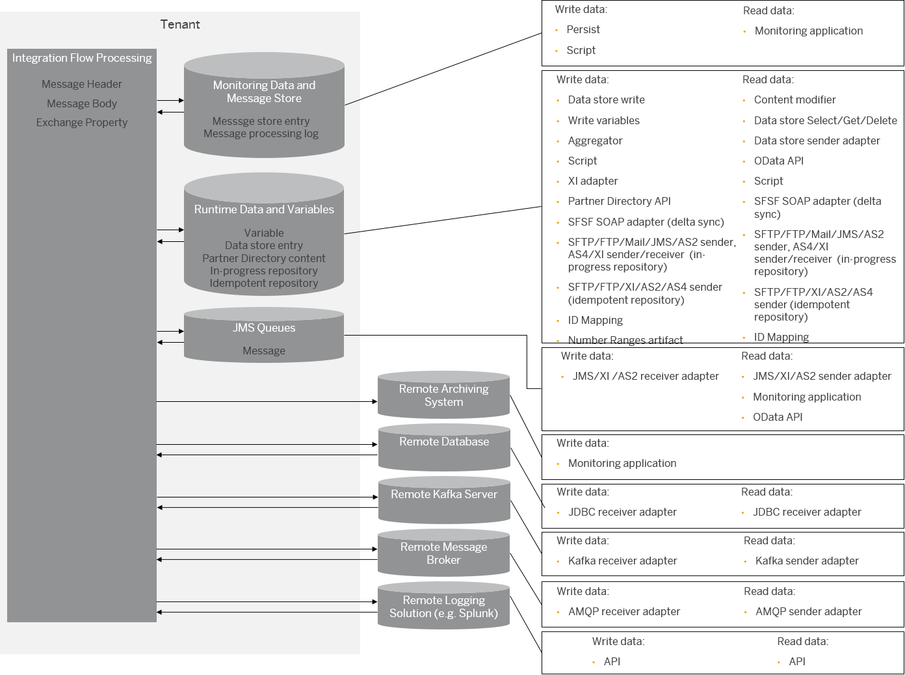

<!-- loioa836b4e38d1a45f6be7071b9b697c2a3 -->

# Using Data Storage Features When Designing Integration Flows

SAP Integration Suite comes with various options for storing data during the execution of an integration scenario. There are also various options for consuming such data during message processing or after message processing has finished.

<a name="loioa836b4e38d1a45f6be7071b9b697c2a3__section_t5q_vky_2xb"/>

## Data Storage Options

The following figure illustrates the available options.

The options also differ according to the phase in which components can consume the stored data:

-   **Stored data consumed during message processing \(at runtime\)**: For example, if you want to store a variable that, and another step consumes the data during consecutive processing of the integration flow.

-   **Stored data consumed after message processing has finished**: For example, if you want to store data and make it available for auditing purposes after message processing has finished.

> ### Note:  
> You might be asking yourself why the script step writes data into the *Monitoring Data and Message Store* data storage component. The monitoring application only reads from that data storage.
> 
> However, there are use cases where you can use the script step to add additional, monitoring-related data to the database, namely:
> 
> -   Message-processing log attachments \(see [Create MPL Attachments in Scripts](create-mpl-attachments-in-scripts-17dba92.md)\)
> 
> -   Custom header properties for the message processing log \(see [Use Custom Header Properties to Search for Message Processing Logs](use-custom-header-properties-to-search-for-message-processing-logs-d4b5839.md)\)

> ### Note:  
> To be more precise from a technical perspective, the following assets are stored in the SAP BTP object store:
> 
> -   Message processing log attachments
> 
> -   Message store content

<a name="loioa836b4e38d1a45f6be7071b9b697c2a3__section_yn4_wtl_hrb"/>

## Using Cloud Integration Data Storage Features

The following table shows the different use cases that you can implement with the data storage feature that comes with Cloud Integration. You also get an overview of the Cloud Integration that are in place to write to and read the data.

<table>
<tr>
<th valign="top">

Use cases

</th>
<th valign="top">

Logical storage

</th>
<th valign="top">

How to write data

</th>
<th valign="top">

How to read data

</th>
</tr>
<tr>
<td valign="top">

Share data **at runtime** across different steps of the same integration flow \(see [Variant: Sharing Data Within the Same Integration Flow](variant-sharing-data-within-the-same-integration-flow-4b75ded.md)\).

</td>
<td valign="top">

Exchange property

</td>
<td valign="top">

Content modifier \(see [Define Content Modifier](define-content-modifier-8f04a70.md)\)

All steps and adapters set framework-provided properties.

Script \(see [Access Headers and Properties in Scripts](access-headers-and-properties-in-scripts-6bc5ed1.md)\)

</td>
<td valign="top">

Content modifier

All steps and adapters that allow dynamic setting of parameters \(see [Dynamically Configure Integration Flow Parameters](dynamically-configure-integration-flow-parameters-fff5b2a.md)\).

Script

</td>
</tr>
<tr>
<td valign="top">

Share data **at runtime**:

-   Across different steps of the same integration flow

-   Across integration flows that communicate with each other

-   With remote \(sender or receiver\) systems

See: [Variant: Sharing Data Across Integration Flows That Communicate with Each Other](variant-sharing-data-across-integration-flows-that-communicate-with-each-other-fe6d139.md)

</td>
<td valign="top">

Message header

</td>
<td valign="top">

Content modifier \(see [Define Content Modifier](define-content-modifier-8f04a70.md)\)

External components

All steps and adapters set framework-provided headers \(see [Headers and Exchange Properties Provided by the Integration Framework](headers-and-exchange-properties-provided-by-the-integration-framework-d0fcb09.md)\).

Script \(see [Access Headers and Properties in Scripts](access-headers-and-properties-in-scripts-6bc5ed1.md)\)

</td>
<td valign="top">

Content modifier

All steps and adapters that allow dynamic setting of parameters \(see [Dynamically Configure Integration Flow Parameters](dynamically-configure-integration-flow-parameters-fff5b2a.md)\).

Script

External receiver system

</td>
</tr>
<tr>
<td valign="top">

Share data **at runtime**:

-   Across different steps of the same integration flow

-   Across integration flows that communicate with each other

-   With remote \(sender or receiver\) systems

See: [Variant: Sharing Data Across Integration Flows That Communicate with Each Other](variant-sharing-data-across-integration-flows-that-communicate-with-each-other-fe6d139.md)

</td>
<td valign="top">

Message body

</td>
<td valign="top">

Content Modifier

Script

External component

</td>
<td valign="top">

Content modifier

Script

External receiver system

</td>
</tr>
<tr>
<td valign="top">

Share data **at runtime**:

-   Across different steps of the same integration flow \(local data store\)

-   Across different integration flows deployed on the same tenant \(global data store\)

See:

[Use Cases for Data Store and Variables](use-cases-for-data-store-and-variables-853d4dd.md)

[Example Using a Global Data Store and a Global Variable](example-using-a-global-data-store-and-a-global-variable-773a7ec.md)

</td>
<td valign="top">

Global/local data store

</td>
<td valign="top">

Data store Write \(see [Define Data Store Operations](define-data-store-operations-79f63a4.md)\).

XI sender adapter \(see [Configure the XI Sender Adapter](configure-the-xi-sender-adapter-41a1a57.md)\)

XI receiver adapter \(see [Configure the XI Receiver Adapter](configure-the-xi-receiver-adapter-5d2670f.md)\)

AS4 sender adapter \(see [AS4 Sender Adapter](as4-sender-adapter-a448605.md)\)

</td>
<td valign="top">

Data store \(Select/Get/Delete\) \(see [Define Data Store Operations](define-data-store-operations-79f63a4.md)\).

XI sender adapter \(see [Configure the XI Sender Adapter](configure-the-xi-sender-adapter-41a1a57.md)\)

XI receiver adapter \(see [Configure the XI Receiver Adapter](configure-the-xi-receiver-adapter-5d2670f.md)\)

AS4 sender adapter \(see [AS4 Sender Adapter](as4-sender-adapter-a448605.md)\)

Data store viewer in the Cloud Integration *Monitor* section \(see [Managing Data Stores](managing-data-stores-ac39f1d.md)\)

</td>
</tr>
<tr>
<td valign="top">

Share a small amount of data \(for example, a timestamp\) **at runtime**:

-   Across different executions of the same integration flow \(local variable\)

    > ### Note:  
    > However, to share data across different steps of the same integration flow, the **general recommendation** is to use properties \(whenever possible\).

    See: [Variant: Sharing Data Within the Same Integration Flow](variant-sharing-data-within-the-same-integration-flow-4b75ded.md)

-   Across different integration flows on the same tenant \(global variable\)

    See:

    [Variant: Sharing Data Across Integration Flows That Operate Independently from Each Other](variant-sharing-data-across-integration-flows-that-operate-independently-from-each-other-1459948.md)

    [Example Scenario: Sharing a Variable Across Two Integration Flows](example-scenario-sharing-a-variable-across-two-integration-flows-303562c.md)

    [Example Using a Global Data Store and a Global Variable](example-using-a-global-data-store-and-a-global-variable-773a7ec.md)

</td>
<td valign="top">

Global/local variable

</td>
<td valign="top">

Write variables \(see [Define Write Variables](define-write-variables-de04b75.md)\)

</td>
<td valign="top">

Content modifier \(see [Define Content Modifier](define-content-modifier-8f04a70.md)\)

Variables viewer in the Cloud Integration *Monitor* section \(see [Managing Variables](managing-variables-ca93653.md)\)

</td>
</tr>
<tr>
<td valign="top">

Aggregate messages **at runtime**.

When aggregating messages, the system temporarily stores data on the tenant during message processing. Therefore, using the *Aggregator* step puts load on the data storage capacity of the system

You can only use this data storage option to implement a message aggregator pattern; you can't use this option for permanent data storage.

See: [Aggregator](aggregator-5f5e01b.md)

</td>
<td valign="top">

Aggregator

</td>
<td valign="top">

Aggregator \(see [Define Aggregator](define-aggregator-aa23816.md)\)

</td>
<td valign="top">

Aggregator \(see [Define Aggregator](define-aggregator-aa23816.md)\)

</td>
</tr>
<tr>
<td valign="top">

Store data to access it **after message processing has finished** \(for example, for error analysis and audit logging\).

Using the *Persist* step allows you to store data at dedicated steps of an integration flow.

Note that the stored message content isn't available for other integration flow steps. You can access it after the message processing run has finished. To read out message content stored with the *Persist* step, use the OData API \(`MessageStoreEntries` resource\).

See: [Use the Persist Step](use-the-persist-step-2707077.md)

</td>
<td valign="top">

Message Store

</td>
<td valign="top">

Persist step \(see [Persist Messages](persist-messages-8c35f3f.md)\)

SOAP 1.x sender adapter if *WS-Security* and *Save Incoming Signed Message* are selected \(see [Configure the SOAP \(SOAP 1.x\) Sender Adapter](configure-the-soap-soap-1-x-sender-adapter-a178913.md)\)

</td>
<td valign="top">

OData API \(`MessageStoreEntries` entity\) \(see [Message Stores](message-stores-1aab5e9.md)\)

</td>
</tr>
<tr>
<td valign="top">

Store data to access it **after message processing has finished** \(for example, for monitoring purposes and error analysis\).

You can store the payload as a message-processing log attachment \(see: [Using Message Processing Log Attachments](using-message-processing-log-attachments-6776fd3.md)\).

</td>
<td valign="top">

Message processing log attachment

</td>
<td valign="top">

Script \(see [Create MPL Attachments in Scripts](create-mpl-attachments-in-scripts-17dba92.md)\)

</td>
<td valign="top">

*Monitoring* application

</td>
</tr>
<tr>
<td valign="top">

Parameterize integration flows **at runtime** for larger partner networks \(see [Use the Partner Directory Appropriately](use-the-partner-directory-appropriately-6e00412.md), [Parameterizing Integration Flows Using the Partner Directory](parameterizing-integration-flows-using-the-partner-directory-b7812a5.md)\).

</td>
<td valign="top">

Partner Directory

</td>
<td valign="top">

OData API \(see [Parameterizing Integration Flows Using the Partner Directory](parameterizing-integration-flows-using-the-partner-directory-b7812a5.md)\)

</td>
<td valign="top">

Script \(see [Parameterizing Integration Flows Using the Partner Directory](parameterizing-integration-flows-using-the-partner-directory-b7812a5.md)\)

Certain integration flow steps such as the XML validator or XSLT mapping \(see [Dynamically Reading XSLT Mappings from the Partner Directory](dynamically-reading-xslt-mappings-from-the-partner-directory-66a551a.md)\)

</td>
</tr>
<tr>
<td valign="top">

Store data **at runtime** to implement scenarios with asynchronous decoupling and message retry.

Messages can be temporarily stored in a JMS queue and consumed by other integration flows if an error occurs \(see [Cloud Integration – Configure Asynchronous Messaging with Retry Using JMS Adapter](https://blogs.sap.com/2017/06/19/cloud-integration-configure-asynchronous-messaging-with-retry-using-jms-adapter/) \(SAP Community blog\), [Decouple Sender and Flows Using JMS Message Queues](decouple-sender-and-flows-using-jms-message-queues-3c26902.md)\).

</td>
<td valign="top">

JMS queues

</td>
<td valign="top">

JMS receiver adapter \(see [JMS Adapter](jms-adapter-0993f2a.md)\)

AS2 sender adapter \(see [Configure the AS2 Sender Adapter](configure-the-as2-sender-adapter-5d7ee17.md)\)

AS4 sender adapter \(see [AS4 Sender Adapter](as4-sender-adapter-a448605.md)\)

XI sender adapter \(see [Configure the XI Sender Adapter](configure-the-xi-sender-adapter-41a1a57.md)\)

XI receiver adapter \(see [Configure the XI Receiver Adapter](configure-the-xi-receiver-adapter-5d2670f.md)\)

</td>
<td valign="top">

JMS sender adapter \(see [Configure the JMS Sender Adapter](configure-the-jms-sender-adapter-161791b.md)\)

AS2 sender adapter \(see [Configure the AS2 Sender Adapter](configure-the-as2-sender-adapter-5d7ee17.md)\)

AS4 sender adapter \(see [AS4 Sender Adapter](as4-sender-adapter-a448605.md)\)

XI sender adapter \(see [Configure the XI Sender Adapter](configure-the-xi-sender-adapter-41a1a57.md)\)

XI receiver adapter \(see [Configure the XI Receiver Adapter](configure-the-xi-receiver-adapter-5d2670f.md)\)

Message queue viewer in the Cloud Integration *Monitor* section \(see [Managing Message Queues](managing-message-queues-cdcce24.md)\)

</td>
</tr>
</table>

<a name="loioa836b4e38d1a45f6be7071b9b697c2a3__section_w4d_jbk_vkb"/>

## Using Remote Data Storages

The following table shows the different use cases that you can implement by connecting SAP Integration Suite to remote data storage systems.

<table>
<tr>
<th valign="top">

Use cases

</th>
<th valign="top">

Logical storage

</th>
<th valign="top">

How to write data

</th>
<th valign="top">

How to read data

</th>
</tr>
<tr>
<td valign="top">

Archive monitoring data for longer than 30 days.

</td>
<td valign="top">

Remote archiving system

</td>
<td valign="top">

Cloud Integration archiving feature \(see [Archiving Data](archiving-data-bc71f88.md)\)

</td>
<td valign="top">

Defined by the connected \(remote\) archiving system

</td>
</tr>
<tr>
<td valign="top">

Store data in a database system on SAP BTP or in an on-premise database system.

A remote database system typically allows you to store data longer than the maximum 30-day retention period offered by the tenant database. However, the supported storage duration depends on the technical characteristics of the remote database system.

See:

[Cloud Integration – A Simple Demo Scenario Using the JDBC Adapter](https://blogs.sap.com/2019/02/19/cloud-integration-a-simple-demo-scenario-using-the-jdbc-adapter/) \(SAP Community blog\)

[Cloud Integration – Using the JDBC Adapter to Implement a Robust Scenario that Handles an Exception](https://blogs.sap.com/2020/08/17/cloud-integration-using-the-jdbc-adapter-to-implement-a-robust-scenario-that-handles-an-exception/) \(SAP Community blog\)

</td>
<td valign="top">

Remote database system

</td>
<td valign="top">

SQL operations injected into a database system through an external call via a JDBC receiver adapter \([JDBC Receiver Adapter](jdbc-receiver-adapter-88be644.md)\)

</td>
<td valign="top">

SQL operations injected into a database system through an external call via a JDBC receiver adapter \(see [JDBC Receiver Adapter](jdbc-receiver-adapter-88be644.md)\)

</td>
</tr>
<tr>
<td valign="top">

Store data at runtime to implement scenarios with asynchronous messaging using an external messaging system \(see [Cloud Integration – What You Need to Know About the Kafka Adapter](https://blogs.sap.com/2021/03/16/cloud-integration-what-you-need-to-know-about-the-kafka-adapter/) \(SAP Community blog\)\).

</td>
<td valign="top">

Kafka topic

</td>
<td valign="top">

Kafka receiver adapter \(see [Configure the Kafka Receiver Adapter](configure-the-kafka-receiver-adapter-fc6ee1f.md)\)

</td>
<td valign="top">

Kafka sender adapter \(see [Configure the Kafka Sender Adapter](configure-the-kafka-sender-adapter-0d849e5.md)\)

</td>
</tr>
<tr>
<td valign="top">

Store data at runtime to implement scenarios with asynchronous messaging using an external messaging system \(see [Cloud Integration – Connecting to Messaging Systems using the AMQP Adapter](https://blogs.sap.com/2019/11/20/cloud-integration-connecting-to-external-messaging-systems-using-the-amqp-adapter/) \(SAP Community blog\)\).

</td>
<td valign="top">

Queues or topics

</td>
<td valign="top">

AMQP receiver adapter \(see [Configure the AMQP Receiver Adapter](configure-the-amqp-receiver-adapter-d5660c1.md)\)

</td>
<td valign="top">

AMQP sender adapter \(see [Configure the AMQP Sender Adapter](configure-the-amqp-sender-adapter-99ce674.md)\)

</td>
</tr>
<tr>
<td valign="top">

Send message processing logs to an external logging system.

</td>
<td valign="top">

Remote logging solution

</td>
<td valign="top">

Via API \(see [External Logging](external-logging-ad719c1.md)\)

</td>
<td valign="top">

Via API \(see [External Logging](external-logging-ad719c1.md)\)

</td>
</tr>
</table>

> ### Note:  
> For an overview of the technical details and limitations of each data storage option, see [Data Storages](data-storages-31efe35.md).

**Related Information**  

[Data Store/Variables Versus Header/Properties: When to Use Which Option?](data-store-variables-versus-header-properties-when-to-use-which-option-61f4045.md "")

[Data Store, Variables, and JMS Queues: When to Use Which Option?](data-store-variables-and-jms-queues-when-to-use-which-option-6bc21cb.md "")

