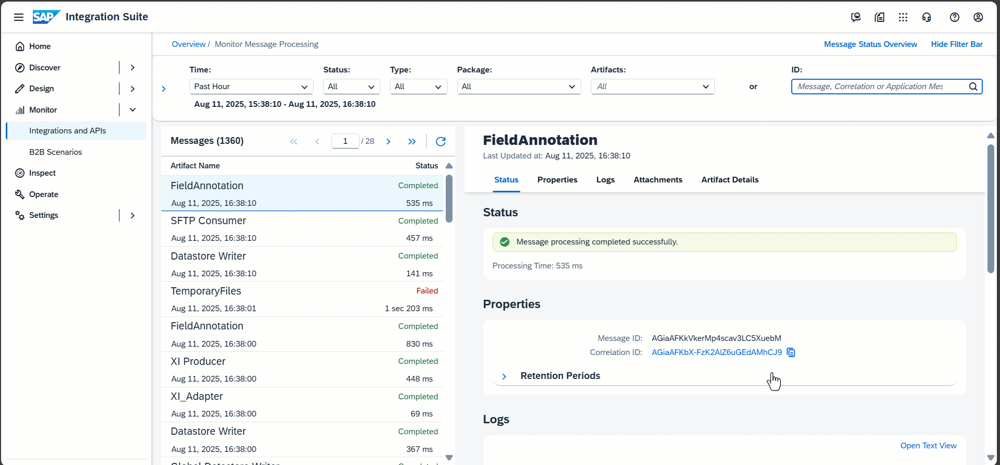

<!-- loioa820752f17cd45afacf3f8dcc192a3c0 -->

# Using IDs to Filter Messages

You can filter message processing logs using different IDs.

The following IDs can be used:

-   *Message ID*

    The unique identifier that is associated with the message processing log.

-   *Correlation ID*

    The identifier used to correlate different messages with each other that are processed jointly in the context of an integration scenario.

    > ### Example:  
    > For example, consider a scenario where one integration flows \(*integration flow 1*\) calls another one \(*integration flow 2*\) using the *ProcessDirect* adapter. In this case, for one message processing run two message processing logs are written: one integration flow 1 and another one for integration flow 2. Both message processing logs have different message IDs values but the same correlation ID.

    > ### Tip:  
    > To filter all the message processing logs with the same *Correlation ID*, choose the *Correlation ID* link from the *Properties* section of a message. 

-   *Application Message ID*

    Identifier set by a dedicated header \(`SAP_ApplicationID`\). You can set this ID using, for example, a *Content Modifier* step.

The ID search process checks for message processing logs that have the specified ID as:

1.  *Message ID*: If not found, the system checks whether there’s a message with the specified *Correlation ID*.

2.  *Correlation ID*: If not found, the system searches for messages with the given *Application ID*.
3.  *Application ID*: This search attribute can't find messages where the *Correlation ID* is the same as an existing *Message ID*, or the *Application ID* equals a *Correlation ID* or *Message ID* \(by coincidence\). Searching for messages by using this attribute is helpful for support use cases \(for root cause analysis, for example\).

