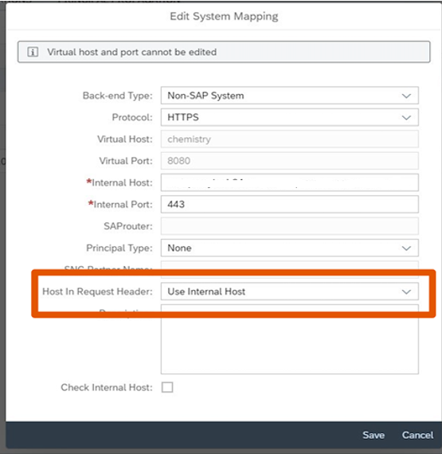
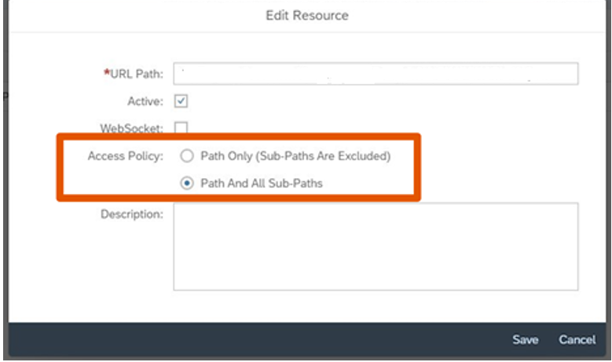

<!-- loio1f45077b7c4a40da9ba9c0024eddae1a -->

# Using SAP Cloud Connector

You need to configure the SAP Cloud Connector to point to your content management system \(CMS\).

For more details about the SAP Cloud Connector, see: [Outbound: SAP Cloud Connector](../40-RemoteSystems/outbound-sap-cloud-connector-642e87f.md).

> ### Note:  
> The location ID is currently not supported.

In the System Mapping, set *Host in Request Header* to `Use Internal Host`.

Example of system mapping pointing to a CMS system:

For security reasons, set *Virtual Host* and *Virtual Port* values different to *Internal Host* and *Internal Port* values. With setting identical values for internal host and port and virtual host and port, you save a direct connection to the repository in the destination. This direct connection can lead to attacks on the CMS, if the destination is known by unauthorized persons.

In the *Edit Resource* screen, set the *Access Policy* to *Path And all Sub-Paths*.

