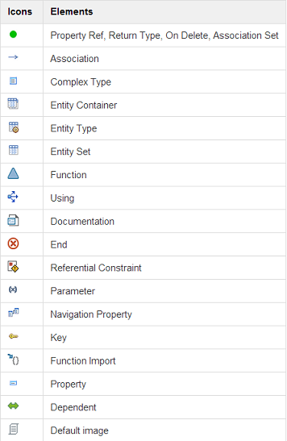

<!-- loiobd77a909950d4e69a1fddf6a3e0ca86d -->

<link rel="stylesheet" type="text/css" href="../css/sap-icons.css"/>

# Using Schema-Based Code Assist

## Context

The schema-based code assist feature provides you with code suggestions that adhere to the Conceptual Schema Definition Language \(CSDL\) specification. These code suggestions are provided based on the current cursor position.

Follow this procedure to use schema-based code assist in the OData Model Editor.

## Procedure

1.  Choose *OData Model Editor* \(\) on the Service Designer page. The OData Model Editor page opens.

2.  Place your cursor in the context where you require assistance, and press [Ctrl\] + [Spacebar\] .

    Based on the cursor location, a list of the elements that can be used appears.

    Each element in the dropdown list is represented by an icon. The following image shows the list of elements and their corresponding icons:

    

3.  Scroll through the list, select the required element, and press [Enter\]. The OData Model Editor inserts a full snippet of code in the desired location.

