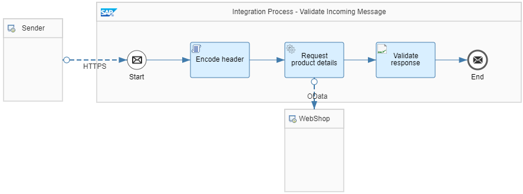

<!-- loiof421c071d123425d82624853e0dbf498 -->

# Validate Incoming Messages

Validate incoming messages during inbound processing to make sure that they adhere to the expected format.

When designing an integration flow, you might not be able to anticipate in any case the format of inbound messages sent from an external component to SAP Integration Suite . Especially, in cases where the external component is controlled by a third party, it can't be guaranteed that the message is sent in the expected format.

<a name="loiof421c071d123425d82624853e0dbf498__section_zkm_ykw_ljb"/>

## Implementation

You can use the XML validator step to specify the expected XML schema and validate all incoming messages against it. If the validation fails, message processing stops.

To illustrate this rule, you can consult the *Relax Dependencies - Validate Incoming Messages* integration flow.

To call this integration flow, provide a*productId* header together with the HTTP request \(from the HTTP client\) and give it any value for a product published in the WebShop catalog \(for example, the value *HT-2001*\).

> ### Note:  
> The *Encode header* Script step encodes the header provided with the inbound message in order to meet the security-related guideline [Encode Dynamic Parameters](encode-dynamic-parameters-d278350.md).

The integration flow requests product details from the WebShop product catalog for this *productId* value.

The OData adapter that gets the product details expects a data format as defined by the following query \(in the OData adapter\):

`$select=ProductId,Category,LongDescription,Name,Weight,DimensionDepth,DimensionHeight,DimensionUnit,DimensionWidth&$filter=ProductId eq '${header.productId}'`

The related XML schema is defined in the `ProductDetails.xsd` resource file that is uploaded as a resource of the integration flow.

The XML Validator step, *Validate response*, takes this resource file and compares the schema against the response received from the WebShop.

To simulate an error, you can temporarily change the content of the *Query Options* field of the OData adapter \(for example, removing 1 entity such as *Category*\). The OData adapter retrieves product details without the *Category* field, and the XML Validator step raises an error message that starts with:

`An internal server error occured: Validation failed for: /xsd/ProductDetails.xsd ...`

**Related Information**  

[Validating Message Payload against XML Schema](validating-message-payload-against-xml-schema-360dc70.md "The XML validator validates the message payload in XML format against the configured XML schema.")

