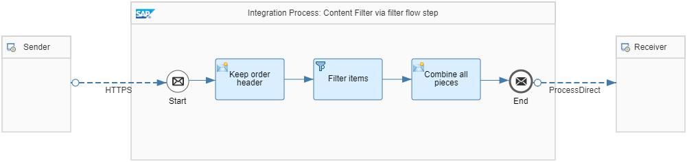

<!-- loio239d8f86f2e64a3c998b4c2d8ede52ce -->

# Variant: Content Filter Step

In this variant, the filter is used to remove all unnecessary data items from the message. However, the message header is kept.

The *Pattern Content Filter - Filter Step* integration flow illustrates this simple scenario.



It contains 3 integration flow steps.

1.  The Content Modifier step keeps the header by creating the following exchange properties:


    <table>
    <tr>
    <th valign="top">

    Name
    
    </th>
    <th valign="top">

    Type
    
    </th>
    <th valign="top">

    Data Type
    
    </th>
    <th valign="top">

    Value
    
    </th>
    </tr>
    <tr>
    <td valign="top">
    
    deliveryNotes
    
    </td>
    <td valign="top">
    
    XPath
    
    </td>
    <td valign="top">
    
    org.w3c.dom.NodeList
    
    </td>
    <td valign="top">
    
    ns0: PurchaseOrder/DeliveryNotes
    
    </td>
    </tr>
    <tr>
    <td valign="top">
    
    address
    
    </td>
    <td valign="top">
    
    XPath
    
    </td>
    <td valign="top">
    
    org.w3c.dom.NodeList
    
    </td>
    <td valign="top">
    
    ns0:PurchaseOrder/Address
    
    </td>
    </tr>
    <tr>
    <td valign="top">
    
    orderDate
    
    </td>
    <td valign="top">
    
    XPath
    
    </td>
    <td valign="top">
    
    java.lang.String
    
    </td>
    <td valign="top">
    
    string\(//@OrderDate\)
    
    </td>
    </tr>
    <tr>
    <td valign="top">
    
    orderNumber
    
    </td>
    <td valign="top">
    
    XPath
    
    </td>
    <td valign="top">
    
    java.lang.String
    
    </td>
    <td valign="top">
    
    string\(//@PurchaseOrderNumber\)
    
    </td>
    </tr>
    </table>
    
2.  The Filter step uses the Category with value type *Nodelist* and the following XPath expression:*ns0:PurchaseOrder/Items/Item\[./Category/text\(\)='Software'\]*.

3.  A Content Modifier step combines the message header from the 1st step and message items from the 2nd step \(in the expression specified in the *Message Body*tab\):

    > ### Sample Code:  
    > ```
    > <ns0:PurchaseOrder xmlns:ns0="http://demo.sap.com/eip/content-filter" PurchaseOrderNumber="${property.orderNumber}" OrderDate="${property.orderDate}">
    > ${property.address}
    > ${property.deliveryNotes}
    > <Items>
    > ${in.body}
    > </Items>
    > </ns0:PurchaseOrder>
    > ```


> ### Note:  
> The corresponding namespace mapping is specified on the *Runtime Configuration* tab of the integration flow:*xmlns:ns0=http://demo.sap.com/eip/content-filter*.

