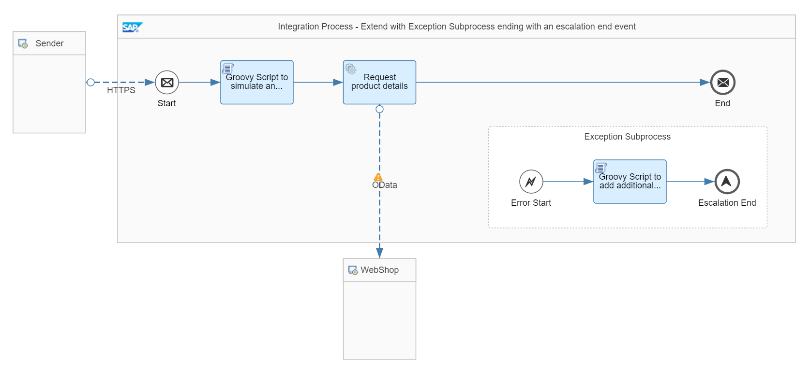

<!-- loio5649cde1d7e549bbb22a4869b1ac0ab2 -->

# Variant: Exception Subprocess with Escalation End Event

Use this variant to catch an error in an exception subprocess to add additional information to the message processing log. In this use case, the message status is set to *Escalated* that allows you to search for messages based on the dedicated Escalated message status.

<a name="loio5649cde1d7e549bbb22a4869b1ac0ab2__section_yhz_xmq_qnb"/>

## Definition

For this variant, the integration flow is extended with an exception subprocess to add additional information to the message processing log \(see [Log the Behavior of an Integration Flow](log-the-behavior-of-an-integration-flow-5a3ec6d.md)\) which helps you improving the root cause analysis. Furthermore, the message is set to status Escalated. This allows you to search for this kind of failed messages using the dedicated status Escalated.

<a name="loio5649cde1d7e549bbb22a4869b1ac0ab2__section_c4d_zmq_qnb"/>

## Implementation

To illustrate this rule, see the *Handle Errors - Extend With Exception Subprocess – Escalation End Event* integration flow.

The integration flow is similar to the variant Exception Subprocess with Error End Event, except that in this case the exception subprocess ends with an escalation end event.

As mentioned already, to easily simulate an error situation, you can run the integration flow by setting the error header to true. In the message processing log, an attachment has been added with the body as defined within the exception subprocess. Furthermore, the log is in status *Escalated*. In the message monitor, you can search for messages in status *Escalated*. You can customize the operations view by adding a new tile showing all messages in status *Escalated* of the past hour.

**Related Information**  

[Define Exception Subprocess](define-exception-subprocess-690e078.md "")

[Create MPL Attachments in Scripts](create-mpl-attachments-in-scripts-17dba92.md "")

[Define an Escalation Event](define-an-escalation-event-f5b3ac8.md "")

