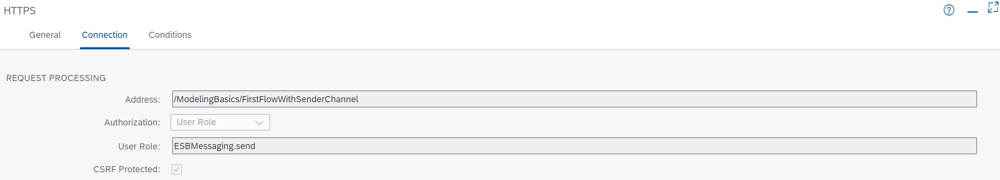

<!-- loio36a61b5938b241baafef4bad3e81adbf -->

# Variant: Sender-Initiated Scenario with External Data Source and Receiver

Get started with Integration flow design with a simple integration flow that is initiated by an HTTPS client \(sender\) and processes data from an external data source.

<a name="loio36a61b5938b241baafef4bad3e81adbf__section_mrt_xgz_rmb"/>

## Implementation

See the *Modeling Basics - Sender-Initiated Scenario with External Data Source and Receiver* integration flow:

<table>
<tr>
<th valign="top">

Integration Flow

</th>
<th valign="top">

Tasks

</th>
</tr>
<tr>
<td valign="top">

*Modeling Basics - Sender-Initiated Scenario with External Data Source and Receiver*

</td>
<td valign="top">

Performs the main business-related steps \(calling WebShop component\).

</td>
</tr>
<tr>
<td valign="top">

*Generic Receiver*

</td>
<td valign="top">

Creates a Data Store entry to represent the receiver system \(both in success and error cases\).

</td>
</tr>
</table>

To make it as easy as possible for you to develop this first integration flow, you don't need to set up a complicated receiver system. This integration flow works with the *Generic Receiver* that creates a data store entry and stands in as a receiver system.

The integration flow processes the message at runtime in the following way:

The *HTTP client*\(represented by the Sender shape\) sends an HTTP request to SAP Integration Suite through an HTTPS sender channel. The HTTPS request body, which is in JavaScript Object Notation \(JSON\) format, contains a product identifier.

The *JSON-to-XML converter* transforms the request body into XML format \(which can be processed in the following step, the Content Modifier\).

The Content Modifier *Define property* defines the Data Store name:

<table>
<tr>
<th valign="top">

Action

</th>
<th valign="top">

Name

</th>
<th valign="top">

Type

</th>
<th valign="top">

Value

</th>
</tr>
<tr>
<td valign="top">

Create

</td>
<td valign="top">

context

</td>
<td valign="top">

Constant

</td>
<td valign="top">

ModelingBasics-SenderInitiated

</td>
</tr>
</table>

It also creates an exchange property called `productIdentifier`, which is needed in the next step:

<table>
<tr>
<th valign="top">

Action

</th>
<th valign="top">

Name

</th>
<th valign="top">

Type

</th>
<th valign="top">

Data Type

</th>
<th valign="top">

Value

</th>
</tr>
<tr>
<td valign="top">

Create

</td>
<td valign="top">

productIdentifier

</td>
<td valign="top">

XPath

</td>
<td valign="top">

java.lang.String

</td>
<td valign="top">

//productIdentifier

</td>
</tr>
</table>

The Request Reply step *Request product data* step passes the message to an external data source and retrieves data \(about orders\) from there.

The external data source supports the Open DataProtocol \(OData\). For our scenario, we use the ESPM WebShop, which is based on the Enterprise Sales and Procurement Model \(ESPM\) provided by SAP. The demo application can be accessed at the following address: [https://refapp-espm-ui-cf.cfapps.eu10.hana.ondemand.com/webshop/index.html](https://refapp-espm-ui-cf.cfapps.eu10.hana.ondemand.com/webshop/index.html)

An OData receiver channel is used for the connection to the OData source. To query for exactly 1 product \(for the product identifier provided with the inbound message\), the header that was created in the preceding Content Modifier is used.

The OData API provides the details of one specific product, which is identified by the actual value of the `productIdentifier` field \(provided with the inbound HTTP request\).

As a last step, the *Generic Receiver* writes the data to the Data Store.

