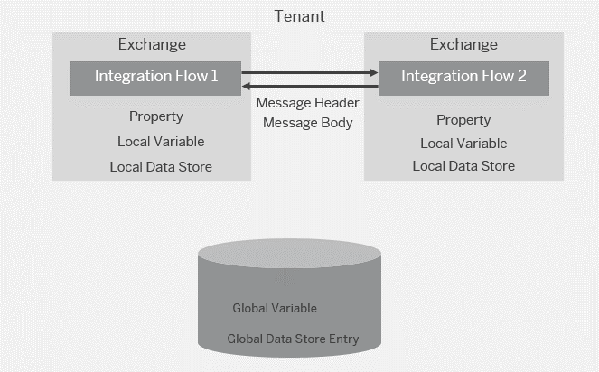

<!-- loiofe6d139d1d64447390911a771cf060c5 -->

# Variant: Sharing Data Across Integration Flows That Communicate with Each Other

Integration flows communicate with each other \(when on the same tenant, through the ProcessDirect adapter\) and need to share data.

In this case, data can only be shared across integration flows by using the following options.

-   Exchanging message headers

-   Global variables or global data stores

-   Exchanging content via the message body

In this setup, the clear recommendation is to share data across integration flows through headers \(as using global variables requires storage capacity on the tenant\).

If you're using an HTTP-based adapter, keep the overall size of all HTTP headers in total as low as possible, as some network components have a limit. If you're using the ProcessDirect adapter for integration flow-to-integration flow communication, no size restriction applies.

<a name="loiofe6d139d1d64447390911a771cf060c5__section_b3x_mkb_xkb"/>

## Implementation

Most example integration flows designed to illustrate design guidelines send a message to the *Generic Receiver* integration flow as explained under [Generic Receiver](generic-receiver-83a6970.md).

The *Generic Receiver* integration flow creates a data store entry, where the name of the data store is dynamically given by the value of the `context` header that is provided by the calling integration flow.

Therefore, the usage of the *Generic Receiver* integration flow shows how to implement this variant.

For an example where this setup is used, check out the [Scatter-Gather](scatter-gather-987eef2.md) pattern.

