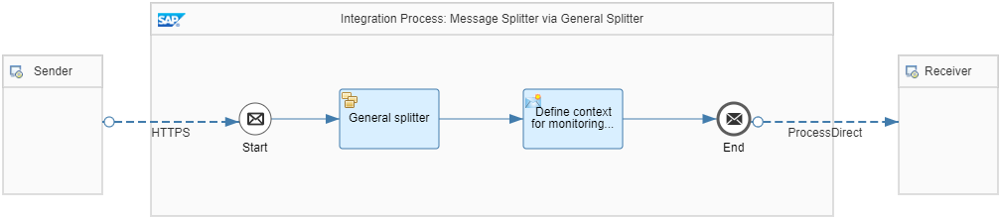

<!-- loiocba1ecb0f88a4a3c862c3cadd0403f6e -->

# Variant with General Splitter

For the **Splitting a Single Order with Multiple Items** use case described in [Splitter](splitter-4b475ea.md), you can use a General Splitter as shown in the *Pattern Message Splitter - General Splitter* integration flow. The General Splitter automatically duplicates the header information of the order for each individual message.

The integration flow contains a General Splitter step with the *XPath* expression type and the following XPath expression:

/ns0:PurchaseOrder/Items/Item

Like in variant [Variant with Iterating Splitter](variant-with-iterating-splitter-24f9f29.md), the following namespace mapping is specified in the *Runtime Configuration* tab of the integration flow:

xmlns:ns0=http://demo.sap.com/eip/splitter

> ### Tip:  
> If possible, use the general splitter rather than message mapping \(see [Variant with Message Mapping](variant-with-message-mapping-f6bb2b7.md)\). The general splitter is the better option compared to message mapping with respect to its runtime behavior. The general splitter streams the message and requires less main memory. Message mapping, on the other hand, loads the whole message into the main memory.

**Related Information**  

[Define General Splitter](define-general-splitter-a6c1916.md "")

[General and Iterating Splitter](general-and-iterating-splitter-b49d088.md "The two splitter types General Splitter and Iterative Splitter behave differently in their handling of the enveloping elements of the input message.")

