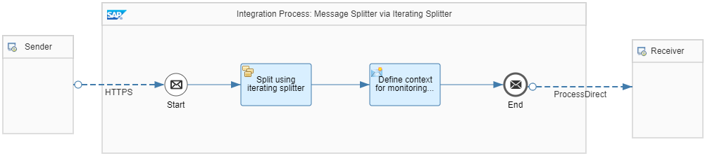

<!-- loio24f9f29ad45849af978c17de4789842a -->

# Variant with Iterating Splitter

You can use an Iterating Splitter to implement the **Splitting a Bulk Order Message into Multiple Orders** use case described in [Splitter](splitter-4b475ea.md). The*Pattern Message Splitter - Iterating Splitter* integration flow illustrates this simple scenario.

It contains an Iterating Splitter step with an *XPath* expression type and the following XPath expression:

`/ns0:PurchaseOrders/ns0:PurchaseOrder`

> ### Tip:  
> Use parallel processing to improve the overall processing time of your splitter scenario, see: [Cloud Integration – Using Parallel Processing in General and Iterating Splitter](https://blogs.sap.com/2018/10/17/cloud-integration-using-parallel-processing-in-general-and-iterating-splitter/) to learn more about proper usage and constraints.

> ### Note:  
> The corresponding namespace mapping is maintained on the *Runtime ConfigurationUse parallel processing to improve the overall processing time of your splitter scenario. Check out the SAP Community blog* tab of the integration flow:

`xmlns:ns0=http://demo.sap.com/eip/splitter`

**Related Information**  

[Define Iterating Splitter](define-iterating-splitter-d61d6ec.md "")

[General and Iterating Splitter](general-and-iterating-splitter-b49d088.md "The two splitter types General Splitter and Iterative Splitter behave differently in their handling of the enveloping elements of the input message.")

