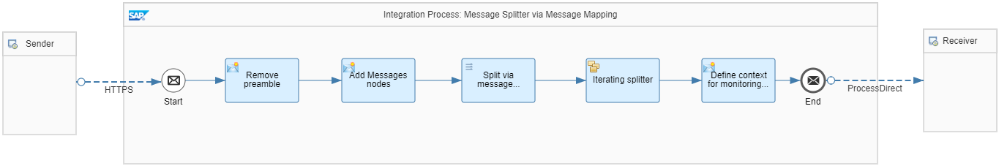

<!-- loiof6bb2b7d6860418bbe4c0c40e5cacecd -->

# Variant with Message Mapping

The integration flow *Pattern Message Splitter - Message Mapping* illustrates the required flow steps. Alternatively, you can implement the **Splitting a Single Order with Multiple Items** use case described in [Splitter](splitter-4b475ea.md) using message mapping.



> ### Tip:  
> Use Message Mapping instead of General Splitter in the following cases:
> 
> -   You have specific requirements that aren't covered by the General Splitter.
> 
> -   You want to reuse the mapping from your SAP Process Orchestration system.

A Content Modifier removes the preamble of the incoming XML message by creating a property with the following attributes:


<table>
<tr>
<th valign="top">

Attribute

</th>
<th valign="top">

Value

</th>
</tr>
<tr>
<td valign="top">

Name

</td>
<td valign="top">

payload

</td>
</tr>
<tr>
<td valign="top">

Data Type

</td>
<td valign="top">

org.w3c.dom.Element

</td>
</tr>
<tr>
<td valign="top">

Value

</td>
<td valign="top">

/

</td>
</tr>
</table>

This step keeps the whole XML message without a preamble in a property.

Since multimapping is used, the payload needs to be wrapped with *Messages* nodes. Those *Messages* nodes are expected if the occurrence of either the source or target message is unbounded in the message mapping.

Therefore, another Content Modifier is needed where the message body is defined by the following expression:

> ### Sample Code:  
> ```
> <ns1:Messages xmlns:ns1="http://sap.com/xi/XI/SplitAndMerge">
> <ns1:Message1>
> ${property.payload}
> </ns1:Message1>
> </ns1:Messages>
> ```

> ### Note:  
> If you migrate your integration scenario from SAP Process Orchestration to SAP Integration Suite , you can connect to your Enterprise Services Repository and upload a message mapping, as described in [Importing Content from SAP Process Orchestration System](IntegrationSettings/importing-content-from-sap-process-orchestration-system-53db5fb.md). Otherwise, you can create the message mapping from scratch.

In the message mapping, the following settings are configured:

-   Source and target message types are defined, and the occurrence of the target message is set to *unbound*.

-   In the Message Mapping editor, the *Item* node of the source structure is mapped to the *ns0:PurchaseOrder* node of the target structure. For each item, a new purchase order message is created.

-   The *PurchaseOrderNumber* node is mapped from source to target. The same is modeled for the *OrderDate* attribute.

-   The *Item* node is mapped from source to target. The *splitByValue* standard function is applied to ensure that each split message contains 1 item only. An identical mapping is applied to all child nodes and attributes of the *Item* node.

-   The target message of the message mapping contains multiple purchase orders, each containing 1 item.


A Splitter flow step is used to actually split the message. In the Iterating Splitter the *Expression Type* attribute is set to *XPath* and the following XPath expression is specified:

`/ns1:Messages/ns1:Message1/ns0:PurchaseOrder`

> ### Note:  
> Like in variant [Variant with General Splitter](variant-with-general-splitter-cba1ecb.md), a namespace mapping is specified in the *Runtime Configuration* tab of the integration flow. In this variant, a namespace mapping for the *Messages* nodes is required:
> 
> `xmlns:ns0=http://demo.sap.com/eip/splitter;xmlns:ns1=http://sap.com/xi/XI/SplitAndMerge`

**Related Information**  


[General and Iterating Splitter](general-and-iterating-splitter-b49d088.md "The two splitter types General Splitter and Iterative Splitter behave differently in their handling of the enveloping elements of the input message.")

