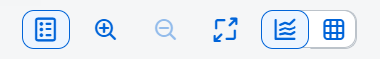

<!-- loio47f349ccd1cb4d1087707983f1f3830d -->

<link rel="stylesheet" type="text/css" href="../css/sap-icons.css"/>

# Viewing Predictions and Trends

Analyze potential API call traffic and identify trends.

> ### Note:  
> The availability of the anomaly detection and prediction features depends on your SAP Integration Suite service plan. For more information about different service plans and their supported feature set, see SAP Notes [2903776](https://me.sap.com/notes/2903776) and [3463620](https://me.sap.com/notes/3463620).

After enabling the feature setting, you can view API call predictions and trends in the analytics dashboard.

In the analytics dashboard, go to the *Predictions* tab to view API call predictions and trends.

<a name="loio47f349ccd1cb4d1087707983f1f3830d__section_otn_wcj_b2c"/>

## Predictions Page

The *Predictions* page provides a visualization of expected traffic patterns for API calls over a specified timeframe. In this page, you can view the following:

-   API Call Predictions
-   API Call Trends

### API Call Predictions

Analyze future API call traffic, customizable for specific timeframes such as daily, weekly, monthly, or custom periods.

**Duration**: By default, the API call predictions are displayed for 30 days. To make changes to the duration, choose  Calendar and select your preferred duration within the next three months.

**Frequency**: By default, the frequency is set to daily. You have the following options to set the frequency:

1.  *Every Day*: Choose this option to view daily API call predictions. This option is selected by default.
2.  *Every 7 Days*: Choose this option to get a weekly overview, showing expected traffic at seven-day intervals.
3.  *Every 4 Weeks*: Choose this option for a broader view, displaying expected traffic every four weeks.
4.  *Custom*: This option allows you to choose recurring days for which you want to view predictions. To set custom days, perform the below:
    -   Choose *Custom* from the drop-down menu.
    -   In the *Custom* dialog, choose your preferred days starting from Monday to Sunday.
    -   Choose *Apply* to save your changes.
    -   Choose *Cancel* to discard your changes and return to the application.

### API Call Trends

Analyze the frequency of API calls within set timeframes, such as hourly or daily.

**Frequency**: By default, the frequency is set to daily. You have the following options:

1.  *Every Day of the Week*: Choose this option to view API call trends for each day within a week.
2.  *Every Hour of the Day*: Choose this option to view hourly API call trends throughout the day.

### Graph: API Call Predictions and Trends

The graph offers a visualization of the anticipated traffic patterns for either all API proxies or the selected ones over a specified timeframe. The x-axis represents time intervals, while the y-axis indicates the expected volume of API calls.

-   **Expected Call Traffic**: The expected pattern is represented by a blue dotted line on the graph, with the expected volume shown in numbers for each proxy.
-   **Action**: Hover over the values on the chart and click on the corresponding dot to view more information such as API name, volume etc. If multiple API proxies are selected, they will be distinguished by different colors.

### Using Filters

By default, the API call predictions and trends data is displayed for all API proxies.

To view API call predictions and trends for specific APIs, follow the steps below:

-   In the *Filters* section, choose the *APIs* drop-down menu. A list of APIs that meet the minimum data requirement of at least 3 months of API call volume data will be displayed.
-   Select the desired APIs for which you want predictions and trends.
-   To remove certain APIs from the selected APIs, choose the API from the *APIs* field and choose :x:.
-   To clear the selection of APIs, simply choose :x: at the end of the *Active Filters* field.

### Action Bar

The Action Bar is located in the top right corner of the *Predictions* page. It offers controls that let you interact with the data displayed. These controls allow you to toggle between graphical and tabular views, and carry out other actions as detailed below:

Choose  to enable or disable the legend view.

Choose  or  to zoom in or out the graph.

Choose  to switch between full screen view and default screen view.

Choose  for graphical view.

Choose  for tabular view.

**Related Information**  

[Enabling Anomaly Detection and Predictions](enabling-anomaly-detection-and-predictions-98534a0.md "Activate the anomaly detection and prediction features for API proxy calls to enhance monitoring and forecasting capabilities.")

[Predictions](predictions-823bcd7.md "In addition to anomaly detection, we have now introduced Predictions, an AI-based feature that can forecast future API call volumes based on past call data. With this new feature, you can identify trends in API traffic and view predictions for upcoming API call volumes. Predictions are available for all API proxies that meet the minimum data requirement of at least 3 months of API call volume data. Additionally, it offers customizable options, allowing you to select specific API proxies, choose the prediction duration, and set the frequency according to your preferences.")

