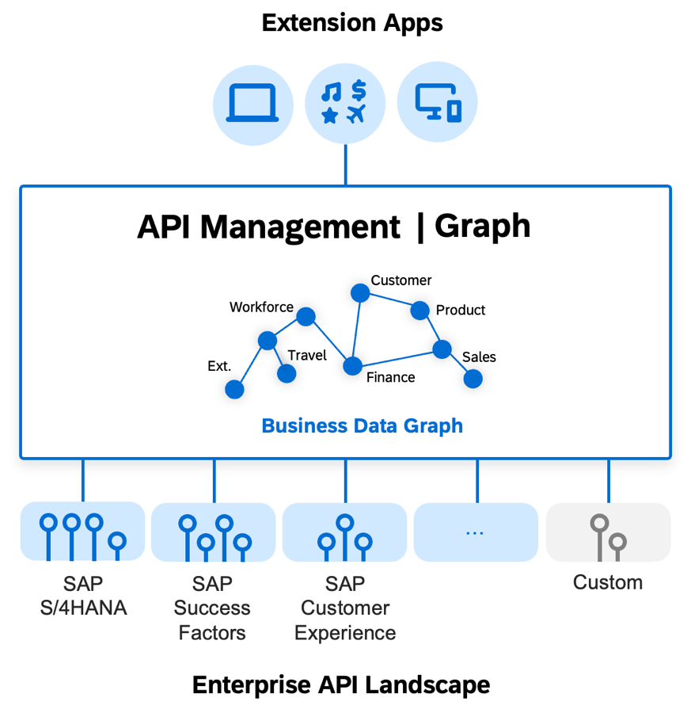

<!-- loio456fc543d687406fba224440a89f81bf -->

# What Is Graph?

Graph is a capability of API Management within SAP Integration Suite. With Graph, developers access your business data as a single semantically connected data graph, spanning the suite of SAP products and beyond. Targeting SAP's ecosystem of partner and customer developers, Graph's powerful API reduces the cost and complexity of creating and deploying reusable extensions and other client applications.

Enterprise landscapes continue to expand in scale and complexity. Each additional system, SaaS, or microservice introduces new protocols, data models, connectivity, and security conventions. Real-world problems often span multiple lines of business, services, and APIs. Consequently, even the most experienced developers struggle to understand all of the technologies and interfaces involved. Developing new business-extending client applications requires an ever-growing range of expertise and skills. The phenomenal adoption of low-code tools by nonprofessional developers further increases the gap.

Enterprises use API Management to partially address this gap: APIs can be renamed, authentication can be streamlined, APIs can be protected against unauthorized access or threats. But this doesn't address the deeper problem: separate, disconnected APIs from different data sources and systems.

Graph is a solution to unify your business APIs in the form of a semantically connected data graph, accessed via a single powerful API. Out of the box, it provides developers a single connected and unified view of your SAP-managed business data. Graph consolidates thousands of data entities from SAP systems likeSAP S/4HANA, SAP Sales Cloud, and SAP SuccessFactors, into one curated, semantically connected, data model. We call this connected graph a *Business Data Graph*.

The out-of-the-box data graph of SAP-managed data is the baseline, the starting point to your own data graph. You can expand it by adding your own data sources and your own data models, projections, and compositions, creating a unique data model of your business.

The business data graph is ultimately an abstraction of the data in your landscape, for developers. It establishes a separation of concerns, by exposing the data graph through a single unified API, entirely hiding the complexities of the landscape itself.

Developers use standard and powerful data graph query languages \(OData V4 or GraphQL\) to efficiently navigate the data, without being exposed to the complexity of data sources, URLs, connections, replications, VPNs, or underlying security concerns. All the data, through one API. Often a single powerful graph-navigating query replaces the complex programming logic that would have been required to issue repeated queries to separate systems or APIs.

Graph technically acts as a scalable and stateless multitenant service, accepting navigation queries from applications, breaking up those queries, and accessing the APIs of the actual data sources on their behalf. Graph doesn’t maintain or cache data; all data requests are semantically routed to the data source systems.

Because of the decoupling of the system landscape from applications, enterprises can deploy Graph-based applications more easily, across more landscapes, and at a lower cost.

As part of SAP Integration Suite, Graph is compatible with SAP's Cloud Application Programming model \(CAP\) and with the range of SAP Build development solutions.

**Related Information**  

[Configure](configure-1b52dd1.md "An introduction to the configuration topics of Graph.")

[Model](model-31f8c54.md "It is common knowledge that data-driven software should be modeled on its underlying business processes.")

[Develop](develop-93b23df.md "As a developer, you want to build applications that consume data from business data graphs. This guide provides all the information you need to start developing.")

